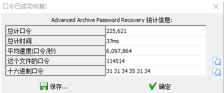
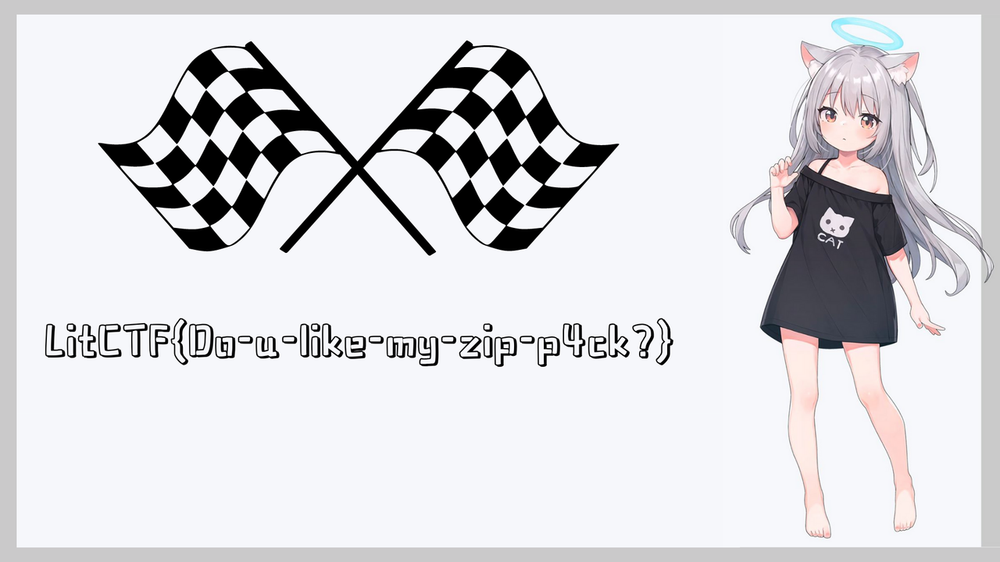
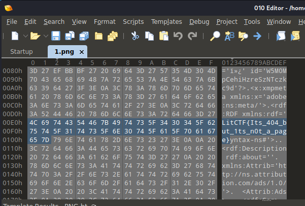
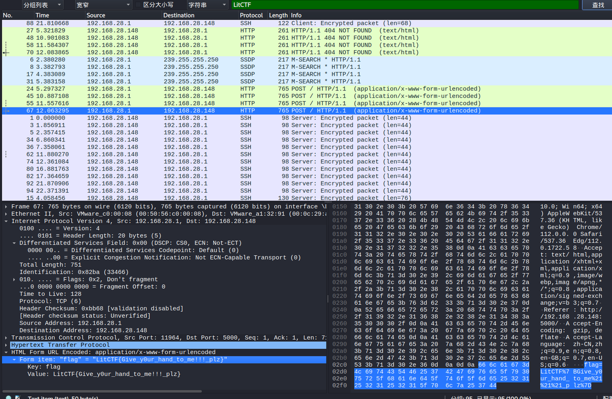
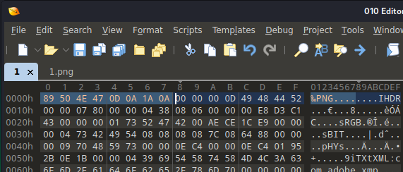
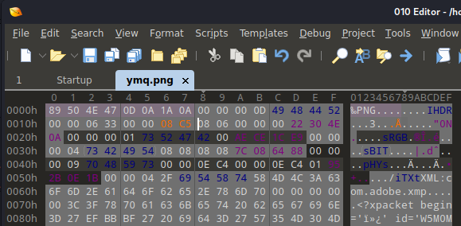
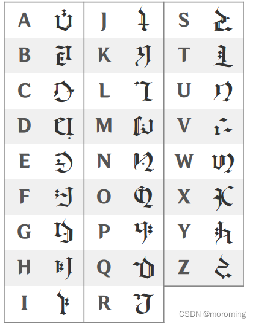

# LitCTF 2023

## Web

### 我Flag呢？

查看html源码

\<!--flag is here flag=NSSCTF{39609b1a-cc8d-4fe1-8ccf-594cd745632a} -->

### Ping

Brupsuite 一把梭

Payload `command=127.0.0.1%3bcat%20%2fflag&ping=Ping`

### Follow me and hack me

Brupsuite 一把梭

Payload `/?CTF=Lit2023 Challenge=i'm_c0m1ng`

## Misc

### 喜欢我的压缩包么 (初级)

<figure><figcaption></figcaption></figure>

<figure><figcaption></figcaption></figure>

### 404notfound (初级)

<figure><figcaption></figcaption></figure>

### Take me hand (初级)

wireshark一把梭

<figure><figcaption></figcaption></figure>

### 破损的图片(初级)

一眼顶针，鉴定为丢了文件头，怼个png进去试试

<figure><figcaption></figcaption></figure>

然后发现成了

<figure><figcaption></figcaption></figure>

### 这羽毛球怎么只有一半啊（恼 (初级)

```python
import zlib
import struct

filename = 'ymq.png'
with open(filename, 'rb') as f:
    all_b = f.read()
    crc32key = int(all_b[29:33].hex(), 16)
    data = bytearray(all_b[12:29])
    n = 4095
    for w in range(n):
        width = bytearray(struct.pack('>i', w))
        for h in range(n):
            height = bytearray(struct.pack('>i', h))
            for x in range(4):
                data[x + 4] = width[x]
                data[x + 8] = height[x]
            crc32result = zlib.crc32(data)
            if crc32result == crc32key:
                print("宽为：", end="")
                print(width)
                print("高为：", end="")
                print(height)
                
#宽为：bytearray(b'\x00\x00\x063')
#高为：bytearray(b'\x00\x00\x08\xc5') 
```

<figure><figcaption></figcaption></figure>

<figure><figcaption></figcaption></figure>

### OSINT 探姬去哪了?\_0

在图片中包含地址位置信息，可以查到结果是 `中国电信大厦`

### OSINT 探姬去哪了?\_2



结果就是 `NSSCTF{漫香音乐酒吧(农科路店)}`&#x20;

### OSINT 探姬去哪了?\_3

通过 CTF 可以猜测探姬是学计算机，直接找计算机学院位于学校哪里，可以查出来位于 `科学校区` ，第二问为第几教学楼，直接从 1 开始穷举，最后图片中显示 217 ，说明是在 2 层 217。

结果就是 `NSSCTF{科学校区-第1教学楼-2层-217}`

### OSINT 这是什么地方？！



结果就是 `陕西有色榆林新材料集团`&#x20;

### OSINT 小麦果汁

WiFi 名字为 Hacker & Craft

百度即可得到答案 `黑客与精酿`&#x20;

### 两仪生四象 (中级)

```python
_hash = {"乾": "111", "兑": "011", "离": "101", "震": "001", "巽": "110", "坎": "010", "艮": "100", "坤": "000"}

encoded_text = "坤乾兑艮兑坎坤坤巽震坤巽震艮兑坎坤震兑乾坤巽坤艮兑震巽坤巽艮坤巽艮艮兑兑艮震兑乾坤乾坤坤兑艮艮坤巽坤坤巽坎坤兑离坎震艮兑坤巽坎艮兑震坤震兑乾坤乾坎坤兑坎坤震艮离坤离乾艮震艮巽震离震坤巽兑艮兑坎坤震巽艮坤离乾艮坎离坤震巽坎坤兑坤艮兑震巽震巽坎坤巽坤艮兑兑坎震巽兑"

__reverse_hash = {k: v for k, v in _hash.items()}

decoded_text = ""
for i in range(0, len(encoded_text)):
    try:
        decoded_text += __reverse_hash[encoded_text[i]]
    except KeyError:
        decoded_text += " "

print(decoded_text)

list = []

for i in range(0, len(decoded_text), 10):
    list.append(int(decoded_text[i:i + 10], 2))

print(bytes(list).decode())

# wh1ch_ag4in_pr0duced_the_3ight_Tr1grams
```

## Crypto

### Hex？Hex！

16 进制转字符串即可 LitCTF{tai111coollaaa!}

### 梦想是红色的



LitCTF{为之则易,不为则难}

### 家人们！谁懂啊，RSA签到都不会

```python
from Crypto.Util.number import *
# from secret import flag
#
# m = bytes_to_long(flag)
# p = getPrime(512)
# q = getPrime(512)
# c = pow(m,e,n)
# print(f'p = {p}')
# print(f'q = {q}')
# print(f'c = {c}')
# '''
import gmpy2
e = 65537
p = 12567387145159119014524309071236701639759988903138784984758783651292440613056150667165602473478042486784826835732833001151645545259394365039352263846276073
q = 12716692565364681652614824033831497167911028027478195947187437474380470205859949692107216740030921664273595734808349540612759651241456765149114895216695451
c = 108691165922055382844520116328228845767222921196922506468663428855093343772017986225285637996980678749662049989519029385165514816621011058462841314243727826941569954125384522233795629521155389745713798246071907492365062512521474965012924607857440577856404307124237116387085337087671914959900909379028727767057
# '''
n = p*q
phi = (p-1)*(q-1)
d = gmpy2.invert(e,phi)
m = pow(c,d,n)
print(long_to_bytes(m))
```

### 原来你也玩原神



YUANLAINIYEWANYUANSHENWWW

### (校外)Euler

已知 n c&#x20;

m^2 mod n = c&#x20;

当e=2 可以认为是低指数，进行低指数加密攻击

```python
n = 115140122725890943990475192890188343698762004010330526468754961357872096040956340092062274481843042907652320664917728267982409212988849109825729150839069369465433531269728824368749655421846730162477193420534803525810831025762500375845466064264837531992986534097821734242082950392892529951104643690838773406549
c = 406480424882876909664869928877322864482740577681292497936198951316587691545267772748204383995815523935005725558478033908575228532559165174398668885819826720515607326399097899572022020453298441

i = 0
while 1:
    if(iroot(c+i*n,2)[1]==1):
        print(iroot(c+i*n,2)[0])
        print(i)
        break
    i=i+1


print(long_to_bytes(637558173724466424603436405558898119893812260428714378729778210205931322986773019220025930769021))
```

LitCTF{a1a8887793acfc199182a649e905daab}

### (校外)md5的破解

```python
list = ['a', 'b', 'c', 'd', 'e', 'f', 'g', 'h', 'i', 'j', 'k', 'l', 'm', 'n', 'o', 'p', 'q', 'r', 's', 't', 'u', 'v',
        'w', 'x', 'y', 'z', '0', '1', '2', '3', '4', '5', '6', '7', '8', '9']

for i in list:
    for j in list:
        for p in list:
            for q in list:
                temp = "LitCTF{md5can%(0)s%(1)s3de%(2)srypt213thoughcr%(3)ssh}" % {'0': i, '1': j, '2': p, '3': q}
                tempp = md5(temp.encode()).hexdigest()
                if tempp == '496603d6953a15846cd7cc476f146771':
                    print(temp)
```

### factordb (中级)

```python
from Crypto.Util.number import *
import gmpy2
e = 65537
n = 87924348264132406875276140514499937145050893665602592992418171647042491658461
p = 275127860351348928173285174381581152299
q = 319576316814478949870590164193048041239
c = 87677652386897749300638591365341016390128692783949277305987828177045932576708

phi = (p-1)*(q-1)
d = gmpy2.invert(e, phi)
m = pow(c, d, n)
print(long_to_bytes(m))
```

### yafu (中级)

```python
import gmpy2
from Crypto.Util.number import *

n = 15241208217768849887180010139590210767831431018204645415681695749294131435566140166245881287131522331092026252879324931622292179726764214435307
c = 12608550100856399369399391849907846147170257754920996952259023159548789970041433744454761458030776176806265496305629236559551086998780836655717
e = 65537

phi = (2151018733 - 1) * (2201440207 - 1) * (2315495107 - 1) * (2585574697 - 1) * (2719600579 - 1) * (2758708999 - 1) * (2767137487 - 1) * (2906576131 - 1) * (2923522073 - 1) * (3354884521 - 1) * (3355651511 - 1) * (3989697563 - 1) * (4021078331 - 1) * (4044505687 - 1) * (4171911923 - 1)
d = gmpy2.invert(e, phi)

m = pow(c, d, n)
print(long_to_bytes(m))
```

### (校外)P\_Leak

一眼顶针，鉴定为 dp泄露

```python
from gmpy2 import *
from Crypto.Util.number import *

e = 65537
n = 50612159190225619689404794427464916374543237300894011803225784470008992781409447214236779975896311093686413491163221778479739252804271270231391599602217675895446538524670610623369953168412236472302812808639218392319634397138871387898452935081756580084070333246950840091192420542761507705395568904875746222477
dp = 5892502924236878675675338970704766304539618343869489297045857272605067962848952532606770917225218534430490745895652561015493032055636004130931491316020329
c = 39257649468514605476432946851710016346016992413796229928386230062780829495844059368939749930876895443279723032641876662714088329296631207594999580050131450251288839714711436117326769029649419789323982613380617840218087161435260837263996287628129307328857086987521821533565738409794866606381789730458247531619

for i in range(1, e):
    if (dp * e - 1) % i == 0:
        if n % (((dp * e - 1) // i) + 1) == 0:
            p = ((dp * e - 1) // i) + 1
            q = n // (((dp * e - 1) // i) + 1)
            phi = (q - 1) * (p - 1)
            d = invert(e, phi)
            m = pow(c, d, n)

print(long_to_bytes(m))
```

### (校外)e的学问

它不互素，那就让他互素！

```python
import gmpy2
from Crypto.Util.number import *
e=74
p= 86053582917386343422567174764040471033234388106968488834872953625339458483149
q= 72031998384560188060716696553519973198388628004850270102102972862328770104493
c= 3939634105073614197573473825268995321781553470182462454724181094897309933627076266632153551522332244941496491385911139566998817961371516587764621395810123
n = p * q
phi = (p-1)*(q-1)
tmp = math.gcd(phi, e)
d = gmpy2.invert(e // tmp, phi)
m = pow(c, d, n)
m = gmpy2.iroot(m, tmp)
print(long_to_bytes(m[0]))
```
