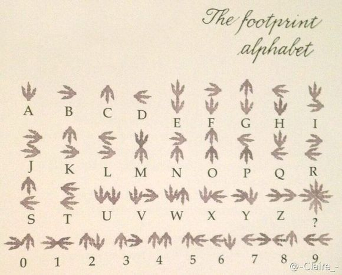
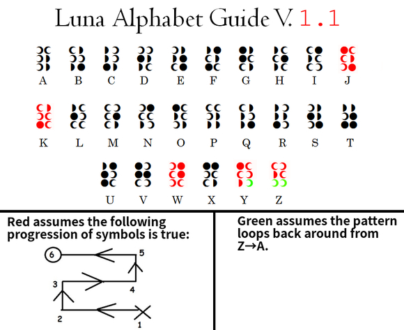
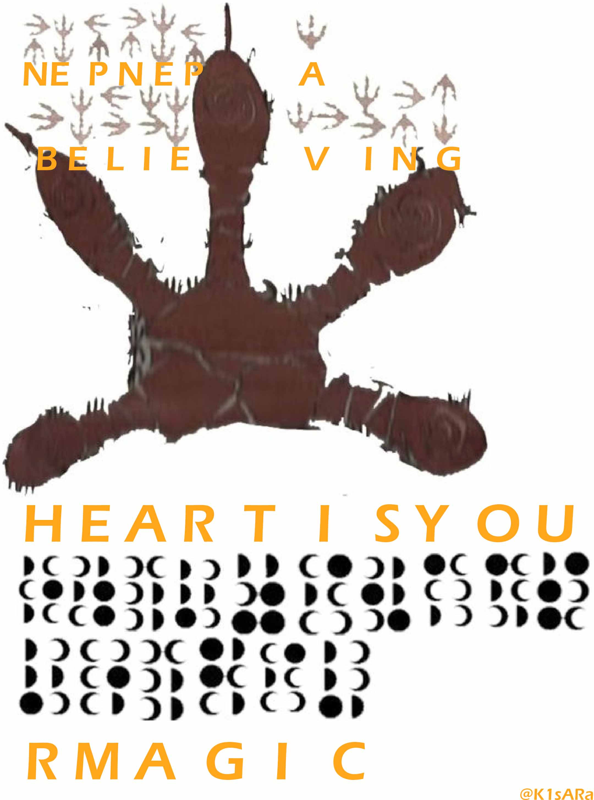
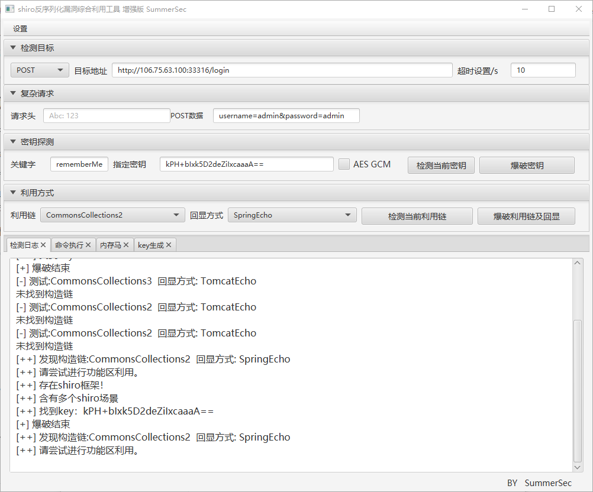
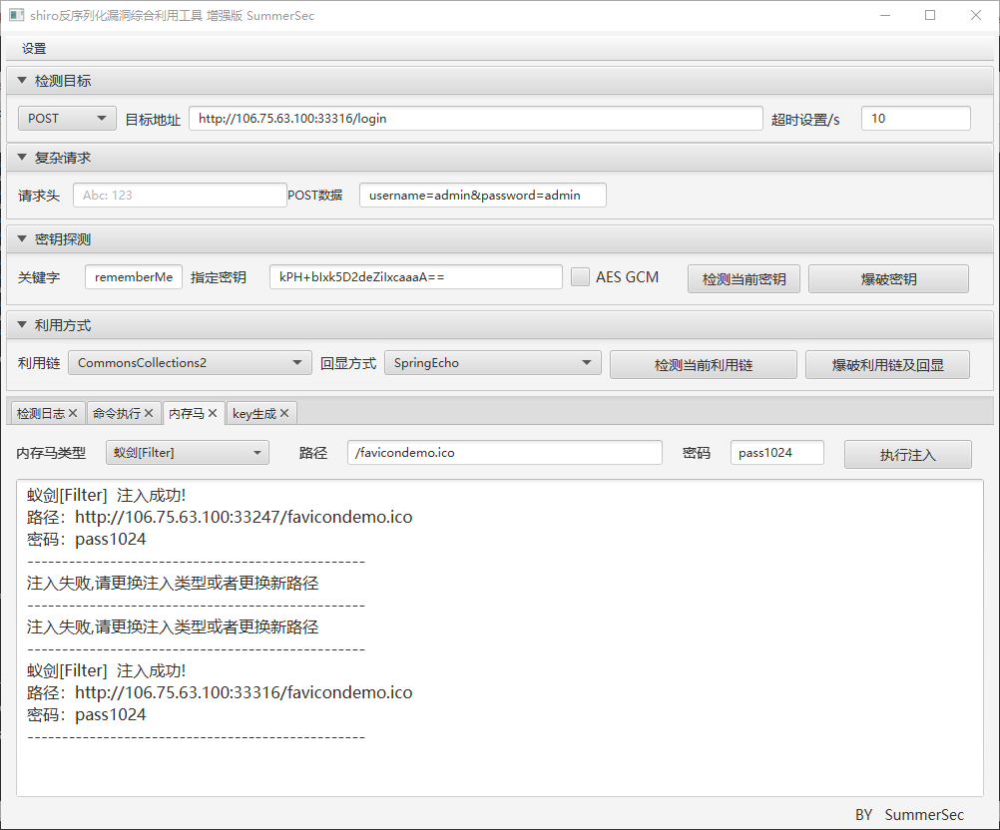
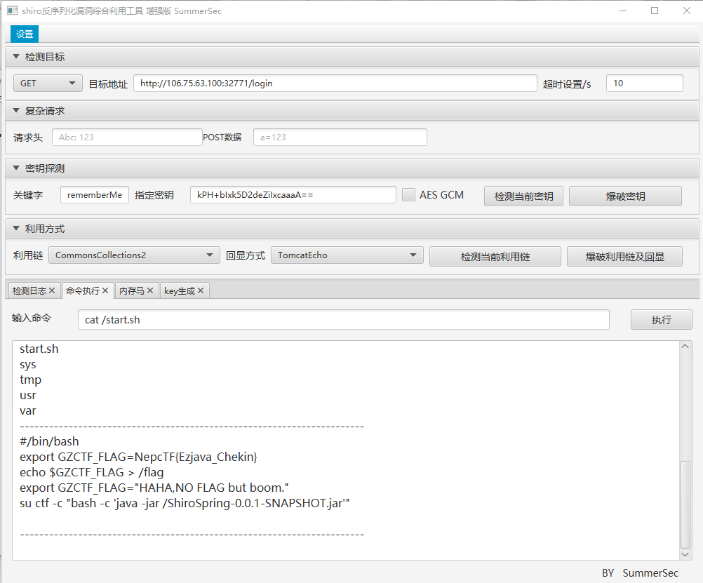

# NepCTF 2023

## NepCTF 2023


好耶！是 NepNep！


## Misc

### 与AI共舞的哈夫曼

ChatGPT 一把梭（确信。

```python
import heapq


class HuffmanNode:
    def __init__(self, char, freq):
        self.char = char
        self.freq = freq
        self.left = None
        self.right = None

    def __lt__(self, other):
        return self.freq < other.freq


def build_huffman_tree(frequencies):
    heap = [HuffmanNode(char, freq) for char, freq in frequencies.items()]
    heapq.heapify(heap)

    while len(heap) > 1:
        left = heapq.heappop(heap)
        right = heapq.heappop(heap)
        merged = HuffmanNode(None, left.freq + right.freq)
        merged.left = left
        merged.right = right
        heapq.heappush(heap, merged)

    return heap[0]


def build_huffman_codes(node, current_code, huffman_codes):
    if node is None:
        return

    if node.char is not None:
        huffman_codes[node.char] = current_code
        return

    build_huffman_codes(node.left, current_code + '0', huffman_codes)
    build_huffman_codes(node.right, current_code + '1', huffman_codes)


def decompress(input_file, output_file):
    with open(input_file, 'rb') as f:
        data = f.read()

    # Read frequency information
    num_frequencies = data[0]
    idx = 1
    frequencies = {}
    for _ in range(num_frequencies):
        byte = data[idx]
        freq = (data[idx + 1] << 24) + (data[idx + 2] << 16) + (data[idx + 3] << 8) + data[idx + 4]
        frequencies[byte] = freq
        idx += 5

    # Rebuild Huffman tree
    root = build_huffman_tree(frequencies)
    huffman_codes = {}
    build_huffman_codes(root, '', huffman_codes)

    # Inverse Huffman codes for decoding
    inverse_huffman_codes = {v: k for k, v in huffman_codes.items()}

    # Read compressed data
    compressed_data = ''
    while idx < len(data):
        byte = data[idx]
        compressed_data += format(byte, '08b')
        idx += 1

    # Decode data
    decoded_data = bytearray()
    current_code = ''
    for bit in compressed_data:
        current_code += bit
        if current_code in inverse_huffman_codes:
            decoded_data.append(inverse_huffman_codes[current_code])
            current_code = ''

    with open(output_file, 'wb') as f:
        f.write(decoded_data)


# Now, let's try decompressing the file again
decompressed_file_path = './decompressed.txt'
decompress('./compressed.bin', decompressed_file_path)

# Read the decompressed content
with open(decompressed_file_path, 'r') as f:
    decompressed_content = f.read()

# Nepctf{huffman_zip_666}
```

### codes

试了下 下面这些都被过滤了。

`exe env sys popen mmap mprotect get`

```c
#include <stdio.h>

int main(int argc, char *argv[], char *third[]) {
    for (int i = 0; third[i] != NULL; i++) {
        printf("%s\n", third[i]);
    }
    return 0;
}
```

```
Nepctf{easy_codes_fc598d45-5bd3-4741-91a8-aeeb2365b30a_[TEAM_HASH]}
```

### 陌生的语言

> https://www.bilibili.com/video/BV1sb411N7Ma
>
> https://tieba.baidu.com/p/4945307221
>
> https://tieba.baidu.com/p/4968926549

<figure><figcaption></figcaption></figure>

<figure><figcaption></figcaption></figure>

<figure><figcaption></figcaption></figure>

NepCTF{NEPNEP\_A\_BELIEVING\_HEART\_IS\_YOUR\_MAGIC}

### ConnectedFive

赢 42 场拿下 Flag。

```bash
▀████▀     █     ▀███▀████▀███▄   ▀███▀
  ▀██     ▄██     ▄█   ██   ███▄    █  
   ██▄   ▄███▄   ▄█    ██   █ ███   █  
    ██▄  █▀ ██▄  █▀    ██   █  ▀██▄ █  
    ▀██ █▀  ▀██ █▀     ██   █   ▀██▄█  
     ▄██▄    ▄██▄      ██   █     ███  
      ██      ██     ▄████▄███▄    ██  
                                       
                                       

NepCTF{GomokuPlayingContinousIsFun_99df4b1dbaf6}
```

### 小叮弹钢琴

使用 MidiEditor 滑到右边可以得到以下内容

```
0x370a05303c290e045005031c2b1858473a5f052117032c39230f005d1e17
```

左边的竖条有的短，有的长，将长的记为 `0` ，短的记为 `1` （要是反过来也无所谓），可以得到以下内容

```
0100 000 110 111 1111 000 110 1011 011 110 111 1 0 1111 11 111 0 000 0110 000 101 111 000 00 1 0 1111 11 01 001
```

二进制，带停顿，那就不妨试试摩斯电码罢，用 `0` 表示 `-` ，用 `1` 表示 `.` ，就可以得到以下内容

```
LOGSHOULDUSETHISTOXORSOMETHING
```

再加点空格，得到以下内容

```
LOG SHOULD USE THIS TO XOR SOMETHING
```

说明需要使用 `LOGSHOULDUSETHISTOXORSOMETHING` 这个字符串去异或

```
0x370a05303c290e045005031c2b1858473a5f052117032c39230f005d1e17
```

，但经过尝试发现不对，那就试试小写咯。

```
转小写 logshouldusethistoxorsomething
转Hex 6c6f6773686f756c6475736574686973746f786f72736f6d657468696e67
```

再写个 Python 脚本来异或并转成字符串，代码如下

```python
from Crypto.Util.number import *

print(hex(0x6c6f6773686f756c6475736574686973746f786f72736f6d657468696e67 ^ 0x370a05303c290e045005031c2b1858473a5f052117032c39230f005d1e17))

c = 0x5b65624354467b68347070795f7031344e307d4e65704354467b68347070
c = str(c)
c = int(c)
print(long_to_bytes(c))
# b'[ebCTF{h4ppy_p14N0}NepCTF{h4pp'
```

就可以得到 flag 了。

## Web

### ez\_java\_checkin

> https://github.com/SummerSec/ShiroAttack2

通过提示可以发现是 Apache Shiro 1.2.4反序列化漏洞（CVE-2016-4437）

通过 ShiroAttack 可以上传马得到 Shell

<figure><figcaption></figcaption></figure>

<figure><figcaption></figcaption></figure>

通过 `cat flag` 发现并没有权限，然后疯狂试根目录最后在 `start.sh` 找到了 flag。

<figure><figcaption></figcaption></figure>
